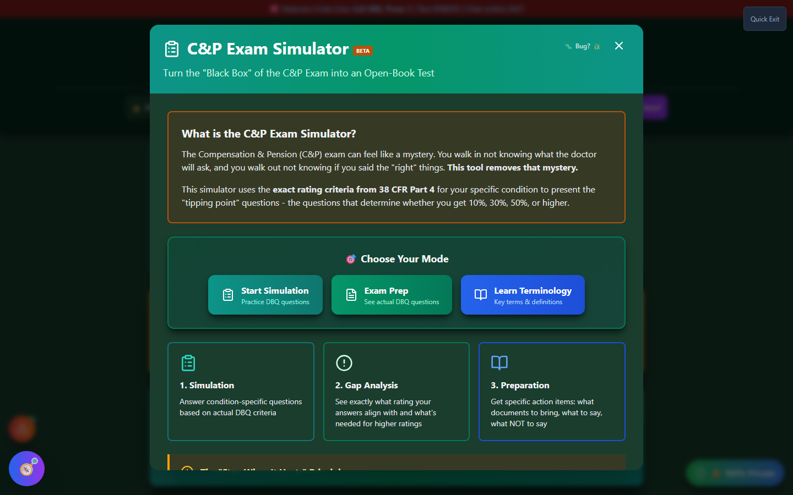

# C&P Exam Simulator

The **C&P Exam Simulator** prepares veterans for their Compensation & Pension examination by simulating condition-specific questions based on the VA's Rating Schedule (38 CFR Part 4).

_The simulator opens with three modes: Start Simulation, Exam Prep, and Learn Terminology._

🆘 <strong>Veterans Crisis Line:</strong> Call 988, Press 1 | Text 838255 | Available 24/7

---

## What is a C&P Exam?

A **Compensation and Pension (C&P) examination** is a medical evaluation conducted by VA healthcare providers or contracted examiners. The exam helps the VA:

- Verify you have the claimed condition
- Assess the current severity
- Determine the appropriate rating percentage

---

## Why Practice Matters

C&P exams can determine your rating for years. Being prepared helps you:

- ✅ **Understand what's evaluated** - Know the specific criteria
- ✅ **Communicate effectively** - Describe your worst symptoms accurately
- ✅ **Avoid common mistakes** - Don't minimize or forget important details
- ✅ **Know the "tipping points"** - Understand what separates rating levels

---

## In This Section

<h3>🚀 Getting Started</h3>

Learn the basics of the C&P Exam Simulator and how to begin.

<a href="getting-started/" class="doc-button">Learn More →</a>

<h3>📋 Condition Selection</h3>

Choose a condition to practice from your packet or the full database.

<a href="condition-selection/" class="doc-button">Learn More →</a>

<h3>🎯 Taking the Simulation</h3>

Walk through the simulation process and understand each question type.

<a href="taking-simulation/" class="doc-button">Learn More →</a>

<h3>📊 Understanding Results</h3>

Interpret your estimated rating and gap analysis.

<a href="results/" class="doc-button">Learn More →</a>

<h3>📚 Flashcard Mode</h3>

Learn medical terminology with interactive flashcards.

<a href="flashcards/" class="doc-button">Learn More →</a>

---

## Key Features

### Condition-Specific Questions

Questions are tailored to each body system:

| Body System         | Question Focus                                         |
| ------------------- | ------------------------------------------------------ |
| **Musculoskeletal** | Range of motion, pain, flare-ups, functional loss      |
| **Mental Health**   | Occupational impairment, social function, symptoms     |
| **Respiratory**     | Breathing difficulty, PFT results, activity limitation |
| **Cardiovascular**  | Exercise tolerance, METs, symptoms                     |
| **Neurological**    | Nerve function, paralysis, sensation                   |

### DBQ-Aligned Scenarios

Questions align with **Disability Benefits Questionnaires (DBQs)** - the forms examiners use to evaluate you.

### Real-Time Feedback

Get immediate feedback on your responses:

- What your answers suggest about your rating
- How to better document your symptoms
- What the examiner will be looking for

### Gap Analysis

See what separates you from higher ratings:

- What criteria you don't currently meet
- What evidence could support a higher rating
- Questions to prepare for your actual exam

---

## How It Works

<strong>Select a condition</strong> - From your packet or search

<strong>Answer questions</strong> - Based on your actual symptoms

<strong>Review feedback</strong> - Understand each answer's impact

<strong>See estimated rating</strong> - Based on your responses

<strong>Review gap analysis</strong> - Learn what affects your rating

---

## Important Notes

!!! warning "Educational Tool Only"
The C&P Exam Simulator is for **educational preparation only**. It does not:

    - Predict your actual VA rating
    - Replace professional medical evaluation
    - Constitute medical or legal advice
    - Guarantee any specific outcome

!!! tip "Best Approach"

    - **Answer honestly** - Based on your actual experience
    - **Think of your worst days** - Not your best days
    - **Consider flare-ups** - Include your worst symptom episodes
    - **Don't minimize** - Describe actual functional limitations
