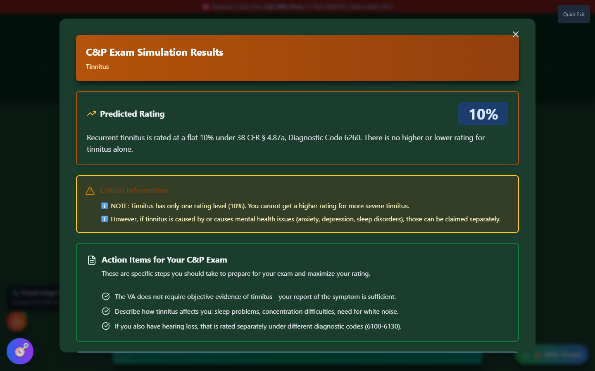

# C&P Simulator - Understanding Results

After completing the simulation, you'll receive a predicted rating and detailed gap analysis.


_The results screen for a single-tier condition (Tinnitus) shows the Predicted Rating, critical information, and specific action items for your exam._

---

## Results Screen Overview

The results screen contains:

1. **Predicted Rating** - Percentage based on your answers
2. **Critical Information** - Condition-specific notes (e.g. whether a higher rating is even possible)
3. **Action Items for Your C&P Exam** - Specific preparation steps
4. **Gap Analysis** - What separates you from higher ratings (multi-tier conditions)
5. **Action Buttons** - Next steps you can take

---

## Predicted Rating

Your predicted rating is displayed prominently at the top of the results:

```
╔══════════════════════════════════════════╗
║                                          ║
║         Predicted Rating: 50%            ║
║                                          ║
║   Based on your responses, your          ║
║   symptoms align with the 50%            ║
║   criteria under 38 CFR § 4.130          ║
║                                          ║
╚══════════════════════════════════════════╝
```

### What This Means

!!! warning "Important Disclaimer"
This is an **educational estimate only**. Your actual VA rating may differ based on: - C&P examiner's evaluation - Medical evidence - Specific details of your case - VA rater interpretation

---

## Rating Breakdown

See how each answer contributed:

### Answer Summary Table

| Question            | Your Answer | Impact |
| ------------------- | ----------- | ------ |
| Occupational Impact | Severe      | +++    |
| Social Impact       | Moderate    | ++     |
| Symptoms            | Moderate    | ++     |
| Functioning         | Serious     | +++    |

### Criteria Mapping

Your answers are mapped to the actual rating criteria:

```
50% Criteria Match:
✓ Reduced reliability and productivity
✓ Difficulty understanding complex commands
✓ Impairment of short/long-term memory
✓ Impaired judgment
✓ Disturbances of motivation and mood
```

---

## Gap Analysis

The gap analysis shows what would be needed for higher ratings:

### Example: Currently at 50%, Looking at 70%

```
╔══════════════════════════════════════════╗
║  Gap Analysis: 50% → 70%                 ║
╠══════════════════════════════════════════╣
║                                          ║
║  To potentially qualify for 70%:         ║
║                                          ║
║  • Evidence of suicidal ideation         ║
║  • Obsessional rituals interfering       ║
║    with routine activities               ║
║  • Speech intermittently illogical       ║
║  • Near-continuous panic/depression      ║
║  • Difficulty adapting to stressful      ║
║    circumstances                         ║
║  • Inability to establish effective      ║
║    work/social relationships             ║
║                                          ║
╚══════════════════════════════════════════╝
```

### How to Use Gap Analysis

1. **Review the criteria** - Understand what higher ratings require
2. **Honestly assess** - Do you actually experience these symptoms?
3. **Document evidence** - If you do experience them, ensure they're documented
4. **Prepare to discuss** - Know how to articulate these during your exam

!!! tip "Documentation is Key"
The gap analysis shows what you'd need to document to potentially qualify for higher ratings. If you genuinely experience these symptoms: - Document them in medical records - Keep a symptom journal - Get buddy statements - Discuss with your doctor

---

## Recommendations

Based on your results, you'll receive personalized recommendations:

### For Your C&P Exam

- What to emphasize
- Common questions to expect
- How to describe your symptoms effectively
- Documents to bring

### For Evidence Building

- Types of evidence that support your rating level
- What medical documentation would help
- Buddy statement suggestions

### For Higher Ratings

- What criteria you don't currently meet
- Whether additional evidence might help
- Questions to discuss with your provider

---

## Action Buttons

### Practice Again

- Retake the simulation
- Try different responses
- See how answers affect ratings

### Try Another Condition

- Select a different condition
- Practice for multiple exams

### Save to My Packet

- If not already saved, add this condition
- Track your preparation progress

### View Full Criteria

- Opens the complete rating criteria
- See all percentage levels

### Download Summary

- Export your results
- Save for reference

---

## Understanding Rating Tiers

### Mental Health (Example)

| Rating   | Key Indicators                           |
| -------- | ---------------------------------------- |
| **100%** | Total occupational and social impairment |
| **70%**  | Deficiencies in most areas               |
| **50%**  | Reduced reliability and productivity     |
| **30%**  | Occasional decrease in efficiency        |
| **10%**  | Mild or transient symptoms               |
| **0%**   | Diagnosed, no significant symptoms       |

### Musculoskeletal (Example - Spine)

| Rating   | Key Indicators                       |
| -------- | ------------------------------------ |
| **100%** | Unfavorable ankylosis, entire spine  |
| **50%**  | Unfavorable ankylosis, thoracolumbar |
| **40%**  | Forward flexion 30° or less          |
| **20%**  | Forward flexion 30-60°               |
| **10%**  | Forward flexion 60-85°               |

---

## Tips for Using Results

!!! tip "Maximize Your Preparation" 1. **Compare to your records** - Do your medical records reflect your answers? 2. **Identify gaps** - What's not documented that should be? 3. **Practice articulation** - Can you explain your symptoms clearly? 4. **Review gap analysis** - Understand what higher ratings need 5. **Don't exaggerate** - Be accurate about your actual experience 6. **Don't minimize** - Also don't understate your symptoms 7. **Take multiple times** - Practice builds confidence

---

## What's Next?

After reviewing your results:

1. **Review the gap analysis** - Understand your current level
2. **Document appropriately** - Ensure records reflect reality
3. **Practice articulation** - Be ready to describe symptoms
4. **Gather evidence** - Buddy statements, medical records
5. **Consult a VSO** - Get professional guidance
6. **Schedule your exam** - When you're ready
