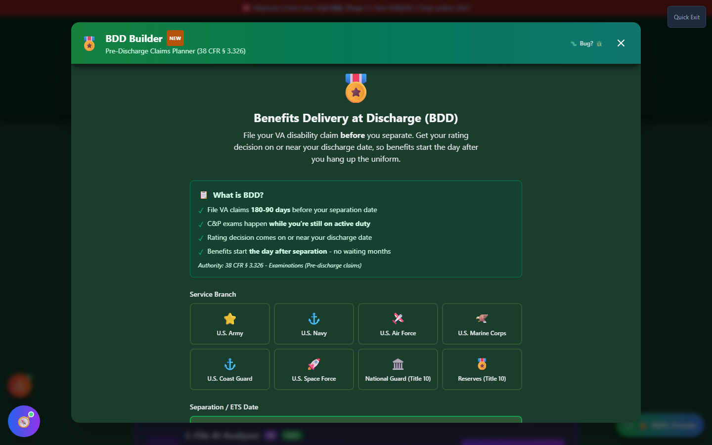
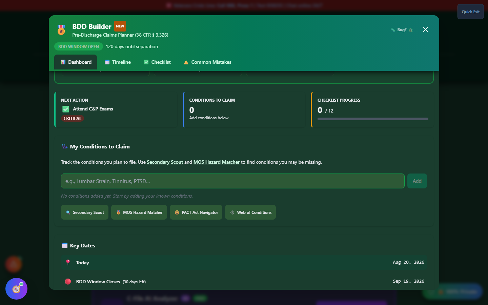
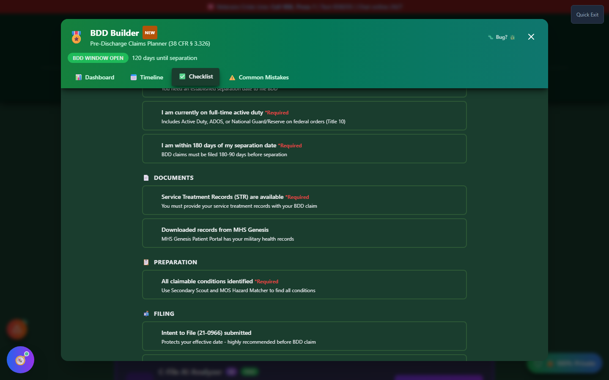

# BDD Builder

BDD Builder plans a **Benefits Delivery at Discharge** claim - the program that lets you file your VA disability claim **while still on active duty**, so your rating decision can arrive on or near your discharge date instead of months later.

🆘 <strong>Veterans Crisis Line:</strong> Call 988, Press 1 | Text 838255 | Available 24/7

---

## What Is a BDD Claim?

Under **38 CFR § 3.326**, service members can file a disability claim before separating, as long as they're within a specific filing window:

!!! va-info "The BDD Window" - **Opens 180 days** before your separation/ETS date - **Closes 90 days** before your separation/ETS date - Filing inside this window lets VA schedule your C&P exams while you're still in-service, so a rating decision can be ready close to Day 1 as a veteran - Missing the window doesn't disqualify you - you can still file a **standard pre-discharge claim** up until separation, it just takes longer

## Who's Eligible

BDD is available to active duty service members (including National Guard/Reserve on qualifying active duty) who:

- Have a known separation/ETS date **90-180 days** in the future
- Can provide their Service Treatment Records (STR) with the claim
- Are filing VA Form 21-526EZ and selecting "BDD" as the claim type

---

## Launching BDD Builder

On the home page, scroll to the **🔍 Discover Your Claims** section and click **"🎖️ Plan My BDD Claim"** on the amber BDD Builder banner, or open it from the header's **🛠️ Tools → Discover** menu.

The first time you open BDD Builder, it asks for your branch and separation/ETS date so it can calculate where you stand in the filing window.

_Enter your anticipated discharge or ETS date to unlock the dashboard, timeline, and checklist._

---

## The Dashboard

Once a separation date is set, BDD Builder shows:

- **Eligibility status** - whether you're pre-window, inside the BDD window, past it, or already separated
- **Days remaining** in your filing window
- **Checklist completion** at a glance
- **Relevant milestones** for your specific timeframe

_The dashboard recalculates your phase automatically based on today's date and your separation date._

## Tabs

BDD Builder is organized into four tabs:

| Tab                    | Purpose                                                                                                   |
| ---------------------- | --------------------------------------------------------------------------------------------------------- |
| **📊 Dashboard**       | At-a-glance eligibility status and next steps                                                             |
| **📅 Timeline**        | Milestones from records-gathering through the BDD window closing, tied to your actual dates               |
| **✅ Checklist**       | Track documents and prep tasks (STR availability, MHS Genesis download, etc.)                             |
| **⚠️ Common Mistakes** | Frequent BDD pitfalls - missing the window, not claiming everything, downplaying symptoms at the C&P exam |

_Check off documents and prep tasks as you gather them - progress saves automatically._

---

## Common Mistakes BDD Builder Warns About

- **Missing the 180-90 day window** - many service members don't learn about BDD until it's too late
- **Not claiming everything** - only claiming the "big" injuries and skipping secondary conditions, mental health, or seemingly minor issues
- **Downplaying symptoms at the C&P exam** - active-duty culture trains you to be tough; report your worst days, not your best

---

## Important Disclaimer

!!! warning "No Guarantee of Outcome"
This tool helps you organize evidence and paperwork for a BDD claim, but **using it does not guarantee any particular VA rating or claim outcome** - ratings and decisions are made solely by the VA.

    For personalized guidance, seek help from an accredited **Veterans Service Officer (VSO)** - free, no fees allowed - and/or a VA-accredited attorney or claims agent. Find one at [va.gov/ogc/apps/accreditation](https://www.va.gov/ogc/apps/accreditation/).
