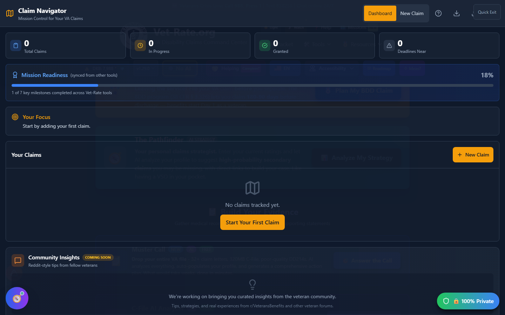

# Claim Navigator

Claim Navigator - internally nicknamed **"Mission Control"** - is a state-aware workflow dashboard for your VA claims. It tracks each claim through its phases, flags approaching deadlines, and shows evidence completeness so you always know exactly where you stand.

🆘 <strong>Veterans Crisis Line:</strong> Call 988, Press 1 | Text 838255 | Available 24/7

!!! info "No Home Page Card"
Unlike most Discovery Tools, Claim Navigator doesn't have a launch card on the home page. Open it from the header's **🛠️ Tools → Discover** menu, or the Ctrl/Cmd+K command palette.

---

## Opening Claim Navigator

Click the **🛠️ Tools** button in the header, then **🗺️ Claim Navigator** under the Discover section. You can also press **Ctrl/Cmd+K** and search for "Claim Navigator."

_Claim Navigator's dashboard view - toggle between Dashboard and New Claim (wizard) in the header._

---

## What Claim Navigator Tracks

Claim Navigator manages multiple claims at once and, for each one, tracks:

- **Claim type** - Original, Increase, Secondary, Supplemental, Higher-Level Review, Board Appeal, or Reopen
- **Current phase** - where the claim sits in the VA process
- **Evidence completeness** - a checklist of the evidence items relevant to that claim type
- **Deadlines** - most critically, the **1-year appeal window**, which is unforgiving if missed

## Starting a New Claim

Switch to the **New Claim** view to run a short decision-tree triage wizard. Answering a few questions about your situation routes you to the right claim type and the right next step, instead of guessing.

## Dashboard Analysis

The dashboard analyzes all your active claims together and surfaces:

- Which claims need attention first (urgency-ranked: Critical, High, Medium, Low)
- Evidence gaps across claims
- Deadlines coming up across your whole caseload, not just one claim

## Integration With Other Tools

Claim Navigator syncs bidirectionally with the app's "Big 3" evidence tracker (used elsewhere in the app) and with Intent to File milestones, so progress you log in one place is reflected in Claim Navigator's phase tracking automatically.

---

## Important Disclaimer

!!! warning "No Guarantee of Outcome"
This tool helps you organize and track your claims, but **using it does not guarantee any particular VA rating or claim outcome** - ratings and decisions are made solely by the VA.

    For personalized guidance, seek help from an accredited **Veterans Service Officer (VSO)** - free, no fees allowed - and/or a VA-accredited attorney or claims agent. Find one at [va.gov/ogc/apps/accreditation](https://www.va.gov/ogc/apps/accreditation/).
