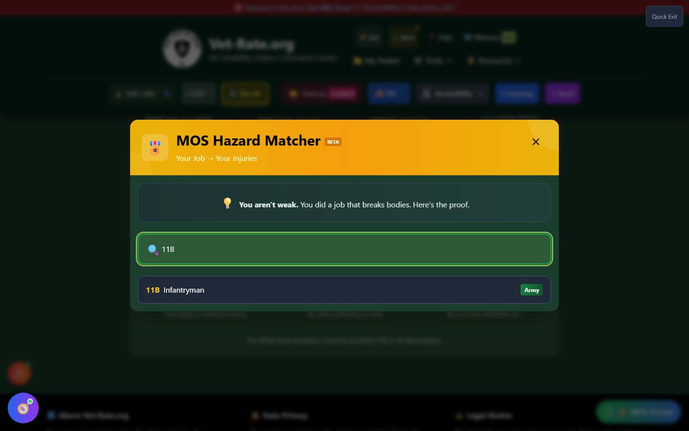
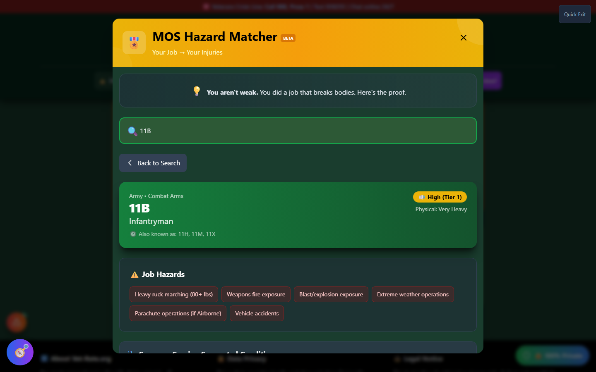

# MOS Hazard Matcher

MOS Hazard Matcher answers a simple question: **"what did my job do to my body?"** Enter your Military Occupational Specialty (Army MOS), Air Force Specialty Code (AFSC), Navy/Coast Guard Rating, or Marine MOS, and instantly see the injuries, hazards, and presumptive conditions associated with that job.

🆘 <strong>Veterans Crisis Line:</strong> Call 988, Press 1 | Text 838255 | Available 24/7

---

## Launching MOS Hazard Matcher

On the home page, scroll to the **💎 Shock & Awe Tools** section and click **"🔍 Match My MOS"**. It's also reachable from the header's **🛠️ Tools → Discover** menu.

## Searching for Your Code

Type your job code into the search field - the database covers modern codes (Army MOS, Air Force AFSC, Navy Ratings, Marine MOS, Coast Guard Ratings) as well as historical codes and their aliases, for veterans who served under an older designation system.

_Typing a code like "11B" surfaces matching results as you type._

Select your code from the results to open its full hazard profile.

_The 11B (Infantryman) profile - noise exposure tier, physical demand, job hazards, and prevalence-ranked common injuries._

---

## What a Profile Shows

Each MOS/AFSC/Rating profile includes:

- **Branch and category** (e.g. Army - Combat Arms)
- **Noise exposure tier** - how likely the job was to cause hearing damage
- **Physical demand level**
- **Job hazards** - specific exposures tied to that role (heavy ruck marching, blast exposure, repetitive lifting, etc.)
- **Common injuries**, each tagged with a **prevalence** rating (Very High, High, Moderate) so you can see which conditions are most strongly associated with that job

The idea behind the tool: if a condition shows up as "Very High" prevalence for your exact job, it's not a coincidence - the physical demands of that role are a documented, common cause.

---

## Using What You Find

MOS Hazard Matcher is a **discovery** tool - it points you toward conditions worth researching and claiming, not a filing mechanism itself. Once you spot a condition your job is known to cause:

- Use **Secondary Scout** or **Web of Conditions** to understand how it connects to conditions you already have
- Use **Nexus Builder** to build the supporting statement
- Add it to **My Packet** to track it alongside your other claims

---

## Important Disclaimer

!!! warning "Educational Tool"
MOS Hazard Matcher shows **documented associations** between military jobs and common injuries - it does not diagnose you or guarantee that any condition will be approved as service-connected.

    Before filing based on a hazard match, consult with a VA-accredited representative and, where required, obtain a **medical nexus opinion** from a qualified physician. Find a VSO at [va.gov/ogc/apps/accreditation](https://www.va.gov/ogc/apps/accreditation/).
