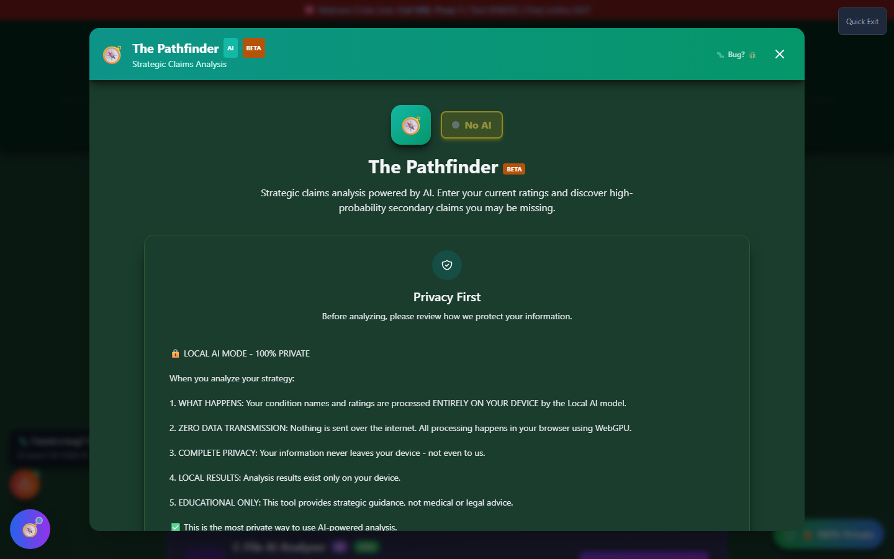
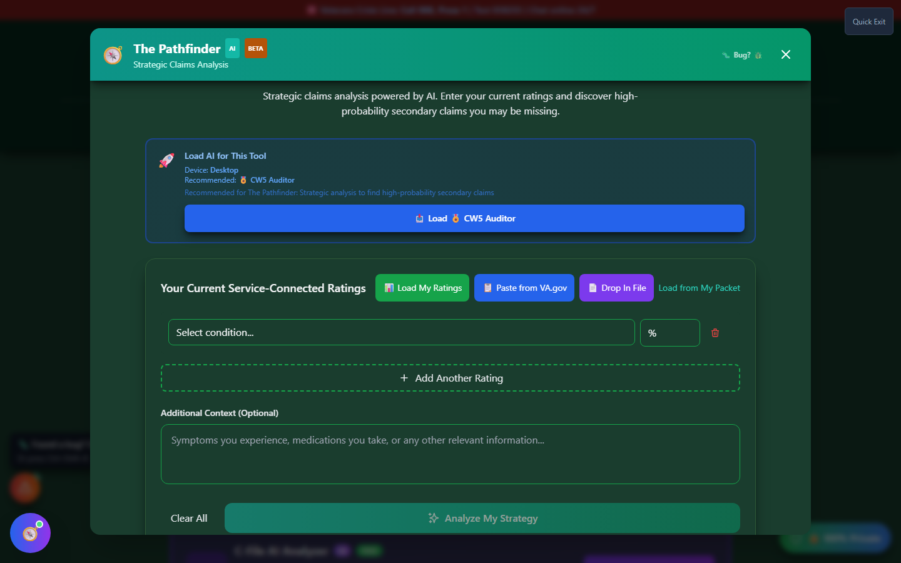
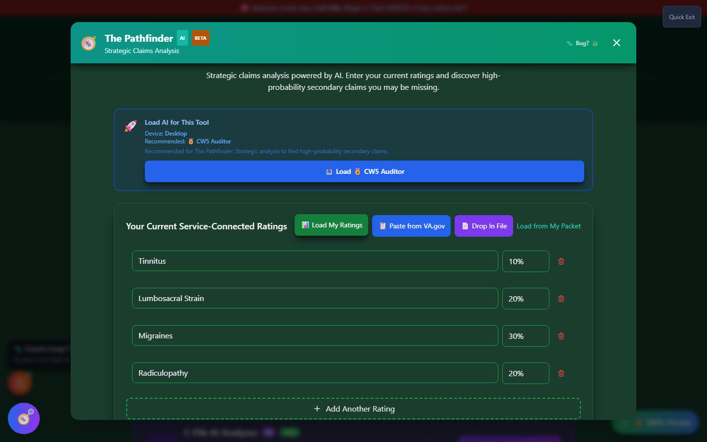

# The Pathfinder

The Pathfinder is Vet-Rate.org's **AI-powered claims strategist**. Enter your current (or target) ratings, and Pathfinder analyzes your profile to suggest **high-probability secondary claims** you may be missing - with direct hand-offs into the tools that help you build each one out.

🆘 <strong>Veterans Crisis Line:</strong> Call 988, Press 1 | Text 838255 | Available 24/7

!!! warning "No Guarantee of Outcome"
This tool does not guarantee any particular VA rating or claim outcome - ratings and decisions are made solely by the VA. Pathfinder's suggestions are a **starting point for research**, not a diagnosis or a legal opinion.

    Before filing based on a Pathfinder suggestion, always have a **VA-accredited Veterans Service Officer (VSO)** or an accredited attorney review your case - free, no fees allowed. Find one at [va.gov/ogc/apps/accreditation](https://www.va.gov/ogc/apps/accreditation/).

---

## Launching The Pathfinder

On the home page, scroll to the **🔍 Discover Your Claims** section and click **"📊 Analyze My Strategy"** on the teal Pathfinder banner. The Pathfinder also opens from the header's **🛠️ Tools → Discover** menu.

The Pathfinder opens as a large modal window rather than a full-screen tool, so you can reference it alongside the rest of the app. The first time you open it, a **Privacy First** screen explains exactly what happens to your data before you can continue.

_Local AI mode processes everything on your device - nothing is sent over the internet._

_The Pathfinder's ratings form - add your current ratings before running the analysis._

---

## Entering Your Ratings

Pathfinder needs to know what's already service-connected before it can suggest what might be missing:

<strong>Add a condition and rating</strong> - Type a condition name and select its current percentage

<strong>Repeat for every rated condition</strong> - The more complete your profile, the better the suggestions

<strong>Or load saved data</strong> - Use "Load My Ratings" to pull in ratings you've already saved to your profile, or paste ratings directly from VA.gov

<strong>Add optional context</strong> - Free-text notes about your service history help the AI reason about likely secondary connections

<strong>Run the analysis</strong> - Pathfinder requires a local or connected AI model to generate suggestions

_"Load My Ratings" pulls in every condition and percentage you've saved to your profile - the "Analyze" step still requires an AI model to be available._

!!! info "AI Required"
The Pathfinder's analysis step is AI-dependent. If no AI model is loaded, Pathfinder prompts you to open **AI Command Center** first. Once a model finishes loading, come back and run the analysis - the screens above show the tool in its pre-analysis, "ready to generate" state.

---

## What Pathfinder Looks At

Pathfinder's strategy engine reasons over:

- Your entered/loaded current ratings
- Known secondary-condition relationships (the same nexus logic behind Secondary Scout)
- Any additional context you provide about your service history

It then returns a ranked list of **proposed conditions**, each with a suggested primary connection (e.g. "Secondary to: Tinnitus") and a brief rationale.

---

## Taking Action on a Suggestion

Every suggestion Pathfinder returns comes with direct hand-offs to the tools that help you build the claim out - you don't have to re-type anything:

| Button              | Sends You To             | What Happens                                                           |
| ------------------- | ------------------------ | ---------------------------------------------------------------------- |
| **Build Nexus**     | Nexus Builder            | Opens with the proposed condition and its primary condition pre-filled |
| **Practice Exam**   | C&P Exam Simulator       | Opens so you can prep for the specific condition's exam questions      |
| **Secondary Scout** | Secondary Scout Launcher | Opens Secondary Scout for a deeper dive into secondary connections     |

Closing Pathfinder to follow a hand-off doesn't lose your ratings - reopen Pathfinder and your entered conditions are still there for the session.

---

## Privacy

Pathfinder can optionally send your entered conditions and context to an AI provider to generate suggestions. Only the non-PII condition/rating data you've entered is sent - never your name, SSN, or file number. See the AI Command Center for which provider (local or cloud) is active before running an analysis.
