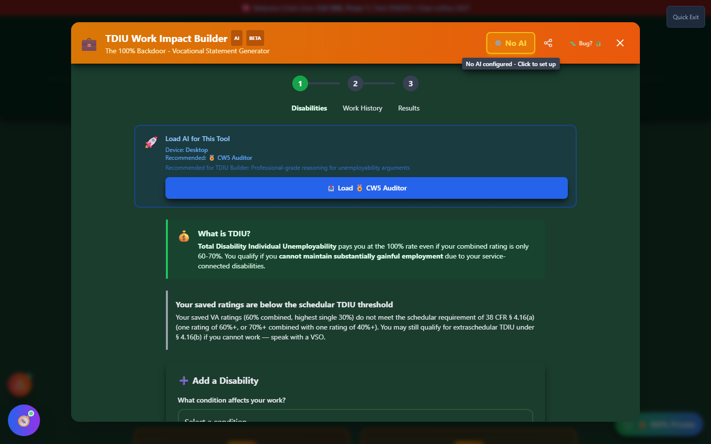

# TDIU Builder

TDIU Builder - "The 100% Backdoor" - helps you translate everyday symptoms into the **vocational-impact language** VA Form 21-8940 expects, for veterans pursuing **Total Disability Individual Unemployability**.

🆘 <strong>Veterans Crisis Line:</strong> Call 988, Press 1 | Text 838255 | Available 24/7

---

## What Is TDIU?

**Total Disability Individual Unemployability (TDIU)** pays you at the **100% rate** even if your combined schedular rating is only 60-70%, if your service-connected disabilities prevent you from maintaining **substantially gainful employment**.

!!! va-info "Schedular Eligibility (38 CFR § 4.16(a))"
You generally meet the schedular threshold for TDIU if:

    - **One condition rated 60% or higher**, OR
    - **Combined rating of 70% or higher**, with **at least one condition rated 40% or higher**

    Falling short of these numbers doesn't automatically disqualify you - **extraschedular TDIU** under § 4.16(b) may still apply if you genuinely cannot work, but it requires a stronger case and is decided differently. Speak with a VSO if you're in this position.

---

## Launching TDIU Builder

On the home page, scroll to the **💰 Maximize Your Rating** section and click **"📝 Build My TDIU Case"**, or open it from the header's **🛠️ Tools → Maximize Your Rating** menu.

TDIU Builder immediately checks your saved ratings against the schedular threshold and shows where you stand.

_TDIU Builder checks your saved ratings against 38 CFR § 4.16(a) automatically - here, a 60% combined rating with no single condition at 60%+ falls short of the schedular threshold._

!!! info "AI-Assisted, AI Optional"
TDIU Builder can use an AI model to help turn your symptom descriptions into formal vocational-impact language for Box 18. If no AI model is loaded, the tool prompts you to load one from **AI Command Center** first - the builder itself is fully usable without AI for organizing your disabilities and work history.

---

## Building Your Case: Three Steps

<strong>1. Disabilities</strong> - Select your service-connected conditions and describe how each one limits your ability to work (from a categorized list of common symptoms, or your own words)

<strong>2. Work History</strong> - Add your recent employment history and education, which VA Form 21-8940 requires

<strong>3. Results</strong> - Review the generated Box 18 statement and export it

## The Box 18 Statement

VA Form 21-8940's Box 18 asks you to explain, in your own words, why your disabilities prevent you from working. TDIU Builder turns the symptoms and limitations you select - things like "cannot sit more than 15-30 minutes" or "2+ prostrating migraine attacks per month" - into a formal written argument you can copy directly into that box, or export as a PDF/Word document to attach.

---

## Important Disclaimer

!!! warning "No Guarantee of Outcome"
TDIU Builder helps you organize evidence and draft language for VA Form 21-8940, but **using it does not guarantee any particular VA rating or claim outcome** - TDIU eligibility and decisions are made solely by the VA.

    For personalized guidance, seek help from an accredited **Veterans Service Officer (VSO)** - free, no fees allowed - and/or a VA-accredited attorney or claims agent. Find one at [va.gov/ogc/apps/accreditation](https://www.va.gov/ogc/apps/accreditation/).
