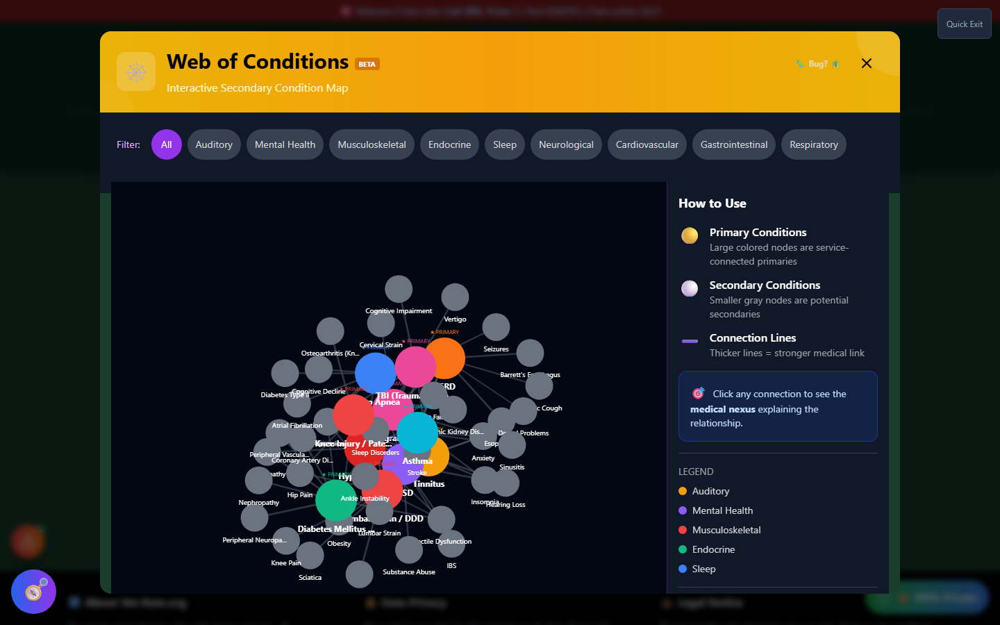
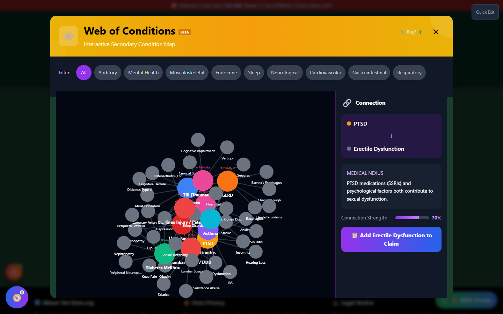

# Web of Conditions

Web of Conditions is an interactive, **"Minority Report"-style** force-directed graph of how VA-rated conditions connect to each other medically. Instead of reading a list, you click a condition and watch its secondary connections physically orbit into view.

🆘 <strong>Veterans Crisis Line:</strong> Call 988, Press 1 | Text 838255 | Available 24/7

---

## Launching Web of Conditions

On the home page, scroll to the **💎 Shock & Awe Tools** section and click **"🗺️ Explore The Web"**. It's also reachable from the header's **🛠️ Tools → Discover** menu.

_The full graph on load - each colored cluster is a category (Mental Health, Musculoskeletal, Auditory, etc.), with primary conditions linked to their known secondaries._

---

## How It Works

The graph runs a live physics simulation:

- **Nodes** are conditions; node color indicates category
- **Links** are nexus relationships - a line between two nodes means one condition is a recognized secondary of the other
- Nodes gently repel each other and settle into a readable layout automatically

## Exploring a Condition

Click any node to select it. The panel that appears shows:

- The condition's **category**
- Every **secondary condition** connected to it
- Click a **link** (the line between two nodes) instead of a node to see the specific **nexus explanation** - the medical reasoning behind that connection

_Clicking a connection line (here, PTSD → Erectile Dysfunction) opens a detail panel with the medical nexus explanation and a direct "Add to Claim" action._

## Filtering by Category

Use the category filter to narrow the graph to a single body system (Mental Health, Musculoskeletal, Auditory, Neurological, etc.) when the full graph feels too dense.

---

## Why This Matters

The same conditions that show up in your own claim profile - for example, if you're already service-connected for Tinnitus or PTSD - are usually the most richly connected nodes in the graph. Exploring around your own conditions is the fastest way to spot secondary claims you haven't filed yet.

!!! tip "Save What You Find"
Web of Conditions is for discovery and understanding, not filing. Once you spot a promising secondary connection, use the connection panel's **"Add to Claim"** button, or head to **Secondary Scout** or **Nexus Builder** to build the actual claim and save it to My Packet.

---

## Important Disclaimer

!!! warning "Educational Tool"
Web of Conditions visualizes **educational** nexus relationships based on 38 CFR § 3.310 principles. It does not guarantee any particular condition will be approved as secondary to another.

    Before filing a secondary claim, consult with a VA-accredited representative, discuss with a medical professional, and obtain a **medical nexus opinion** where required. Find a VSO at [va.gov/ogc/apps/accreditation](https://www.va.gov/ogc/apps/accreditation/).
