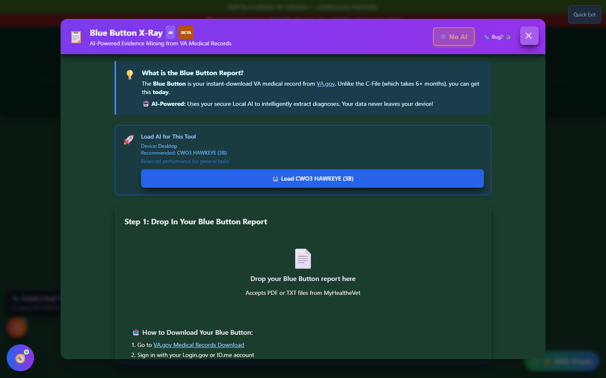
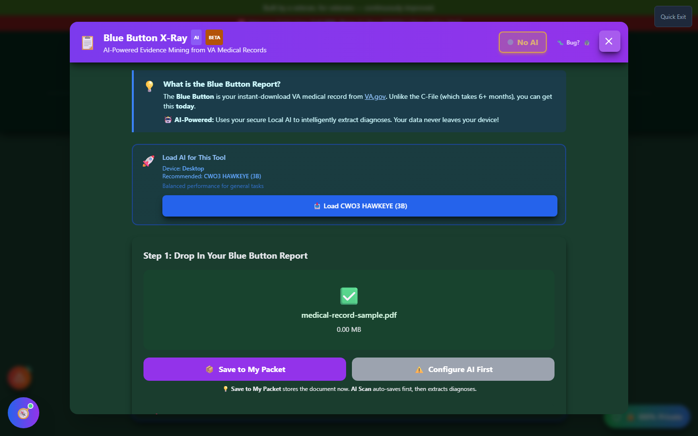

# Blue Button X-Ray

Blue Button X-Ray mines your **VA Blue Button medical record export** for diagnoses that were documented by a doctor but never turned into a claim.

🆘 <strong>Veterans Crisis Line:</strong> Call 988, Press 1 | Text 838255 | Available 24/7

---

## What is a Blue Button Report?

The **Blue Button** report is your instant-download VA medical record from [VA.gov](https://www.va.gov/records/get-military-service-records/) - unlike a full C-File, which can take six or more months to arrive by request, you can download your Blue Button report **today** through MyHealtheVet or the VA.gov medical records section.

Because it's a medical record rather than a claims file, Blue Button X-Ray is tuned specifically for finding **unclaimed diagnoses** hiding in your problem lists and visit notes - conditions your doctor has already documented that you haven't filed a claim for yet.

---

## Launching Blue Button X-Ray

Click **"🔬 Scan My Records"** on the home page, in the Blue Button X-Ray card under **Build Your Evidence**.

_The tool explains the Blue Button report and offers to load a recommended local AI model for extraction._

---

## Step 1: Drop In Your Report

Blue Button X-Ray accepts PDF or TXT files exported from MyHealtheVet. Drop your report onto the upload zone, or click to browse.

_Once a file is loaded, you can save it straight to My Packet, or configure AI first to auto-extract diagnoses._

---

## Saving vs. AI Scanning

Once your report is loaded you have two options:

- **Save to My Packet** - stores the document in your packet immediately, with no AI required
- **Configure AI first** - loads a local (on-device) or cloud AI model to automatically extract diagnoses from the report before saving; the recommended local model for this tool is a lightweight, general-purpose model since Blue Button reports are typically shorter than a full C-File

### How to Download Your Blue Button Report

1. Go to the [VA.gov Medical Records Download page](https://www.va.gov/records/get-military-service-records/)
2. Sign in with your Login.gov or ID.me account
3. Choose a **VA Health Summary** or **Continuity of Care Document** export
4. Download the PDF or TXT file and upload it here

---

## Important Disclaimer

!!! warning "No Guarantee of Outcome"
Blue Button X-Ray helps you organize evidence and paperwork, but **using it does not guarantee any particular outcome** on your VA claim - ratings and decisions are made solely by the VA. Always have a Veterans Service Officer (VSO) or VA-accredited attorney [review your evidence before filing](https://www.va.gov/ogc/apps/accreditation/). AI-extracted diagnoses can be incomplete or inaccurate - always cross-check against your actual medical record before filing.
