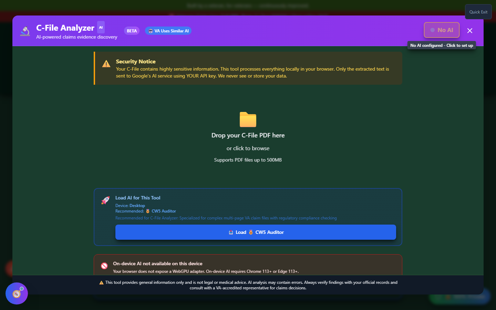
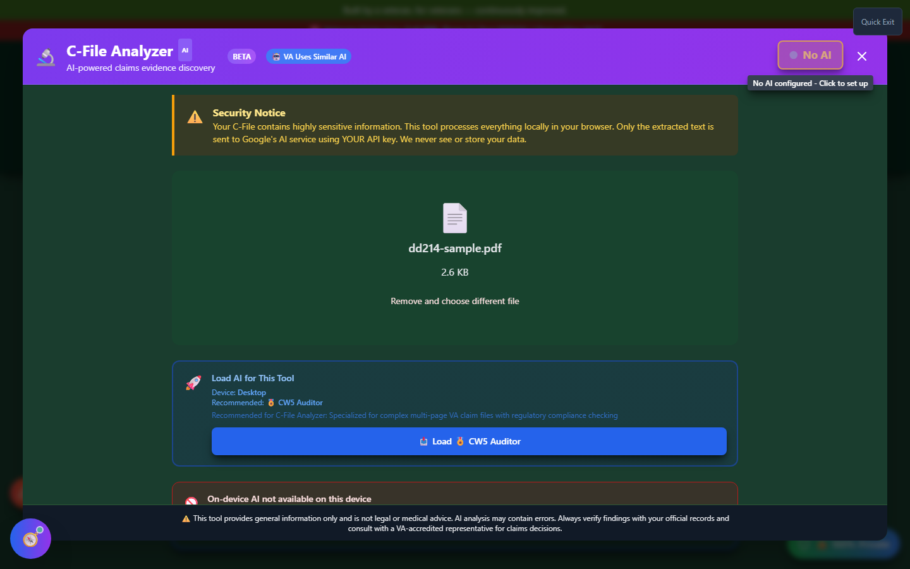

# C-File AI Analyzer

The C-File AI Analyzer mines your full **Claims File (C-File)** - the VA's complete record of your military service and claims history - for the evidence that actually wins claims: in-service events, current diagnoses, and the medical nexus connecting them.

🆘 <strong>Veterans Crisis Line:</strong> Call 988, Press 1 | Text 838255 | Available 24/7

---

## What is a C-File?

Your C-File is the comprehensive collection of everything the VA has on you: Service Treatment Records, personnel records, private and VA medical records, prior decisions, C&P exam results, and correspondence. It can run from a few dozen pages to several thousand. You can request it from [VA.gov](https://www.va.gov/records/get-military-service-records/) or via a FOIA request.

---

## Launching the C-File Analyzer

Click **"🚀 Analyze My C-File"** on the home page, in the C-File AI Analyzer card under **Build Your Evidence**.

_The analyzer opens with a security notice explaining that only extracted text - never the PDF itself - is ever sent to an AI provider._

Drop your C-File PDF (up to 500MB) onto the drop zone, or click to browse.

---

## Loading AI

Once your PDF is loaded, you'll see a **"Load AI for This Tool"** panel recommending a model suited to complex, multi-page VA claim files. If your browser doesn't support on-device AI (no WebGPU adapter), you can still analyze using a cloud AI provider with your own API key - only the extracted text is sent, never the original PDF.

_A document loaded and ready - this is the state you'll see before choosing to load a local or cloud AI model._

---

## Understanding the Results Tabs

Once analysis completes, results appear across several tabs:

| Tab                 | What it shows                                                                            |
| ------------------- | ---------------------------------------------------------------------------------------- |
| 🎯 Potential Claims | Conditions found in your file, each rated by claim likelihood                            |
| 📅 Timeline         | A chronological view of in-service events, diagnoses, and treatments with page citations |
| ☢️ Exposures        | Toxic or hazardous exposures identified, useful for PACT Act presumptive claims          |
| 🧠 Mental Health    | Documented mental health indicators and stressors                                        |
| ✅ Action Items     | Prioritized next steps based on what the analysis found                                  |

### Claims Cards

The **Potential Claims** tab renders each finding as an expandable card showing the condition, supporting evidence, and how strong the nexus is - similar in spirit to Secondary Scout's suggestion cards, but sourced directly from your own C-File rather than a general medical database.

### Timeline

The **Timeline** tab lays out every dated event the AI found - injuries, diagnoses, treatments, exposures - in chronological order, each with a page citation back into your original PDF so you can verify it yourself.

### Semantic Search

Separately from the AI's summarized tabs, C-File Analyzer builds a **semantic search index** over your document as it's processed. This lets you search your C-File for a topic or phrase and find relevant passages even if the AI's summary tabs didn't call them out directly - useful for double-checking that nothing was missed. Open it from the "Open search" control that appears once your document has been indexed.

---

## Important Disclaimer

!!! warning "No Guarantee of Outcome"
The C-File Analyzer helps you organize evidence and paperwork, but **using it does not guarantee any particular outcome** on your VA claim - ratings and decisions are made solely by the VA. Always have a Veterans Service Officer (VSO) or VA-accredited attorney [review your evidence before filing](https://www.va.gov/ogc/apps/accreditation/). AI analysis can miss evidence or misread handwritten and low-quality scanned pages - always verify findings against your original C-File before acting on them.
