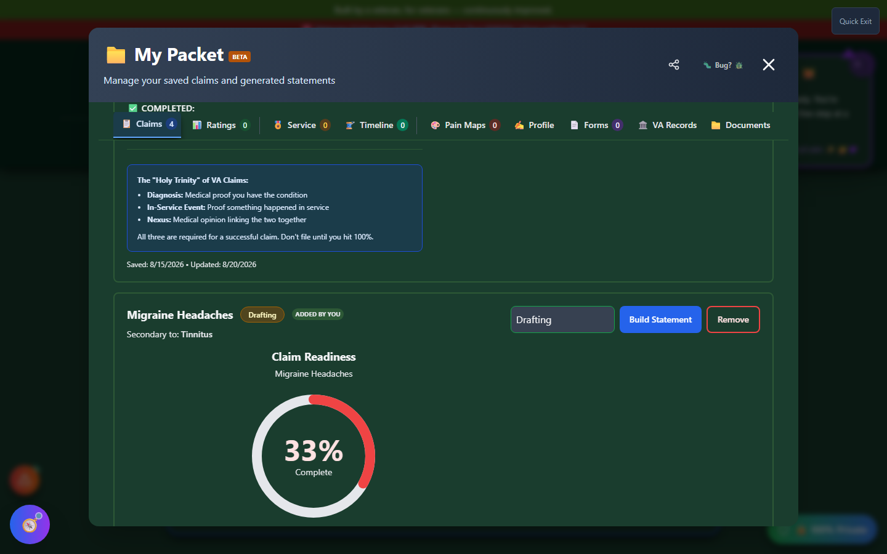

# Claim Evidence Upload

Claim Evidence Upload lets you attach a specific piece of evidence - a DBQ, a nexus letter, a buddy statement, medical or service records - directly to one of your saved claims in **My Packet**, and submit it to the VA through your connected VA.gov account.

🆘 <strong>Veterans Crisis Line:</strong> Call 988, Press 1 | Text 838255 | Available 24/7

---

## Where to Find It

Claim Evidence Upload lives inside **My Packet's Claims tab**, attached to each individual claim. It isn't a standalone tool on the home page - it's reached by clicking **"Upload Evidence to VA"** on a specific claim entry.

_Each claim card in My Packet shows a status dropdown and action buttons - Upload Evidence to VA appears here once a claim is linked to VA.gov._

---

## Supported Document Types

When available, Claim Evidence Upload lets you choose a document type before uploading, so the VA files it correctly:

| Type                                    | Description                                                |
| --------------------------------------- | ---------------------------------------------------------- |
| DBQ (Disability Benefits Questionnaire) | Official VA medical form filled out by your private doctor |
| Nexus Letter / IMO                      | Independent medical opinion linking a condition to service |
| Buddy Statement / Lay Statement         | Witness statements from fellow service members or family   |
| Medical Records                         | Private or military treatment records                      |
| Service Records                         | DD-214, personnel records, deployment orders               |
| Other Evidence                          | Any other supporting documentation                         |

Files must be PDFs, up to 25MB (the VA's own upload limit).

---

## Requires a Connected VA.gov Claim

Uploading directly to the VA requires two things: the claim in My Packet must be linked to a real **VA Claim ID**, and you must be signed in with a **VA.gov account** so the upload can be submitted through VA's claims API on your behalf.

!!! va-info "VA.gov sign-in status"
Direct VA.gov claim upload depends on Vet-Rate.org's VA API integration being enabled and configured for your account. If you don't see an "Upload Evidence to VA" button on a claim, it's because that claim isn't yet linked to a VA Claim ID, VA.gov sign-in isn't currently available in your build of the app, or both. Check **Settings** for the current status of VA.gov integration.

Until a claim is linked and you're signed in, you can still track and organize the same evidence types as ordinary attachments elsewhere in My Packet's Documents tab - you just won't get the one-click "send straight to VA" step this tool provides once it's fully connected.

---

## Important Disclaimer

!!! warning "No Guarantee of Outcome"
Claim Evidence Upload helps you organize evidence and paperwork, but **using it does not guarantee any particular outcome** on your VA claim - ratings and decisions are made solely by the VA. Always have a Veterans Service Officer (VSO) or VA-accredited attorney [review your evidence before filing](https://www.va.gov/ogc/apps/accreditation/).
