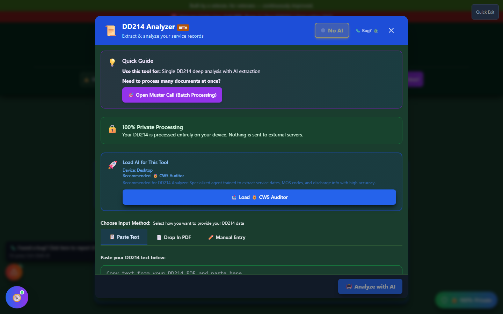
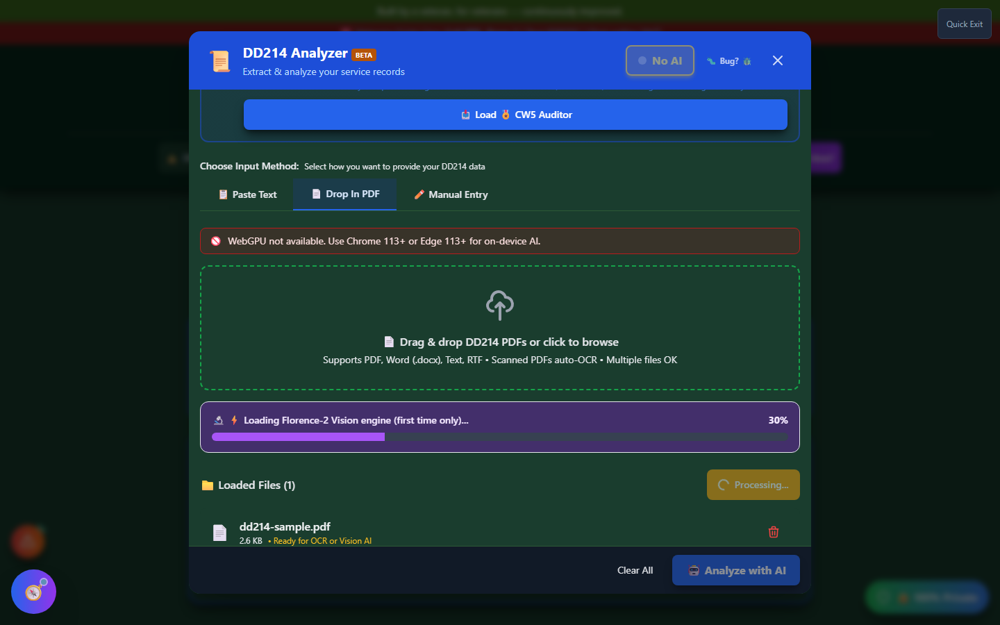
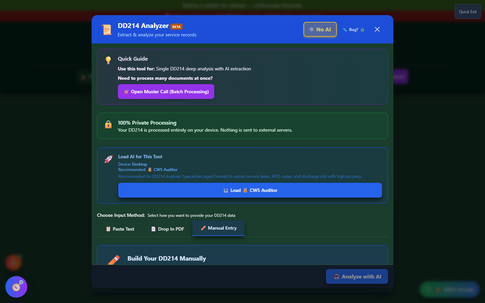
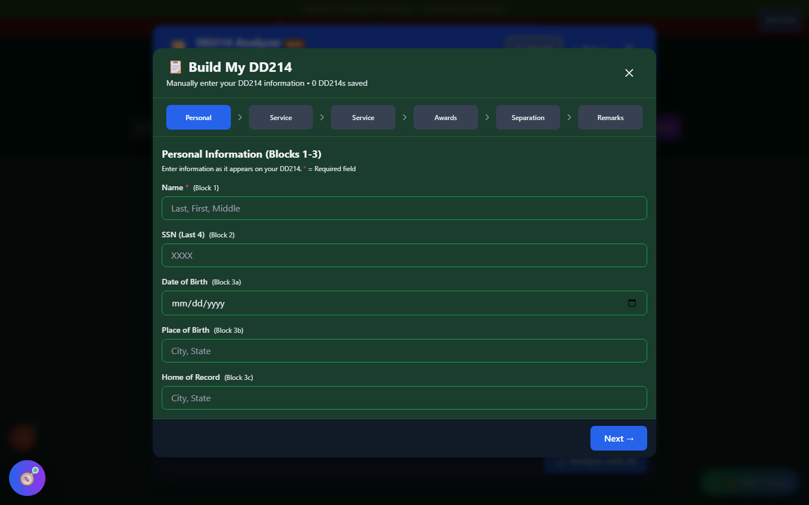

# DD214 Analyzer &amp; Form Builder

Your DD214 (Certificate of Release or Discharge from Active Duty) is the foundation of your service record - branch, dates of service, MOS, awards, and character of service all live on it. The DD214 Analyzer extracts that data automatically from a digital copy, and the companion **Form Builder** lets you enter it manually block-by-block if you don't have one.

🆘 <strong>Veterans Crisis Line:</strong> Call 988, Press 1 | Text 838255 | Available 24/7

---

## Launching the DD214 Analyzer

Open it from the DD214 card on the home page, or from Muster Call's "batch processing" shortcut if you have multiple discharge documents (DD214, NGB 22, DD256/257) to process at once.

_Three ways in: Paste Text, Drop In PDF, or Manual Entry. A Quick Guide points you to Muster Call if you have several documents to process together._

---

## Choose Your Input Method

### Paste Text

If you have your DD214 as selectable text (not a scanned image), copy and paste it directly into the text box - this works with no AI and no file upload at all.

### Drop In PDF

Upload a PDF or image copy of your DD214. As soon as it's added, the analyzer automatically starts extracting text. Scanned service records go through the **on-device OCR ensemble** first, because that is what reads a real scanned DD214 most accurately - on genuine scans it reads the form reliably where the vision model produced confident-looking but invented text. The vision model is kept as a fallback for documents OCR reads poorly, and its output has to clear a field-level confidence bar before it's allowed to replace the OCR text.

_Extraction runs entirely on your device. Both the OCR engine and the vision fallback are local - nothing about your DD214 leaves the browser._

!!! tip "Scans read letters as digits"
OCR routinely reads the letter **O** as a zero, so `HONORABLE` arrives as `H0N0RABLE` and `COMBAT ACTION BADGE` as `C0MBAT ACTI0N BADGE`. The analyzer corrects this before matching fields, which is why an award can be recognised even when the raw text looks mangled. It's also why you should still check the extracted fields against your original.

Once extraction finishes, click **"Analyze with AI"** to have a loaded AI model turn the raw extracted text into structured fields (name, branch, dates, MOS, awards, character of service, and more). Everything happens locally except any text you deliberately choose to send to a configured cloud AI provider.

### Manual Entry

If you don't have a clean copy of your DD214, switch to the **Manual Entry** tab to build one from scratch using the **DD214 Form Builder**.

_Manual Entry explains what the Form Builder offers before you open it: all DD214 blocks covered, multiple DD214s supported, data stays private, and guided form labels._

---

## The DD214 Form Builder

Clicking **"📝 Open Form Builder"** opens a guided, multi-step form covering every block of the DD214 in order:

_Steps run Personal → Service → Service → Awards → Separation → Remarks, each pre-labeled with its corresponding DD214 block number (e.g., "Name (Block 1)") so you can copy from a physical or low-quality copy field by field._

This is the right tool when your only copy of your DD214 is a blurry photo, a fax, or handwritten notes you're transcribing from memory or a paper original - you enter the data directly instead of relying on OCR to read it.

---

## Awards and Combat Service

Block 13 awards are matched against a master list of decorations, so `CAB` on one document and `COMBAT ACTION BADGE` spelled out on another are recognised as the same award and recorded once.

Any decoration on VA's combat-participation list is flagged separately, because it changes the evidence VA requires from you. See **[Combat Service Determination](combat-service.md)** for the full list, what it does for your claim, and what deliberately doesn't count.

---

## Multi-Document Cumulative Logic

If you have more than one discharge document (for example, an original DD214 plus a later DD215 correction, or documents from multiple periods of service), the analyzer applies a "Master Record" protocol that combines them without double-counting awards or service time.

Combat status is **sticky** across that set: only one page of a multi-page DD214 usually carries Block 13, so a page that lists no decorations never erases a finding another page established.

---

## Important Disclaimer

!!! warning "No Guarantee of Outcome"
The DD214 Analyzer and Form Builder help you organize evidence and paperwork, but **using them does not guarantee any particular outcome** on your VA claim - ratings and decisions are made solely by the VA. Always have a Veterans Service Officer (VSO) or VA-accredited attorney [review your evidence before filing](https://www.va.gov/ogc/apps/accreditation/). AI-extracted service data can contain errors, especially from low-quality scans - always verify the Service tab in My Packet against your original DD214.
