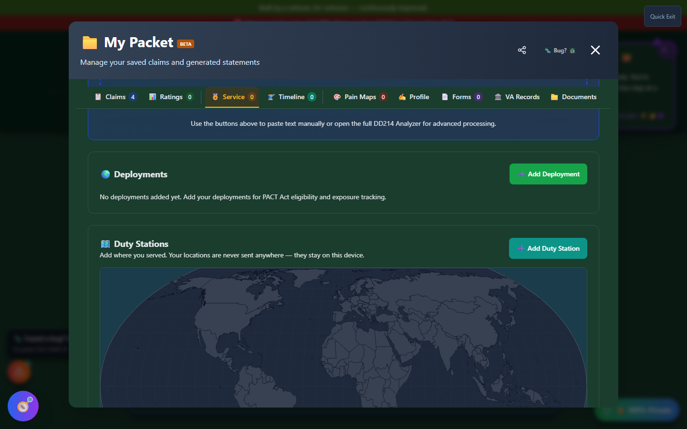

# Duty Stations

Duty Stations is a mapping tool built into **My Packet's Service tab** that tracks everywhere you were stationed during your military career - useful for PACT Act eligibility, environmental exposure tracking, and simply having a complete record of your service history in one place.

🆘 <strong>Veterans Crisis Line:</strong> Call 988, Press 1 | Text 838255 | Available 24/7

---

## Finding Duty Stations

Duty Stations isn't a standalone tool you launch from the home page - it lives inside **My Packet**. Open My Packet, switch to the **Service** tab, and scroll past Deployments to find it, right above your Awards.

_Duty Stations sits between Deployments and Awards on the Service tab. The world map plots every station you add._

---

## Adding a Duty Station

Click **"+ Add Duty Station"** to open the entry form. You can specify:

- **Linked service period** - which period of service this duty station belongs to, if you have more than one
- **Station name** - the base, post, or installation name
- **Location** - pick a country from a dropdown, click directly on the map, or enter latitude/longitude by hand; all three methods resolve to the same country automatically
- **Start and end dates**
- **Notes** - anything else worth recording about that assignment

Once saved, the station appears both in the list and as a marker on the world map.

---

## Why This Matters for PACT Act Claims

The PACT Act expanded presumptive service connection for veterans exposed to burn pits, Agent Orange, and other environmental hazards based on **where and when** you served. A complete, dated list of duty stations makes it much easier to check your own eligibility (see the **PACT Act Navigator** tool) and to back up an exposure-based claim with a clear service timeline.

---

## Privacy

!!! va-info "Your locations never leave your device"
Duty Station data - names, dates, and coordinates - is stored entirely in your browser's local storage, the same as the rest of My Packet. It is never sent to a Vet-Rate.org server, and is only included in an AI request if you explicitly use an AI-powered tool (like Muster Call or Pathfinder) that pulls from your service history.
