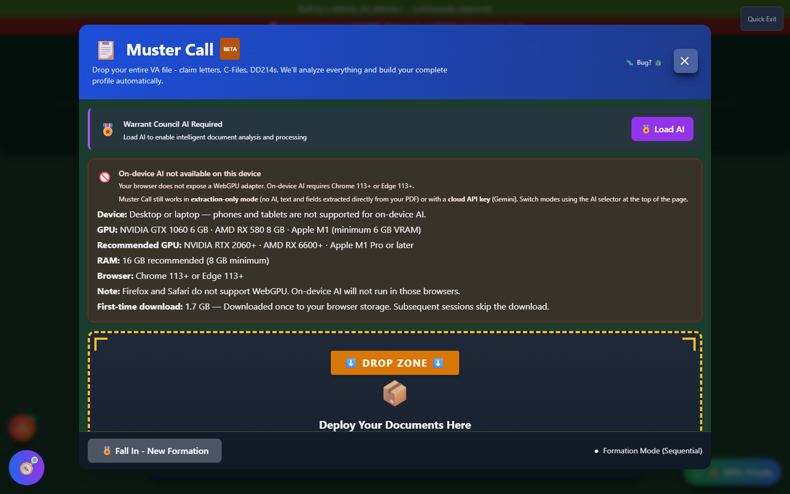
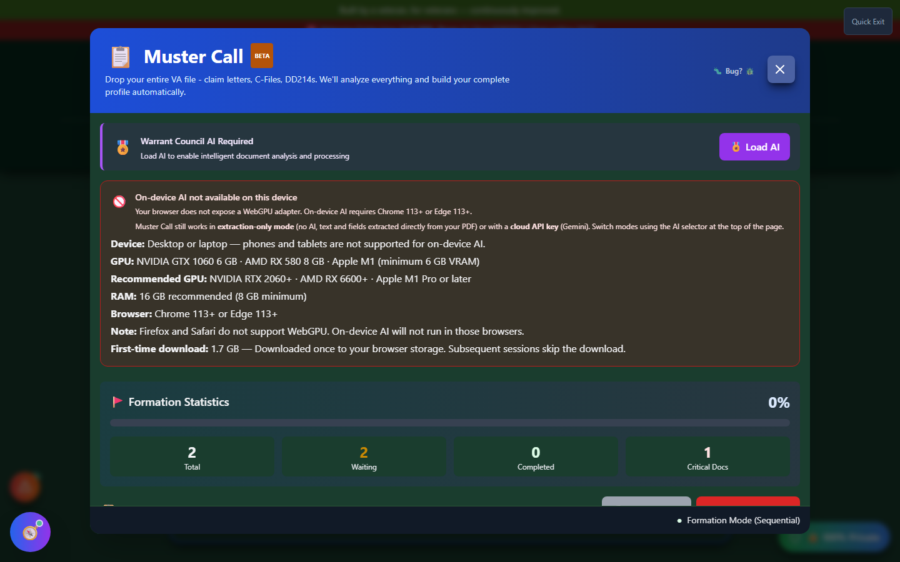

# Muster Call

Muster Call is Vet-Rate.org's **main document-ingestion pipeline**. Instead of manually re-typing information from every DD214, medical record, and decision letter you own, you drop the whole pile in at once and Muster Call walks each document through extraction, review, and save - one at a time, in order.

🆘 <strong>Veterans Crisis Line:</strong> Call 988, Press 1 | Text 838255 | Available 24/7

---

## Every Document Goes Through Muster Call

Muster Call isn't just one tool among many - it's the same pipeline the app uses whenever documents need bulk processing. DD214s, medical records, decision letters, and other VA correspondence are all handled through this one "Formation" workflow, so you only need to learn it once. The DD214 Analyzer's own upload tab, for example, routes single files through this same extraction engine.

---

## Launching Muster Call

Click the **"🎯 Answer the Call"** button in the Muster Call card on the home page (in the **Build Your Evidence** section), or dispatch it from anywhere in the app via the header **Tools** menu.

_The home page in its default state, with the Muster Call card ready to launch._

---

## Step 1: Drop Your Documents

Drag and drop files onto the Muster Call modal, or click to browse. You can queue up multiple documents at once - the wizard processes them one at a time in "Formation" order, and you can drag to reorder the queue before starting.

---

## Step 2: Load AI to Start Formation

Muster Call's extraction step is AI-driven - the **Start Formation** button stays disabled until a local or cloud AI model is loaded for the tool. If your browser doesn't expose a WebGPU adapter (needed for on-device AI), you'll see a notice explaining that on-device AI isn't available, along with the option to use extraction-only mode or a cloud API key instead.

_Two documents queued in Formation Statistics; the Start Formation button won't activate until AI is loaded via the "Load AI" button or the header AI selector._

!!! tip "No local AI available?"
Local, on-device AI requires a desktop or laptop with a WebGPU-capable browser (Chrome 113+ or Edge 113+) and a supported GPU. If your device doesn't qualify, you can still load a cloud AI model with your own API key from the AI Command Center, accessible from the "No AI" badge in the header.

---

## Step 3: Per-Document Review (Intelligence Briefing)

Once AI is loaded and Formation starts, each document is processed one at a time:

1. **Extraction** - the document's text is pulled out (using its PDF text layer, or on-device OCR/vision analysis for scanned pages)
2. **Classification and analysis** - the AI determines what kind of document it is and extracts structured fields
3. **Intelligence Briefing** - a per-document review modal shows every extracted field so you can verify, correct, or skip it before it's saved

You can skip any document in the queue, and Muster Call tracks waiting, completed, skipped, and error counts as it works through the formation.

---

## Step 4: Verify & Save (Final Intelligence Briefing)

After every document in the queue has been processed, Muster Call opens a final **Intelligence Briefing** summary covering everything extracted across the whole batch, organized into five sections:

| Section            | Covers                                                   |
| ------------------ | -------------------------------------------------------- |
| 👤 Personal Info   | Name, contact details, and other identifying information |
| 🎖️ Service History | Branch, dates of service, duty stations, and deployments |
| 🏥 Conditions      | Diagnoses and conditions found across your documents     |
| 📋 Medical Records | Extracted medical record details                         |
| 📄 Documents       | The list of documents processed in this session          |

This screen also flags **discrepancies** - for example, if two documents disagree on a date or a name - so you can resolve them before anything is committed. Confirming the briefing saves the reconciled data into **My Packet**.

---

## Important Disclaimer

!!! warning "No Guarantee of Outcome"
Muster Call helps you organize evidence and paperwork, but **using it does not guarantee any particular outcome** on your VA claim - ratings and decisions are made solely by the VA. Always have a Veterans Service Officer (VSO) or VA-accredited attorney [review your evidence before filing](https://www.va.gov/ogc/apps/accreditation/). AI-extracted data can contain mistakes - always verify what Muster Call pulled from your documents against the originals before relying on it.
