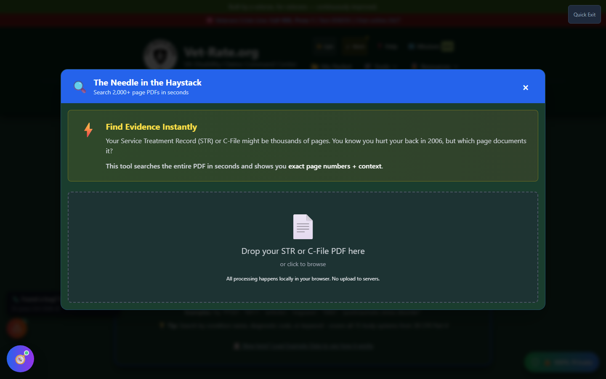
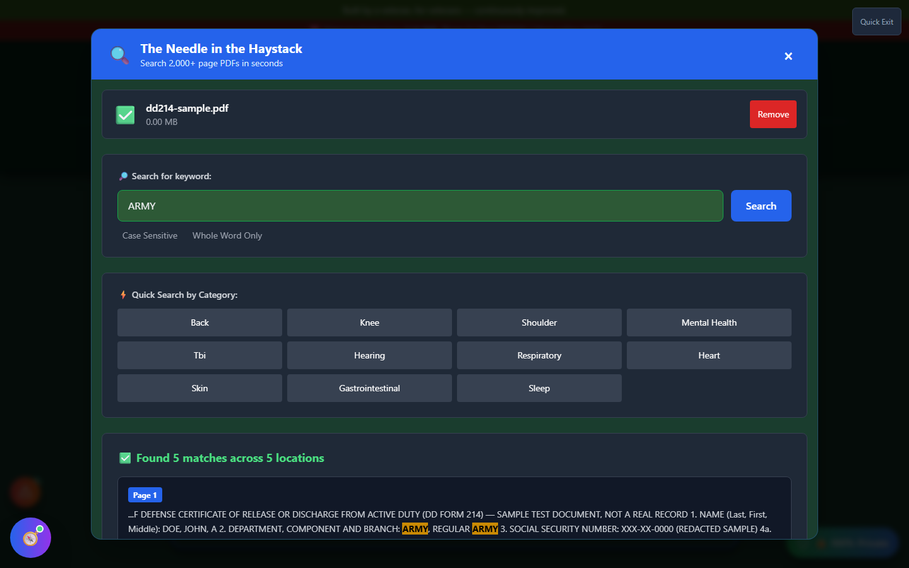

# Record Search

Record Search - internally nicknamed **"The Needle in the Haystack"** - instantly finds every mention of a keyword across a 2,000+ page PDF, so you don't have to scroll through your entire Service Treatment Record by hand to find the page that documents your back injury.

🆘 <strong>Veterans Crisis Line:</strong> Call 988, Press 1 | Text 838255 | Available 24/7

---

## Finding Record Search

Unlike most Evidence Tools, Record Search has **no card on the home page**. Reach it from:

- The header **🛠️ Tools** dropdown, under the "Build Evidence" section
- The command palette (press <kbd>Ctrl</kbd>+<kbd>K</kbd> or <kbd>Cmd</kbd>+<kbd>K</kbd> and search for "Record Search")

_Drop a PDF onto the search modal, then search for a keyword or pick from Quick Search categories like Back, Knee, Mental Health, or Sleep._

---

## How It Works

1. **Drop your PDF** - a Service Treatment Record, C-File, or any other large document
2. **Search for a keyword** - type a term directly, or click a Quick Search category button for common condition-related terms
3. **Toggle Case Sensitive or Whole Word Only** if you need more precise matching
4. **Review the results** - every match is shown with its page number and surrounding context, with your search term highlighted

_Searching "ARMY" in a sample document found 5 matches across 5 locations, each tagged with its page number and highlighted in context._

---

## No AI Required

Record Search runs entirely on client-side PDF text matching - there's no AI model to load, no download, and no data ever leaves your browser. It's one of the fastest tools in the toolkit to get useful results from.

!!! tip "Use it before Muster Call or the C-File Analyzer"
If you already know roughly what you're looking for (a specific injury, a diagnosis, a duty station), a quick Record Search can save you time versus running a full AI analysis - jump straight to the page and read it yourself.
