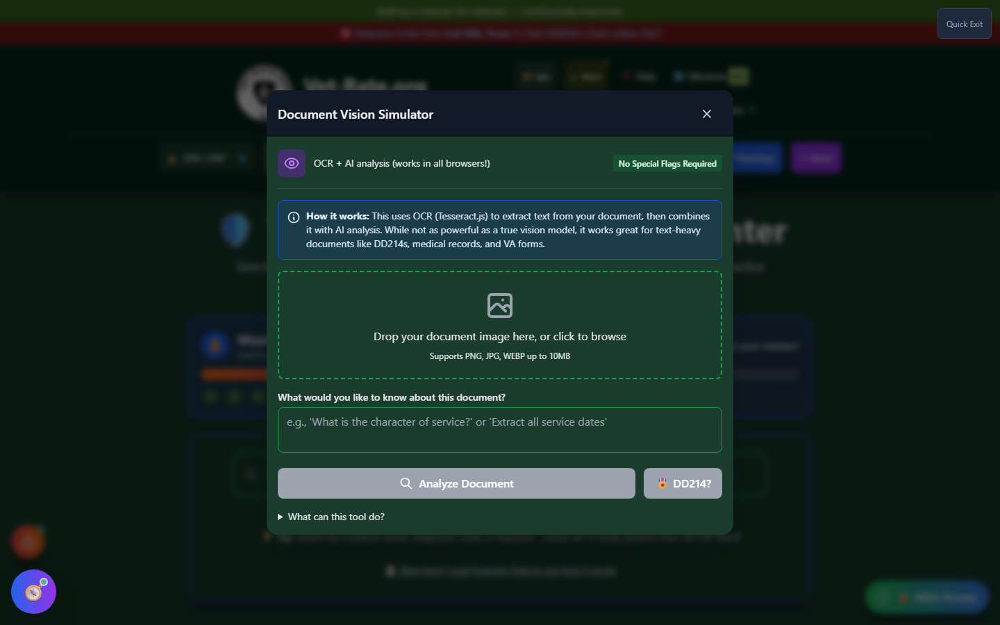

# Vision Simulator

Vision Simulator is an **automatic fallback screen**, not a tool you launch on purpose. It appears when a document-analysis tool tries to load a vision-capable local AI model and that model fails to load - giving you an OCR-based alternative instead of a dead end.

🆘 <strong>Veterans Crisis Line:</strong> Call 988, Press 1 | Text 838255 | Available 24/7

---

## Why You Might See This

If you don't see a way to open Vision Simulator from a button or menu anywhere in the app, that's expected - it isn't meant to be reached directly. It's wired to fire automatically from the **AI Command Center / Local AI Panel** whenever a vision-capable model fails to initialize, so you still have a working path to analyze a document instead of hitting an error with no recovery option.

_"OCR + AI analysis (works in all browsers!)" - Vision Simulator is the no-special-requirements fallback when a true vision model can't load._

---

## How It Works

Instead of a full vision-language model reading the document image directly, Vision Simulator combines two lighter-weight pieces:

1. **OCR (Tesseract.js)** extracts the text from your document image
2. **AI analysis** is then run on that extracted text, the same way it would be for any other text-based document

The tool explains this trade-off directly: _"While not as powerful as a true vision model, it works great for text-heavy documents like DD214s, medical records, and VA forms."_

---

## Using It

1. Drop a document image (PNG, JPG, or WEBP, up to 10MB) onto the panel, or click to browse
2. Optionally type a specific question - for example, _"What is the character of service?"_ or _"Extract all service dates"_
3. Click **Analyze Document**, or use the quick **DD214?** shortcut if that's what you're analyzing

---

## Important Disclaimer

!!! warning "No Guarantee of Outcome"
Vision Simulator helps you organize evidence and paperwork, but **using it does not guarantee any particular outcome** on your VA claim - ratings and decisions are made solely by the VA. Always have a Veterans Service Officer (VSO) or VA-accredited attorney [review your evidence before filing](https://www.va.gov/ogc/apps/accreditation/). OCR-based analysis is less accurate than a true vision model, especially on handwritten or low-quality scans - always verify extracted text against your original document.
