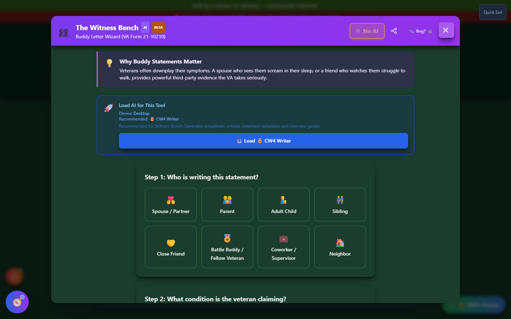
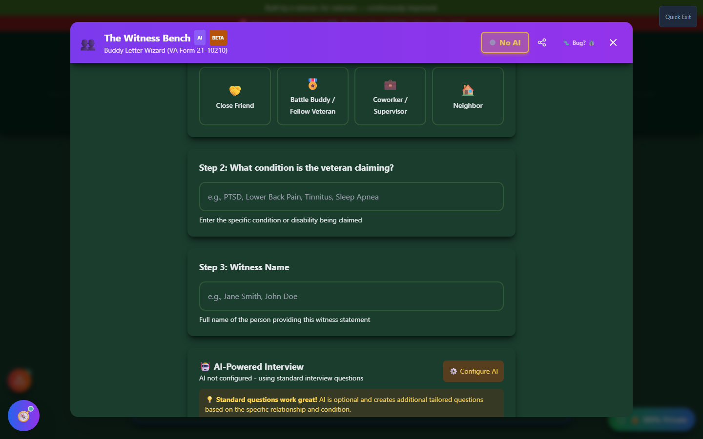
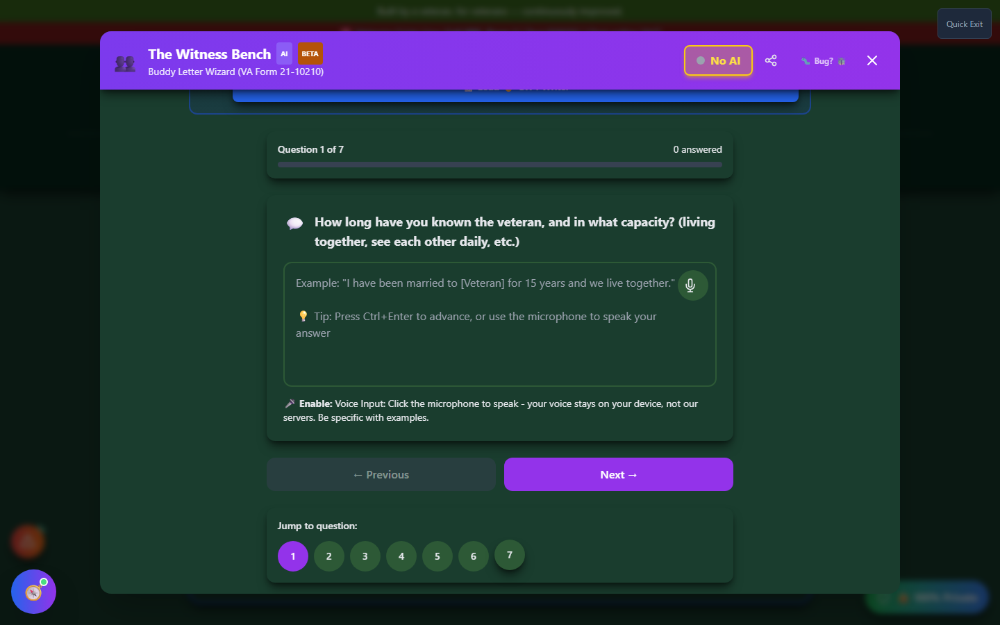

# Witness Bench

Witness Bench is a guided interview wizard for the person who knows your condition best from the outside - a spouse, parent, sibling, close friend, or battle buddy. It walks them through the right questions to write a powerful **buddy statement** (VA Form 21-10210).

🆘 <strong>Veterans Crisis Line:</strong> Call 988, Press 1 | Text 838255 | Available 24/7

---

## Why Buddy Statements Matter

Veterans often downplay their own symptoms. A spouse who sees you scream in your sleep, or a friend who watches you struggle to walk, can provide powerful third-party evidence that the VA takes seriously - evidence you may not think to describe about yourself.

---

## Launching Witness Bench

Click **"✍️ Create Buddy Statement"** on the home page, in the Witness Bench card under **Build Your Evidence**. Hand your device to the person writing the statement, or send them the link.

---

## Step 1: Who is Writing This Statement?

The wizard opens by asking the witness's relationship to the veteran, since this shapes which questions get asked later:

_Choose from Spouse/Partner, Parent, Adult Child, Sibling, Close Friend, Battle Buddy/Fellow Veteran, Coworker/Supervisor, or Neighbor._

---

## Step 2 & 3: Condition and Witness Name

Next, enter the specific condition being claimed (for example, "PTSD" or "Lower Back Pain") and the witness's full name.

_Typing the condition here tailors which interview questions come next - mental health conditions surface different questions than physical or hearing-related ones._

!!! tip "AI is optional here"
Witness Bench works great with **standard interview questions alone** - AI is optional and only adds extra tailored questions on top of the standard set based on the relationship and condition you entered.

---

## Step 4: The Guided Interview

Once you start the interview, Witness Bench walks through a series of open-ended questions built around **observable behaviors** rather than medical terminology - what the witness has actually seen, not a diagnosis they aren't qualified to give.

_Each question includes an example answer for guidance. A microphone button lets the witness speak their answer instead of typing - voice stays on-device and is never sent anywhere._

Questions adapt to both the relationship and the condition category. For a spouse describing a mental health condition, for example, the wizard asks about sleep behavior, social withdrawal, and personality changes since service - the kind of detail that makes a buddy statement credible.

You can navigate with **Previous**/**Next**, jump directly to any question number, and press **Ctrl+Enter** to advance quickly.

---

## After the Interview

Once all questions are answered, Witness Bench compiles the responses into a formatted buddy statement you can export and save to your claim in My Packet.

---

## Important Disclaimer

!!! warning "No Guarantee of Outcome"
Witness Bench helps you organize evidence and paperwork, but **using it does not guarantee any particular outcome** on your VA claim - ratings and decisions are made solely by the VA. Always have a Veterans Service Officer (VSO) or VA-accredited attorney [review your evidence before filing](https://www.va.gov/ogc/apps/accreditation/). The witness should only describe what they personally observed - never guess at a diagnosis or exaggerate for effect.
