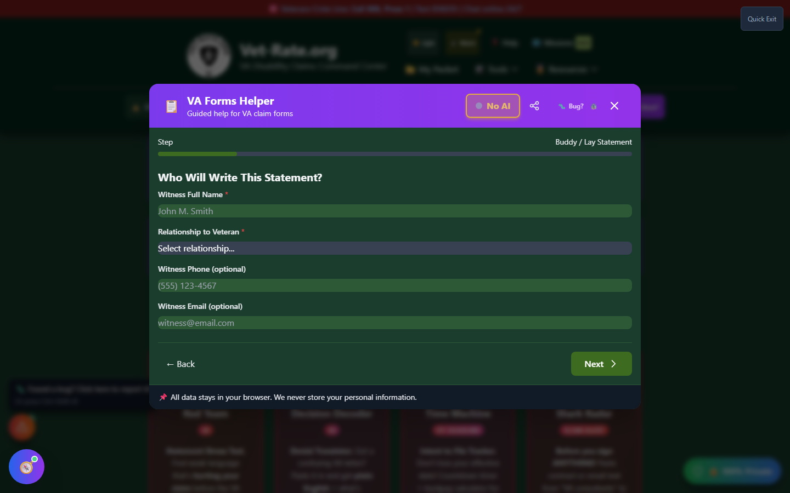

# Buddy Statements

Create supporting statements from fellow veterans, family members, or others who can attest to your condition.

_The guided builder starts by collecting the witness's information._

---

## What is a Buddy Statement?

A **buddy statement** is a written statement from someone who:

- Witnessed your injury or illness
- Observed your symptoms
- Can describe changes in your behavior
- Has knowledge of your condition's impact

---

## Why Buddy Statements Matter

Buddy statements provide:

### Corroborating Evidence

- Confirms your account of events
- Supports what's in (or missing from) records
- Adds credibility to your claim

### Gap-Filling

- When military records are incomplete
- When you didn't seek treatment immediately
- When symptoms developed over time

### Impact Documentation

- How your condition affects daily life
- Changes others have observed
- Work and relationship impacts

---

## Who Can Write a Buddy Statement?

| Person             | What They Can Attest To                                 |
| ------------------ | ------------------------------------------------------- |
| **Fellow Veteran** | Shared service events, your duties, observed injuries   |
| **Spouse/Partner** | Daily symptoms, sleep issues, mood changes, limitations |
| **Family Member**  | Behavioral changes, physical limitations                |
| **Coworker**       | Work limitations, missed days, performance changes      |
| **Friend**         | Activity limitations, social changes                    |
| **Caregiver**      | Care needs, daily assistance required                   |

---

## Creating a Buddy Statement

### Using Forms Helper

Open <strong>Forms Helper</strong>

Select <strong>"Buddy / Lay Statement"</strong>, then click <strong>"Start Guided Builder"</strong>

Enter the <strong>witness's information</strong>

Complete the <strong>statement sections</strong>

<strong>Optionally enhance with AI</strong> using the Three Pillars approach

<strong>Download</strong> and have witness sign

### AI Enhancement (Optional)

After generating your buddy statement, you can optionally enhance it with AI:

1. Click **"✨ Enhance with AI"** button
2. Review the privacy disclosure (shows exactly what will be shared)
3. Consent to AI enhancement
4. Toggle between AI-enhanced and original versions
5. Download whichever version you prefer

!!! info "What AI Improves"
The AI uses the "Three Pillars" approach to make buddy statements more compelling:

    - **Pillar 1:** Your relationship to the veteran
    - **Pillar 2:** What you personally observed
    - **Pillar 3:** Impact you've witnessed on daily life

    [Learn more about AI privacy →](../privacy/ai-assistant/)

### Form Sections

#### Section 1: Witness Information

| Field            | Description               |
| ---------------- | ------------------------- |
| **Full Name**    | Legal name of the witness |
| **Relationship** | How they know you         |
| **Address**      | Current address           |
| **Phone**        | Contact number            |
| **Email**        | Contact email             |

#### Section 2: Veteran Information

| Field              | Description                         |
| ------------------ | ----------------------------------- |
| **Veteran's Name** | Your full legal name                |
| **VA File Number** | If known                            |
| **Condition**      | What condition they're attesting to |

#### Section 3: Statement

The witness describes:

- What they personally observed
- When and where they observed it
- How it affects you

#### Section 4: Certification

Witness certifies the statement is true under penalty of perjury.

---

## Writing Effective Statements

### What to Include

!!! tip "Strong Buddy Statements Include:"

    - **Specific details** - Dates, locations, events
    - **First-hand observations** - "I saw..." not "I heard..."
    - **Concrete examples** - Specific incidents
    - **Time comparisons** - Before vs. after service
    - **Frequency information** - How often symptoms occur
    - **Impact descriptions** - How it affects your life

### Example: Service Buddy

    I served with [Veteran] in the 82nd Airborne Division from
    2008-2012. We were in the same squad during our deployment
    to Afghanistan in 2010.

    On or about June 15, 2010, near FOB Shank, our patrol was
    hit by an IED. I personally witnessed [Veteran] being thrown
    by the blast. He immediately complained of severe back pain
    and ringing in his ears.

    After this incident, I observed [Veteran] having difficulty
    carrying his equipment and often holding his lower back.
    He frequently mentioned the ringing in his ears never stopped.

    I certify that the above information is true and correct
    to the best of my knowledge.

### Example: Spouse

    I have been married to [Veteran] since 2015, three years
    after his separation from the Marine Corps.

    Since I've known him, I have observed the following regarding
    his claimed back condition:

    - He has difficulty bending over and often needs my help
      putting on socks and shoes
    - He wakes up multiple times per night due to back pain
    - He can no longer do yard work, which he used to enjoy
    - He has missed approximately 20 days of work in the past
      year due to severe back pain episodes
    - He takes over-the-counter pain medication daily

    His symptoms appear worse on cold, damp days and after
    physical activity. I have witnessed him unable to get out
    of bed during severe episodes.

    I certify that the above information is true and correct
    to the best of my knowledge.

---

## Common Topics for Buddy Statements

### Physical Conditions

- Observable pain behaviors
- Physical limitations
- Use of assistive devices
- Activity restrictions

### Mental Health Conditions

- Sleep disturbances
- Mood changes
- Social withdrawal
- Behavioral changes
- Nightmares (that woke the witness)

### Hearing/Tinnitus

- Having to repeat yourself
- High TV/radio volume
- Difficulty in conversations
- Complaints about ringing

---

## Tips for Getting Good Statements

!!! tip "For the Veteran"

    1. **Explain what you need** - Tell them what to focus on
    2. **Provide the form** - Give them VA 21-10210 or the PDF from Forms Helper
    3. **Share your timeline** - When did things happen?
    4. **Be specific** - Tell them what examples would help
    5. **Don't pressure** - Let them write honestly
    6. **Thank them** - Appreciate their support

!!! tip "For the Witness"

    1. **Only write what you observed** - First-hand knowledge only
    2. **Be specific** - Dates, events, details
    3. **Be honest** - Don't exaggerate
    4. **Sign and date** - Required for the form
    5. **Keep a copy** - For your records

---

## Submitting Buddy Statements

### With Your Claim

Include buddy statements when you file:

1. Download completed form
2. Have witness sign
3. Scan or photograph
4. Upload to VA.gov with your claim

### After Filing

Add buddy statements anytime:

1. Complete the form
2. Upload to VA.gov
3. Reference your claim number

---

## Multiple Statements

You can submit multiple buddy statements:

- Different people observing different aspects
- Multiple witnesses to the same event
- Various time periods (service vs. current)

!!! tip "More is Better"
Multiple consistent buddy statements strengthen your claim. Quality over quantity, but several good statements are powerful evidence.
