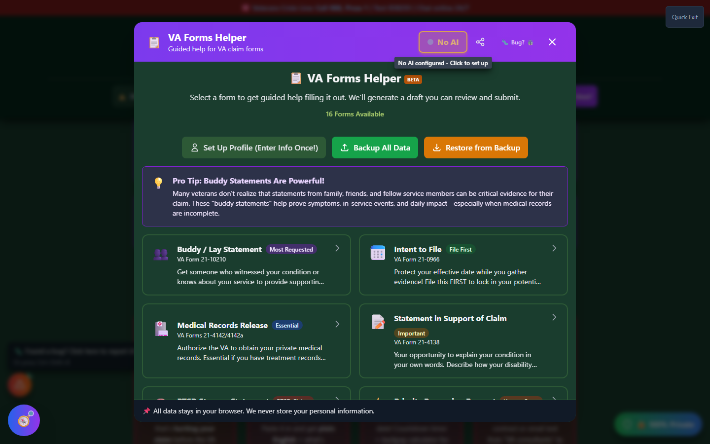

# Forms Helper

The **Forms Helper** is a comprehensive forms assistant that guides you through completing essential VA claims forms with step-by-step instructions and pre-filled templates.

_Forms Helper opens with a list of 16 forms - select one to see its details and start the guided builder._

🆘 <strong>Veterans Crisis Line:</strong> Call 988, Press 1 | Text 838255 | Available 24/7

---

## What is Forms Helper?

Forms Helper simplifies the process of completing VA forms by:

- ✅ **Explaining each field** - Plain language descriptions
- ✅ **Providing examples** - Sample answers for each field
- ✅ **Pre-filling information** - Uses your saved profile data
- ✅ **Step-by-step guidance** - Wizard-style completion
- ✅ **Export options** - Download completed forms
- ✨ **AI Enhancement** - Optional AI-powered statement improvement

!!! tip "AI Statement Assistant"
After generating a statement, you can optionally enhance it with AI using the "Three Pillars" approach. This helps create more professional and compelling statements while keeping your personal information private. [Learn more about AI privacy →](../privacy/ai-assistant/)

---

## In This Section

<h3>📋 Available Forms</h3>

Overview of all forms supported by Forms Helper.

<a href="available-forms/" class="doc-button">Learn More →</a>

<h3>👥 Buddy Statements</h3>

Create supporting statements from fellow veterans or family.

<a href="buddy-statements/" class="doc-button">Learn More →</a>

<h3>📝 Intent to File</h3>

Establish your claim date to protect your effective date.

<a href="intent-to-file/" class="doc-button">Learn More →</a>

<h3>⚠️ PTSD Stressor Statement</h3>

Document traumatic events for PTSD claims.

<a href="ptsd-stressor/" class="doc-button">Learn More →</a>

<h3>👤 Veteran Profile</h3>

Save your information for faster form completion.

<a href="veteran-profile/" class="doc-button">Learn More →</a>

---

## Accessing Forms Helper

### From the Header

Open the **Tools ▾** menu and select Forms Helper.

### From the Main Page

Click **"📝 Open Forms Helper"** on the purple Forms Helper feature card.

---

## Supported Forms

Forms Helper covers **16 forms** in total. The most commonly used ones:

| Form                 | Name                          | Purpose                            |
| -------------------- | ----------------------------- | ---------------------------------- |
| **VA 21-4138**       | Statement in Support of Claim | Personal statement                 |
| **VA 21-10210**      | Buddy / Lay Statement         | Buddy statements                   |
| **VA 21-0966**       | Intent to File                | Protect effective date             |
| **VA 21-0781**       | PTSD Stressor Statement       | Document trauma                    |
| **VA 21-4142/4142a** | Medical Records Release       | Authorize record access            |
| **VA 20-10207**      | Priority Processing Request   | Expedite for hardship/urgent cases |

See [Available Forms](available-forms.md) for the full list.

---

## How Forms Helper Works

<strong>Select a form</strong> - Choose from the available forms list

<strong>Review the form's intro screen</strong> - Purpose, tips for success, and a link to the official VA form

<strong>Click "Start Guided Builder"</strong> - Opens the step-by-step wizard

<strong>Enter your information</strong> - Follow the guided wizard, one step at a time

<strong>Preview the form</strong> - See the completed version

<strong>Download</strong> - Export as PDF, Word, or plain text

---

## Key Features

### Veteran Profile Integration

Save your information once, use it everywhere:

- Name and contact info
- Service dates and branch
- VA file number
- Common addresses

### Field Explanations

Each field includes:

- **Plain language description** - What the field is asking
- **Why it matters** - How it affects your claim
- **Examples** - Sample entries
- **Tips** - Best practices

### Smart Defaults

Forms Helper pre-fills:

- Your saved profile information
- Common selections
- Today's date where appropriate

### Progress Saving

Your progress is saved:

- Continue where you left off
- Forms saved in My Packet
- Edit anytime before submission

---

## Form Categories

### Claim Support Forms

For building your claim:

- Statement in Support of Claim
- Lay/Witness Statements
- PTSD Stressor Statements

### Administrative Forms

For claim management:

- Intent to File
- VSO Appointment
- Medical Records Release

---

## Important Notes

!!! warning "No Guarantee of Outcome"
Forms Helper - including the optional AI Statement Assistant - helps you organize evidence and paperwork, but **using it does not guarantee any particular VA rating or claim outcome**. Ratings and decisions are made solely by the VA. Before filing, have a VSO or VA-accredited attorney review your forms. Find one at [va.gov/ogc/apps/accreditation](https://www.va.gov/ogc/apps/accreditation/).

!!! warning "Forms Helper Limitations"

    - Forms Helper **assists** with completing forms
    - It does **not** submit forms to the VA
    - You must still **print, sign, and submit** or upload through VA.gov
    - Always **verify** information before submission

!!! tip "Best Practice"

    1. Complete the form in Forms Helper
    2. Download the PDF
    3. Review carefully
    4. Print and sign
    5. Submit through official VA channels

---

## Submission Methods

After completing your form:

| Method          | Description                        |
| --------------- | ---------------------------------- |
| **VA.gov**      | Upload through your VA.gov account |
| **eBenefits**   | Upload through eBenefits portal    |
| **Mail**        | Mail to your VA Regional Office    |
| **Fax**         | Fax to appropriate VA number       |
| **In Person**   | Submit at VA office                |
| **Through VSO** | Give to your representative        |
