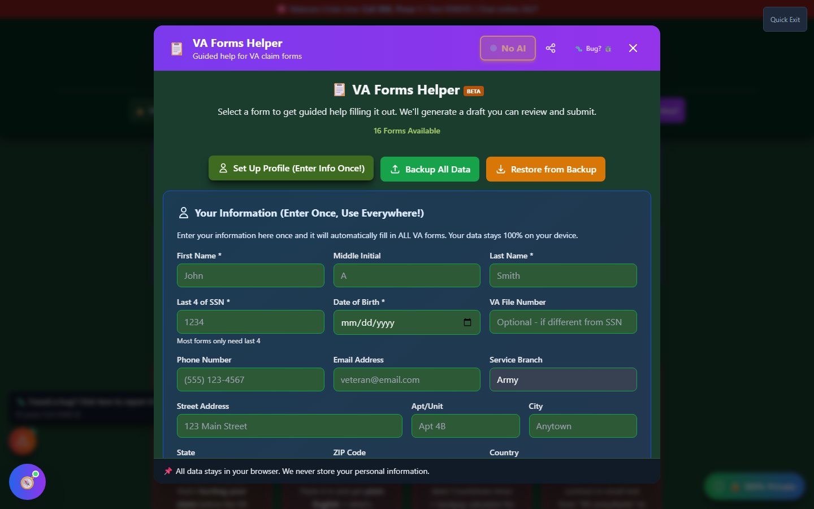

# Veteran Profile

Save your information for faster form completion across all Forms Helper tools.

_Opened from the "Set Up Profile (Enter Info Once!)" button at the top of Forms Helper._

---

## What is Veteran Profile?

The **Veteran Profile** is a secure, locally-stored profile containing your basic information. When you complete it once, Forms Helper can pre-fill this information on every form you create.

---

## Benefits

### Time Savings

- Enter information once
- Auto-fills on all forms
- Skip repetitive data entry

### Consistency

- Same information on all forms
- Reduces errors
- Maintains accuracy

### Convenience

- Always available
- Easy to update
- No account needed

---

## Accessing Veteran Profile

Open <strong>Forms Helper</strong>

Click <strong>"Set Up Profile (Enter Info Once!)"</strong> at the top of the form list

Complete your <strong>profile information</strong>

Click <strong>"Save Profile"</strong>

---

## Profile Information

### Personal Information

| Field               | Description                          |
| ------------------- | ------------------------------------ |
| **Full Legal Name** | As it appears on military records    |
| **Date of Birth**   | Your birth date                      |
| **SSN**             | Social Security Number               |
| **VA File Number**  | If you have one (may be same as SSN) |
| **Gender**          | Male/Female/Other                    |

### Contact Information

| Field        | Description          |
| ------------ | -------------------- |
| **Address**  | Street address       |
| **City**     | City                 |
| **State**    | State                |
| **ZIP Code** | ZIP code             |
| **Phone**    | Primary phone number |
| **Email**    | Email address        |

### Military Service

| Field                      | Description                                              |
| -------------------------- | -------------------------------------------------------- |
| **Branch**                 | Army, Navy, Air Force, Marines, Coast Guard, Space Force |
| **Service Start Date**     | Date you entered active duty                             |
| **Service End Date**       | Date you separated                                       |
| **Rank at Separation**     | Your final rank                                          |
| **MOS/Rating**             | Military occupational specialty                          |
| **Character of Discharge** | Honorable, General, etc.                                 |

### Additional Service Periods

For veterans with multiple service periods:

- Add additional entries for each period
- Include guard/reserve service if applicable

---

## Data Security

### Local Storage Only

!!! va-info "Your Data Stays Local"

    Your Veteran Profile is stored **only in your browser's local storage**. It is:

    - ✅ Never sent to any server
    - ✅ Never transmitted over the internet
    - ✅ Never shared with third parties
    - ✅ Only accessible on your device
    - ✅ Controlled entirely by you

### Clearing Your Data

To remove your profile data:

1. Open Veteran Profile
2. Click **"Clear Profile"**
3. Confirm deletion

Or:

1. Clear your browser's local storage
2. Clear cookies and site data for Vet-Rate.org

---

## How Pre-Fill Works

When you start a new form:

### Automatic Pre-Fill

Forms Helper automatically fills:

- Name fields
- Address fields
- Service dates
- VA File Number
- Contact information

### Review Before Submission

!!! warning "Always Review"

    Even with pre-fill, **always review** each form before submission:

    - Verify information is current
    - Check for any needed updates
    - Ensure accuracy

### Editing Pre-Filled Data

You can always:

- Edit any pre-filled field
- Override with different information
- Update for specific forms

---

## Updating Your Profile

### When to Update

Update your profile when:

- You move to a new address
- You change phone numbers
- You get a new VA File Number
- Any information changes

### How to Update

Open <strong>Veteran Profile</strong>

<strong>Edit</strong> the fields that changed

Click <strong>"Save Profile"</strong>

---

## Multiple Devices

### Limitation

Because your profile is stored locally:

- It's only available on **this browser/device**
- It doesn't sync across devices
- You'll need to enter it again on other devices

### Workaround

If you use multiple devices:

- Keep a secure copy of your information
- Enter profile on each device
- Or use My Packet's backup/restore feature

---

## Sensitive Information

### SSN and VA File Number

These are sensitive fields. Consider:

- Only entering on trusted devices
- Clearing after each session if using shared computer
- Using browser privacy features

### Browser Privacy

If using a shared computer:

1. Use **private/incognito browsing**
2. Clear site data after use
3. Don't save profile
4. Enter information each time

---

## Tips for Your Profile

!!! tip "Profile Best Practices"

    1. **Complete all fields** - More data = more convenience
    2. **Keep it current** - Update when information changes
    3. **Verify accuracy** - Match your official records
    4. **Back up regularly** - Use My Packet export
    5. **Secure your device** - Protect your information
    6. **Review on forms** - Always double-check pre-filled data
