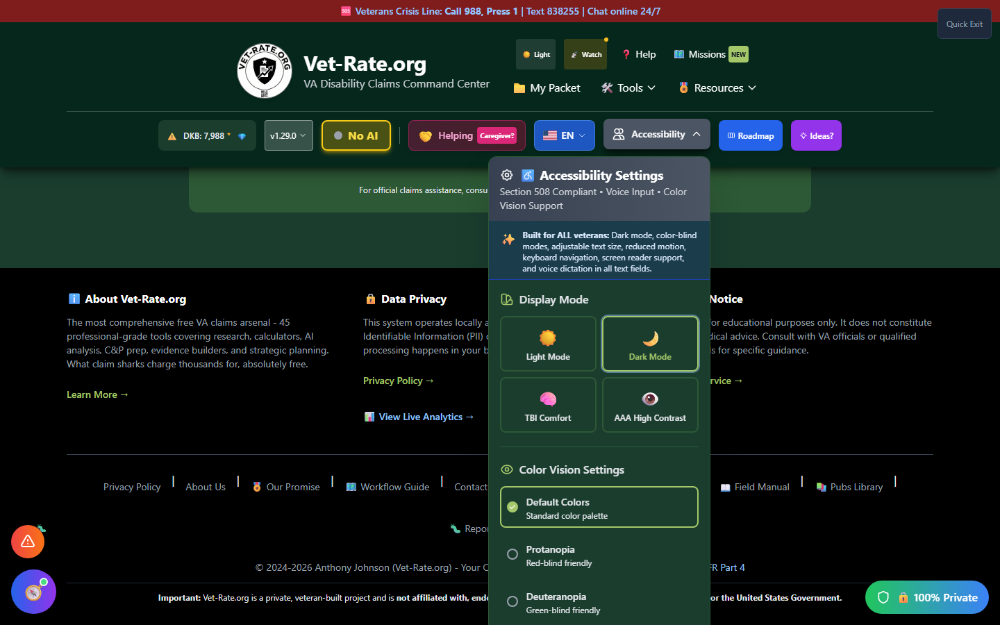

# Accessibility Settings

Vet-Rate.org is committed to accessibility and complies with **WCAG 2.1 AA** and **Section 508** standards. This guide covers all available accessibility options.

---

## Opening Accessibility Settings

To access accessibility settings:

1. **Click the Accessibility button** (♿) in the header
2. Or use **keyboard navigation** - Tab to the button and press Enter

The accessibility menu opens as a dropdown panel.

_Display Mode and Color Vision Settings are the first two sections in the dropdown._

---

## Available Settings

### Display Mode

<h4>🌙 Dark Mode / ☀️ Light Mode</h4>

Reduce eye strain by switching between light and dark themes.

| Setting               | Description                                                        |
| --------------------- | ------------------------------------------------------------------ |
| **Light Mode**        | Default theme with warm, muted colors                              |
| **Dark Mode**         | Dark background with light text                                    |
| **TBI Comfort**       | Reduced-stimulation palette for traumatic brain injury sensitivity |
| **AAA High Contrast** | Maximum-contrast display mode (WCAG AAA)                           |

**Benefits of Dark Mode:**

- Reduces eye strain in low-light conditions
- Lower screen brightness for nighttime use
- Preferred by users with light sensitivity

**How to toggle:**

- Click any of the four Display Mode buttons
- The change takes effect immediately

---

### Color Vision Settings

Vet-Rate.org supports multiple color blind modes to ensure all users can distinguish important information.

| Mode               | Description            | Best For          |
| ------------------ | ---------------------- | ----------------- |
| **Default Colors** | Standard color palette | Most users        |
| **Protanopia**     | Blue/Yellow spectrum   | Red-blind users   |
| **Deuteranopia**   | Blue/Yellow spectrum   | Green-blind users |
| **Tritanopia**     | Modified palette       | Blue-blind users  |
| **High Contrast**  | Maximum visibility     | Low vision users  |

**How to change:**

1. Open accessibility settings
2. Scroll to "Color Vision Settings"
3. Select the radio button for your preferred mode
4. Changes apply immediately

!!! tip "Testing Color Modes"
Try different modes to find what works best for you. All important information uses shapes, icons, and text labels in addition to color, ensuring nothing is lost when colors change.

---

### Text Size

Adjust the base font size for better readability:

| Size            | Base Font | Description         |
| --------------- | --------- | ------------------- |
| **Small**       | 14px      | Compact layout      |
| **Normal**      | 16px      | Default setting     |
| **Large**       | 18px      | Easier reading      |
| **Extra Large** | 20px      | Maximum readability |

**How to change:**

1. Open accessibility settings
2. Find the "Text Size" section
3. Click your preferred size button
4. All text scales proportionally

---

### Reduced Motion

<h4>⏯️ Reduce Motion</h4>

Minimize or eliminate animations and transitions for users with vestibular sensitivity.

When enabled:

- ✅ Animations are simplified or removed
- ✅ Transitions become instant
- ✅ Loading spinners are simplified
- ✅ Scroll behavior remains smooth (user-controlled)

**Who benefits:**

- Users with vestibular disorders
- Users prone to motion sickness
- Users who prefer instant transitions
- Users on older devices (performance improvement)

**How to enable:**

1. Open accessibility settings
2. Find "Reduce Motion" toggle
3. Click to enable (toggle turns colored)

!!! info "System Preference Detection"
Vet-Rate.org respects your operating system's "Reduce Motion" preference. If enabled at the system level, the website will automatically minimize animations.

---

## Keyboard Navigation

All of Vet-Rate.org is fully navigable via keyboard:

| Key           | Action                                    |
| ------------- | ----------------------------------------- |
| `Tab`         | Move forward through interactive elements |
| `Shift + Tab` | Move backward through elements            |
| `Enter`       | Activate buttons and links                |
| `Space`       | Toggle checkboxes and buttons             |
| `Escape`      | Close modals and dropdowns                |
| `Arrow Keys`  | Navigate within menus and lists           |

### Skip Link

For screen reader users, a **"Skip to main content"** link appears when you first Tab into the page. This allows bypassing the header navigation.

---

## Screen Reader Support

Vet-Rate.org is optimized for screen readers:

- ✅ **Semantic HTML** - Proper heading hierarchy
- ✅ **ARIA labels** - Descriptive labels on all interactive elements
- ✅ **Role attributes** - Clear indication of component types
- ✅ **Focus management** - Focus moves appropriately when modals open/close
- ✅ **Live regions** - Dynamic content changes are announced

### Tested Screen Readers

| Screen Reader | Browser         | Status       |
| ------------- | --------------- | ------------ |
| NVDA          | Chrome, Firefox | ✅ Supported |
| JAWS          | Chrome, Edge    | ✅ Supported |
| VoiceOver     | Safari, Chrome  | ✅ Supported |
| Narrator      | Edge            | ✅ Supported |

---

## Focus Indicators

All focusable elements have visible focus indicators:

- **Buttons** - Ring outline with offset
- **Links** - Underline and color change
- **Form inputs** - Border color change and ring
- **Cards** - Shadow and border enhancement

Focus indicators meet **WCAG 2.1 AA contrast requirements** (minimum 3:1 ratio).

---

## Settings Persistence

Your accessibility settings are **saved locally** in your browser:

- ✅ Settings persist between sessions
- ✅ Settings are device-specific
- ✅ Clearing browser data will reset settings
- ✅ No account needed to save preferences

---

## Reporting Accessibility Issues

If you encounter an accessibility barrier:

1. Click the **Bug Report** button (🐛)
2. Select "Accessibility Issue" as the category
3. Describe the barrier you encountered
4. Include details about your assistive technology

!!! tip "Feedback Welcome"
We're committed to accessibility. If something doesn't work with your assistive technology, please report it so we can improve.

---

## Accessibility Statement

Vet-Rate.org strives to conform to:

- **WCAG 2.1 Level AA** - Web Content Accessibility Guidelines
- **Section 508** - U.S. federal accessibility requirements
- **ADA** - Americans with Disabilities Act compliance principles

We continuously test and improve accessibility with both automated tools and manual testing with assistive technologies.
