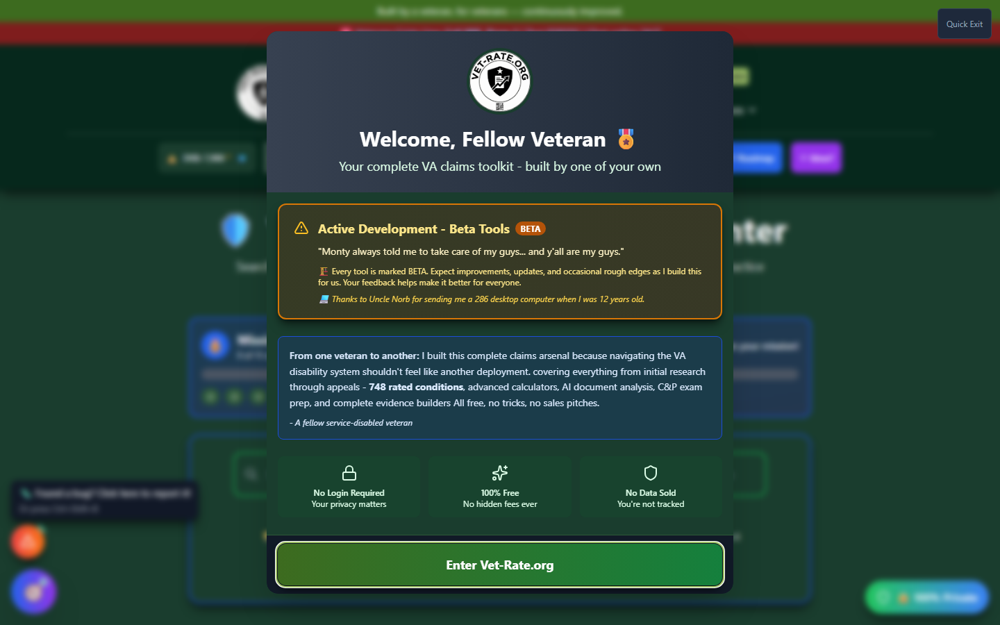
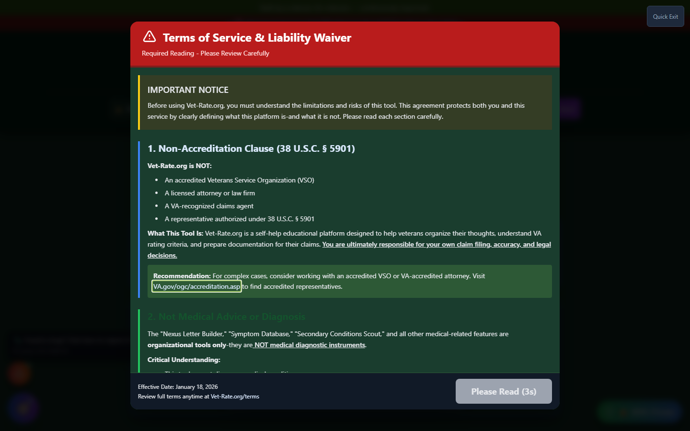
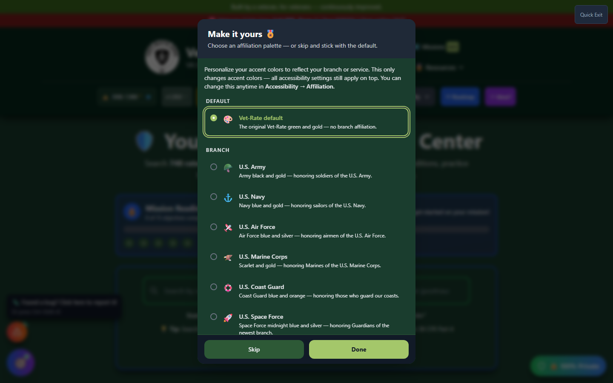
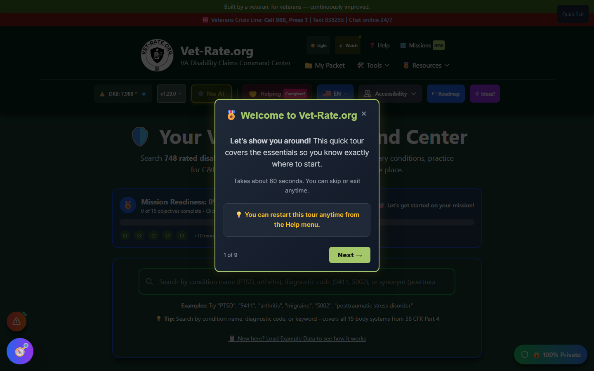

# First Visit

When you first visit Vet-Rate.org, you'll walk through a short one-time sequence: a welcome screen, a required terms review, an optional color palette picker, and a guided tour. Each step only appears once - your choices are saved locally in your browser.

---

## The Welcome Screen

On your first visit, a **Welcome Splash Screen** appears with the following information:

_The first screen every new visitor sees - personal message, trust signals, and the "Enter Vet-Rate.org" button._

### Welcome Message

> "Welcome, Fellow Veteran 🎖️"
>
> Your complete VA claims toolkit - built by one of your own

The welcome screen includes a personal message from the creator explaining why the platform was built - to help veterans navigate the VA disability system without feeling like another deployment. It also carries an "Active Development - Beta Tools" notice, since every tool on the site is marked BETA.

---

## Trust Signals

The welcome screen displays three key trust indicators:

| Feature                  | Description                                                |
| ------------------------ | ---------------------------------------------------------- |
| 🔒 **No Login Required** | Your privacy matters - use all features without an account |
| ✨ **100% Free**         | No hidden fees ever                                        |
| 🛡️ **No Data Sold**      | You're not tracked or monitored                            |

---

## Your Claims Toolkit Includes

The welcome screen lists all available tools:

<strong>748 conditions</strong> with official VA rating criteria from 38 CFR Part 4

<strong>Secondary Scout</strong> - discover linked conditions to maximize your rating

<strong>C&P Exam Simulator</strong> - practice with DBQ-aligned questions

<strong>Forms Helper</strong> - guided buddy statements & VA form assistance

<strong>AI Statement Assistant</strong> - optional AI-powered statement enhancement ✨

<strong>My Packet</strong> - organize your evidence and track your claims

---

## Acknowledging the Welcome Screen

At the bottom of the welcome screen, you'll see:

!!! note "Quick Note"
This is an educational resource, not a VSO or law firm. For official claims assistance, your local VSO is a great free resource.

Click the **"Enter Vet-Rate.org"** button to proceed to the main application.

---

## Terms of Service & Liability Waiver

Right after you acknowledge the welcome screen, a **required** Terms of Service review appears.

_The "I Understand & Accept the Risks" button stays disabled for a mandatory 3-second read window._

This screen explains, in plain language:

- Vet-Rate.org is **not** an accredited VSO, law firm, or VA-recognized claims agent
- The site is a **self-help educational platform** - you're responsible for your own claim filing, accuracy, and legal decisions
- Tools like Nexus Builder and Secondary Scout are **organizational tools only**, not medical diagnostic instruments

!!! warning "You Must Read Before Accepting"
The **"I Understand & Accept the Risks"** button is disabled and shows a countdown (`Please Read (3s)`) until the timer runs out. This is intentional - it ensures you actually see the disclosure before continuing.

Once the countdown ends, click the button to proceed.

---

## Affiliation Picker (Optional)

Next, a one-time prompt invites you to personalize the site's accent colors to match your branch of service.

_Purely cosmetic - accent colors only. Every accessibility setting still applies on top of whichever palette you choose._

- Pick a branch palette, or leave the default **Vet-Rate green and gold**
- Click **"Skip"** to leave it for now, or **"Done"** after choosing
- You can change this anytime later under **Accessibility → Affiliation**

---

## Boot Camp Tour

Finally, a short guided tour walks you through the main interface using numbered popovers.

_A 9-step tour ("1 of 9") that highlights the search bar, feature cards, and other key areas. Skippable at any time._

- Takes about 60 seconds
- Click **"Next →"** to advance, or close the popover to skip the rest
- You can restart it anytime from the **Help** menu in the header

---

## After First Visit

Once you've been through the welcome screen, Terms of Service, and (optionally) the affiliation picker and tour:

1. **None of these screens appear again** - Your choices are saved locally
2. **You'll go directly to the main interface** - Future visits skip straight to the home page
3. **You can always access help** - Through the Help menu and footer links

!!! tip "Clearing Your Browser Data"
If you clear your browser's local storage or use a different browser/device, the welcome screen and Terms of Service will appear again. This is normal behavior.

---

## What's Next?

After entering Vet-Rate.org, you'll see the main interface with:

- The **search bar** prominently displayed
- **Navigation links** in the header
- **Feature CTAs** below the search area
- **Footer links** for additional resources

Continue to [Understanding the Interface](interface-overview.md) to learn about all elements of the main screen.
