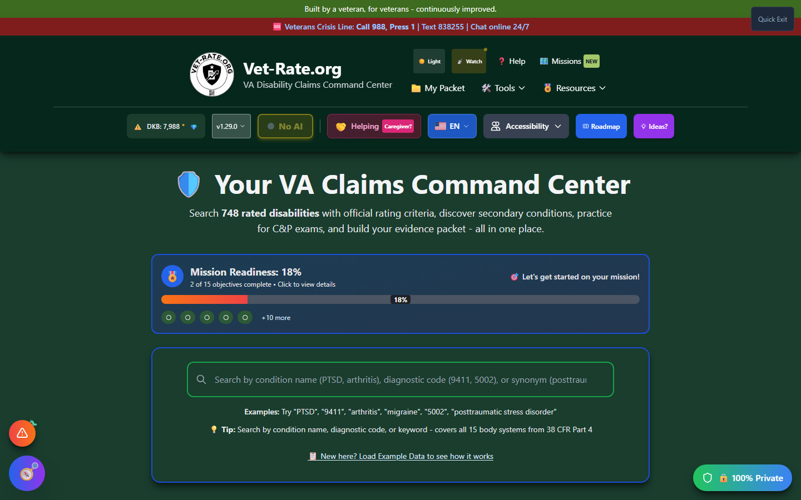
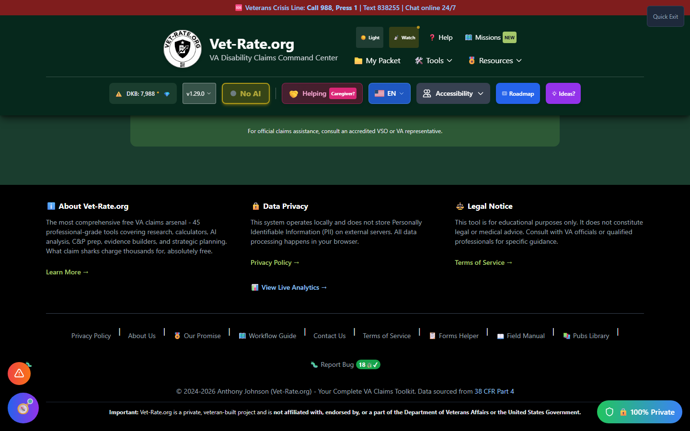

# Understanding the Interface

This guide provides a complete tour of the Vet-Rate.org interface, covering every element you'll encounter.

_The top of the home page: crisis banner, header navigation, utility bar, hero heading, and search bar._

---

## Page Layout Overview

The Vet-Rate.org interface is organized into these main sections:

1. **Crisis Line Banner** - Always visible at the very top
2. **Header** - Logo, navigation, and accessibility settings
3. **Hero Section** - Welcome text and search bar
4. **Feature CTAs** - Quick access to main tools
5. **Search Results** - Displayed after searching
6. **Footer** - Links, legal info, and support options

---

## Crisis Line Banner

🆘 <strong>Veterans Crisis Line:</strong> Call 988, Press 1 | Text 838255 | Chat online 24/7

The **red banner** at the very top of every page provides immediate access to crisis support. It's always visible and links directly to the Veterans Crisis Line website.

!!! crisis "Always Available"
The crisis line banner appears on every page and cannot be dismissed. If you or a veteran you know is in crisis, help is available 24/7.

---

## Header Section

The header contains the following elements:

### Logo and Title

- **Vet-Rate.org Logo** - Circular logo on the left
- **Site Name** - "Vet-Rate.org"
- **Tagline** - "Free VA Claims Toolkit for Veterans"

### Primary Navigation

The header is organized into two rows. The top row holds the main navigation:

| Button             | Function                                                                    |
| ------------------ | --------------------------------------------------------------------------- |
| **Light/Watch**    | Toggles the color theme                                                     |
| **Help**           | Opens the Help menu                                                         |
| **Missions**       | Community roadmap / feature voting                                          |
| 📁 **My Packet**   | Opens your saved claims packet                                              |
| 🛠️ **Tools ▾**     | Dropdown with Secondary Scout, C&P Simulator, Forms Helper, and other tools |
| 🎖️ **Resources ▾** | Dropdown menu with VA resource links                                        |

A second **utility bar** below it shows a live database-build counter, the current app version, an AI status toggle ("No AI" / model name), a caregiver-support badge, the language selector, and:

| Button                 | Function                            |
| ---------------------- | ----------------------------------- |
| ♿ **Accessibility ▾** | Opens accessibility settings menu   |
| **Roadmap**            | Links to the public feature roadmap |
| **Ideas?**             | Opens the feature request form      |

### Veteran Resources Dropdown

Clicking "Vet Resources" reveals a dropdown with:

- 🌐 **VA Resources Hub** - Comprehensive guide to VA benefits
- 🆘 **Veterans Crisis Line** - Emergency support
- ⚠️ **PACT Act Benefits** - New presumptive conditions
- 🧪 **Toxic Exposure Assessment** - Free MEEA evaluations
- 🏠 **Homeless Veterans** - Housing assistance
- 🧠 **Mental Health & PTSD** - Treatment resources
- 🏥 **VA Health Care** - Health benefits
- 👩 **Women Veterans** - Specialized resources
- 💼 **Veteran Jobs** - Employment programs
- 🎓 **GI Bill Benefits** - Education assistance
- 🏡 **VA Home Loans** - Housing loans
- 👨‍👩‍👧‍👦 **Caregiver Support** - Caregiver programs
- ⚖️ **Board of Veterans Appeals** - Appeals information
- 📚 **National Resource Directory** - Comprehensive database

---

## Hero Section

The main content area starts with:

### Welcome Heading

> 🛡️ Your VA Claims Command Center

With the description:

> Search **748 rated disabilities** with official rating criteria, discover secondary conditions, practice for C&P exams, and build your evidence packet-all in one place.

### Search Bar

The large search bar is the centerpiece of the interface:

- **Full-width design** - Easy to find and use
- **Placeholder text** - Shows example searches
- **Clear button** - Appears when text is entered
- **Auto-suggestions** - Appears as you type (2+ characters)
- **Keyboard accessible** - Full keyboard navigation support

!!! tip "Search Tips"
The search bar accepts:

    - Condition names: "PTSD", "arthritis", "migraines"
    - Diagnostic codes: "9411", "5002", "6260"
    - Synonyms: "ringing in ears", "back pain"

---

## Feature CTA Cards

Below the search bar, you'll find quick-access cards:

### Secondary Scout Card

- **Color:** Emerald/Teal gradient
- **Icon:** Clipboard with list
- **Label:** "NEW" badge
- **Description:** Discover secondary claims linked to your service-connected disabilities
- **Button:** "🚀 Launch Secondary Scout"

### C&P Exam Simulator Card

- **Color:** Amber/Yellow gradient
- **Icon:** Checkmark circle
- **Label:** "NEW" badge
- **Description:** Practice for your C&P exam with condition-specific questions
- **Button:** "🎯 Launch C&P Simulator"

### Forms Helper Card (Full Width)

- **Color:** Purple/Indigo gradient
- **Icon:** Document
- **Label:** "NEW" badge
- **Description:** Get guided help filling out VA forms, especially buddy statements
- **Button:** "📝 Open Forms Helper"

### Quick Condition Picker

A streamlined way to select common conditions and launch Secondary Scout directly.

---

## Footer Section

_Scroll to the bottom of any page to reach the footer._

The footer is divided into three columns:

### About Vet-Rate.org

- Brief description of the platform ("the most comprehensive free VA claims arsenal")
- "Learn More →" link to About Us
- "View Live Analytics →" link

### Data Privacy

- Privacy statement about local data processing
- "Privacy Policy →" link

### Legal Notice

- Educational purposes disclaimer
- "Terms of Service →" link

### Footer Links Bar

A row of quick links including Privacy Policy, About Us, Our Promise, Workflow Guide, Contact Us, Terms of Service, Forms Helper, Field Manual, Pubs Library, and 🐛 Report Bug.

### Copyright

> © 2024-2026 Anthony Johnson (Vet-Rate.org) - Your Complete VA Claims Toolkit. Data sourced from 38 CFR Part 4

With a link to 38 CFR Part 4 on eCFR, and a final disclaimer bar noting Vet-Rate.org is a private, veteran-built project not affiliated with the Department of Veterans Affairs or the U.S. Government.

---

## Floating Bug Report Button

In the **bottom-right corner** of every page, you'll see a floating bug button:

- 🐛 **Red circular button**
- **Always visible** - Stays in position as you scroll
- **Click to report** - Opens the Bug Squasher form

---

## Modal Windows

Throughout Vet-Rate.org, various features open in **modal windows** (overlay popups):

- **Semi-transparent backdrop** - Dims the main content
- **Centered content** - Modal appears in the center
- **Close button** - X in the top-right corner
- **Escape key** - Press Escape to close
- **Scroll lock** - Prevents background scrolling

All modals are:

- ✅ Keyboard navigable
- ✅ Screen reader accessible
- ✅ Mobile responsive

---

## Dark Mode Indicator

_Opened from the header's Accessibility button - see [Accessibility Settings](accessibility.md) for the full walkthrough._

When dark mode is enabled:

- Header becomes darker
- Background switches to gray-900
- Text becomes light colored
- Cards have dark backgrounds
- All contrast ratios maintained for accessibility

---

## Responsive Design

The interface adapts to different screen sizes:

| Screen Size             | Behavior                                |
| ----------------------- | --------------------------------------- |
| **Desktop** (1024px+)   | Full navigation, multi-column layouts   |
| **Tablet** (768-1023px) | Condensed navigation, adjusted spacing  |
| **Mobile** (< 768px)    | Stacked layouts, hamburger-style access |

---

## Next Steps

Now that you understand the interface, explore:

- [Accessibility Settings](accessibility.md) - Customize your experience
- [How to Search](../search/how-to-search.md) - Learn search techniques
- [Secondary Scout](../secondary-scout/index.md) - Discover secondary conditions
