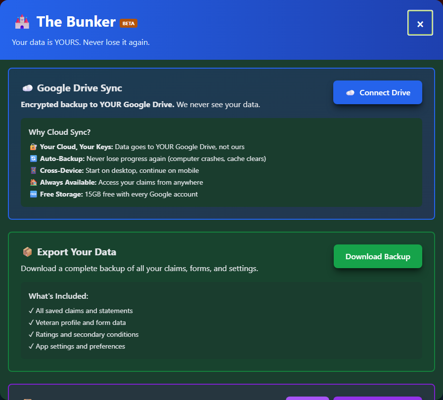
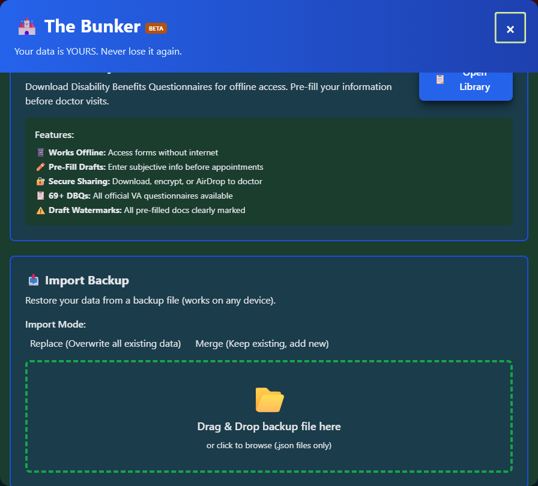

# Backup & Restore

Export your packet data and restore from backup files to protect your work.

---

## Why Backup?

Your My Packet data is stored locally in your browser. This means it can be lost if you:

- Clear browser cookies/data
- Reinstall your browser
- Switch to a different browser
- Use a different device
- Have browser/storage issues

**Regular backups protect your work.**

---

## Creating a Backup

### Export Process

<div class="step-container">
<div class="step">
Open <strong>My Packet</strong>
</div>
<div class="step">
Click <strong>"Local Backup"</strong> in the toolbar at the top
</div>
<div class="step">
Your browser <strong>downloads</strong> a dated JSON file
</div>
</div>

For more options - storage stats, restoring a previous session, or wiping local data - open the fuller **Backup Manager** ("The Bunker"), reachable from Support & Resources in the header or from within My Packet.


_The Bunker: Google Drive Sync, the JSON backup export, and (further down) an HTML Dossier export._

### What's Included

Your backup includes:

- ✅ All saved conditions
- ✅ Claim types and status
- ✅ Generated statements
- ✅ Doctor's cheat sheets
- ✅ Form drafts
- ✅ Notes
- ✅ Veteran Profile (if saved)
- ✅ Settings preferences

### Backup File Format

The backup file is a **JSON file** named with the date, e.g. `vet-rate-complete-backup-2026-08-20.json`. It's plain text - you can open it in any text editor to see exactly what's in it.

---

## Storing Backups Safely

### Local Storage

Save backups to:

- Documents folder
- External hard drive
- USB flash drive

### Google Drive Sync (Built In)

The Backup Manager has a **"Connect Drive"** button that syncs your backup to your own Google Drive account - Vet-Rate never sees that data, and you get 15GB of free storage with any Google account. This is generally easier and more reliable than manually re-uploading a downloaded file.

### Other Cloud Storage

If you'd rather manage it yourself, you can also manually upload the downloaded JSON file to Dropbox, OneDrive, iCloud, or any storage you prefer.

### Naming Convention

If you rename your downloaded backups, use descriptive names, for example:

```
vetrate_backup_2026-08-20.json
vetrate_backup_pre_filing_2026-08-20.json
vetrate_backup_complete_packet.json
```

---

## Restoring from Backup

### When to Restore

Restore when:

- You've lost your data
- Moving to a new device
- Switching browsers
- After clearing browser data
- Recovering from an issue

### Restore Process

<div class="step-container">
<div class="step">
Open <strong>My Packet</strong>
</div>
<div class="step">
Click <strong>"Restore"</strong> or <strong>"Import Backup"</strong>
</div>
<div class="step">
<strong>Select</strong> your backup file
</div>
<div class="step">
Choose <strong>restore options</strong>
</div>
<div class="step">
<strong>Confirm</strong> restoration
</div>
</div>


_Choose Replace or Merge, then drag your JSON backup file onto the drop zone (or click to browse)._

### Restore Options

| Option          | What Happens                            |
| --------------- | --------------------------------------- |
| **Replace All** | Backup completely replaces current data |
| **Merge**       | Backup data merges with current data    |

!!! warning "Replace All"
Choosing "Replace All" will: - Delete your current packet data - Replace with backup contents - Consider backing up your current data first

---

## Backup Frequency

### Recommended Schedule

| Situation                   | Backup Frequency |
| --------------------------- | ---------------- |
| **Active claims work**      | Weekly           |
| **After major changes**     | Immediately      |
| **Before clearing browser** | Immediately      |
| **Before device changes**   | Immediately      |
| **Minimal activity**        | Monthly          |

### Trigger Events

Always backup after:

- Adding multiple conditions
- Generating important statements
- Completing forms
- Updating claim statuses
- Before filing with VA

---

## Transferring Between Devices

### Same Browser

<div class="step-container">
<div class="step">
<strong>Export</strong> backup from Device A
</div>
<div class="step">
<strong>Transfer</strong> file (email, cloud, USB)
</div>
<div class="step">
<strong>Import</strong> backup on Device B
</div>
</div>

### Different Browsers

The backup file works across browsers:

- Chrome → Firefox ✅
- Firefox → Edge ✅
- Safari → Chrome ✅

---

## Backup File Contents

### Structure

Your backup file contains:

```json
{
  "version": "1.0",
  "exportDate": "2024-01-15T10:30:00",
  "conditions": [...],
  "statements": [...],
  "forms": [...],
  "profile": {...},
  "settings": {...}
}
```

### Viewing Backup Contents

You can open the JSON file in:

- Text editor (Notepad, TextEdit)
- JSON viewer
- Web browser

---

## Troubleshooting

### Backup Won't Export

- Check browser permissions
- Try a different browser
- Check available storage space

### Restore Fails

- Verify file isn't corrupted
- Check file format (should be .json)
- Try smaller backup if file is very large

### Data Missing After Restore

- Backup may be from before data was added
- Check backup date
- Try a more recent backup

### File Won't Open

- Ensure file has .json extension
- Check file isn't empty
- Verify it's the correct file

---

## Best Practices

!!! tip "Backup Best Practices" 1. **Backup regularly** - Don't wait until you need it 2. **Store multiple copies** - Local + cloud 3. **Name files clearly** - Include date 4. **Test restores** - Verify backups work 5. **Keep old backups** - Don't overwrite everything 6. **Backup before changes** - Major edits, browser updates 7. **Secure sensitive data** - Store backups safely
