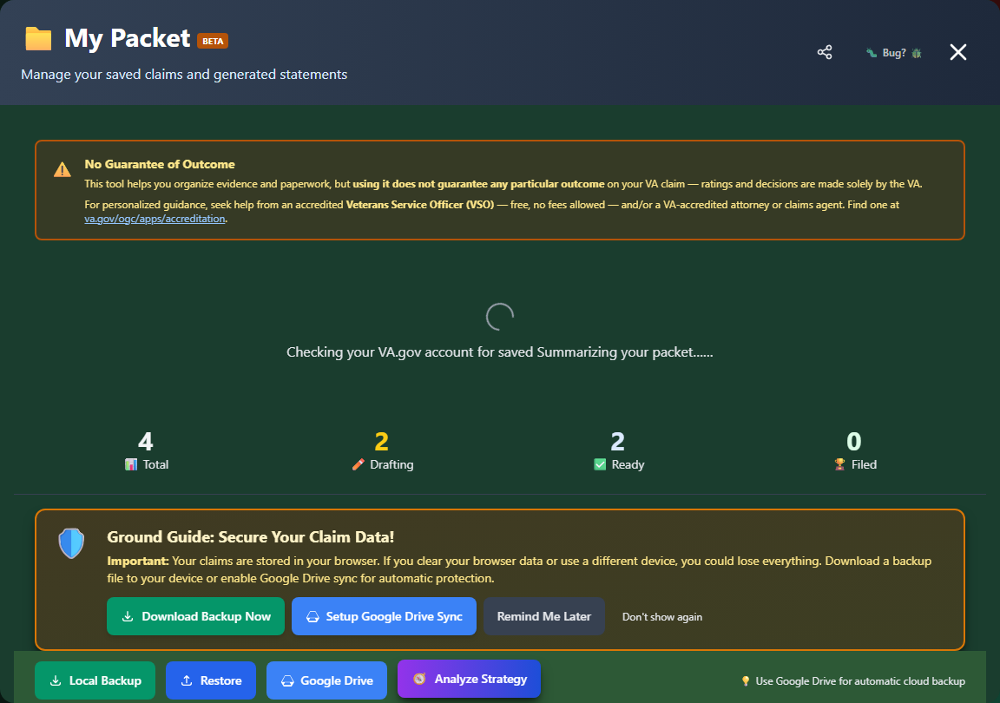
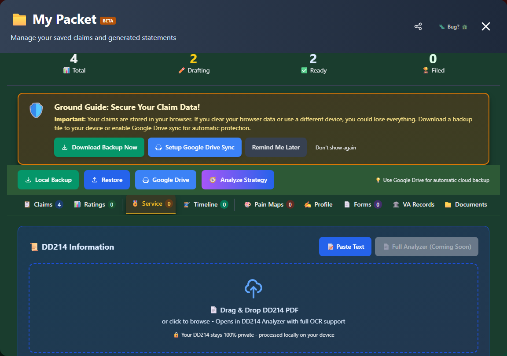
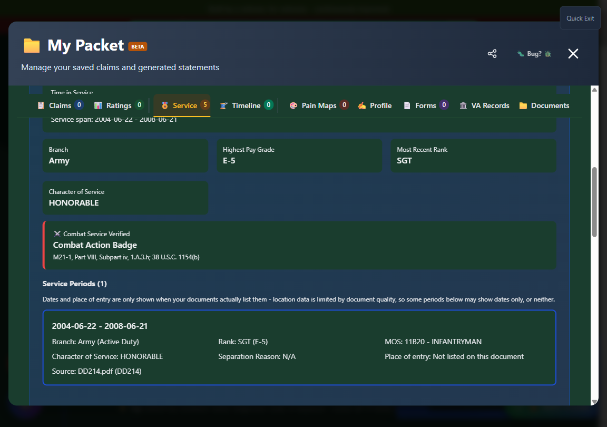

# My Packet

**My Packet** is your personal claims management hub - a secure, locally-stored workspace where you can organize conditions, track progress, save statements, and manage your entire VA claims journey.

🆘 <strong>Veterans Crisis Line:</strong> Call 988, Press 1 | Text 838255 | Available 24/7

---

## What is My Packet?

My Packet serves as your:

- **Claims Organizer** - Track conditions you're researching or claiming
- **Statement Repository** - Store generated nexus statements
- **Progress Tracker** - Monitor claim status
- **Evidence Manager** - Organize your documentation
- **Backup System** - Export and restore your work

_My Packet's Claims tab, with the always-visible Local Backup / Restore / Google Drive toolbar at the top._

---

## In This Section

<h3>📁 Managing Claims</h3>

Add, organize, and track your claimed conditions.

<a href="managing-claims/" class="doc-button">Learn More →</a>

<h3>📋 Saved Forms</h3>

Access and manage your saved forms and statements.

<a href="saved-forms/" class="doc-button">Learn More →</a>

<h3>💾 Backup & Restore</h3>

Export your packet and restore from backup files.

<a href="backup-restore/" class="doc-button">Learn More →</a>

<h3>📤 Exporting Data</h3>

Download your packet data in various formats.

<a href="exporting-data/" class="doc-button">Learn More →</a>

---

## Accessing My Packet

### From the Header

Click **"📁 My Packet"** in the navigation header.

### Global Command Search

Press **Ctrl+K** (**Cmd+K** on Mac) and search for "My Packet."

---

## What's Stored in My Packet

| Item                     | Description                                                           |
| ------------------------ | --------------------------------------------------------------------- |
| **Primary Conditions**   | Disabilities you're claiming as direct/aggravation                    |
| **Secondary Conditions** | Disabilities linked to service-connected conditions                   |
| **Nexus Statements**     | Generated Statements in Support of Claim                              |
| **Doctor Cheat Sheets**  | Reference documents for your providers                                |
| **Forms**                | Completed VA forms from Forms Helper                                  |
| **Status**               | Tracking status for each claim (Drafting, Statement Generated, Filed) |

My Packet also has tabs for **Ratings**, **Service History** (deployments, duty stations, awards, and DD-214 data), **Timeline**, **Pain Maps**, **Profile**, and **Forms** - all part of the same locally-stored packet.

_The Service tab covers deployments, duty stations, and awards alongside your claims. This is its empty state, before any service record has been read._

Once a DD214 or NGB 22 has been processed, the Service tab fills in with your DD214 summary, each period of service, and - if your record carries a qualifying decoration - a **Combat Service** card:

_The Combat Service card names the decoration that established the finding and cites the rule it invokes. Sample record shown. See [Combat Service Determination](../evidence-tools/combat-service.md)._

---

## Key Features

### Claim Organization

- Each condition shows as its own card, with secondary conditions linked to the primary they're connected to
- Cards are listed in the order they were added, newest additions included in your VA Records/C-File suggestions section if applicable

### Progress Tracking

Track each claim's status with the dropdown on its card:

| Status                  | Meaning                                             |
| ----------------------- | --------------------------------------------------- |
| **Drafting**            | Still building your statement and evidence          |
| **Statement Generated** | A nexus statement has been built for this condition |
| **Filed**               | You've submitted this claim to the VA               |

Each condition card also shows a **Readiness Gauge** - a quick visual check for the "Big 3" of a strong claim: current diagnosis, an in-service event, and a nexus connecting them.

### Document Generation

From My Packet, you can:

- Generate nexus statements
- Create doctor's cheat sheets
- Build supporting forms
- Download individual statements as TXT, Word, or PDF (after certifying you've reviewed them)

### Data Security

!!! va-info "Privacy Protected"

    Your packet data is stored **locally in your browser**:

    - ✅ Never leaves your device
    - ✅ Never transmitted to any server
    - ✅ Complete privacy
    - ✅ You control your data

---

## How to Use My Packet

### Basic Workflow

<strong>Add conditions</strong> - Save conditions from search or Secondary Scout

<strong>Research</strong> - Review rating criteria and requirements

<strong>Build statements</strong> - Generate nexus statements for each

<strong>Track progress</strong> - Update status as you work

<strong>Export</strong> - Download your documents when ready

### Adding Conditions

Add conditions from:

- **Search Results** - Click "Save to Packet" on any condition
- **Disability Details** - Click "Save to Packet" in details panel
- **Secondary Scout** - Add suggested secondary conditions
- **C-File Analyzer** - Review conditions the AI identified in your uploaded records and file the ones that apply

---

## Data Persistence

### What Persists

Your packet data persists:

- ✅ Between sessions
- ✅ After closing browser
- ✅ After computer restart

### What Clears Data

Your packet will be cleared if you:

- ❌ Clear browser cookies/data
- ❌ Use browser's "Clear Site Data"
- ❌ Switch browsers
- ❌ Switch devices

### Backup Recommendation

!!! warning "Regular Backups"

    Since data is stored locally, **regularly export backups**:

    1. Open My Packet
    2. Click "Local Backup" in the toolbar (or "Google Drive" to sync to your own Drive)
    3. Save the file to a safe location
    4. See [Backup & Restore](backup-restore.md) for the full options

---

!!! warning "No Guarantee of Outcome"
My Packet helps you organize evidence and paperwork, but **using it does not guarantee any particular outcome** on your VA claim - ratings and decisions are made solely by the VA.

    For personalized guidance, seek help from an accredited **Veterans Service Officer (VSO)** - free, no fees allowed - and/or a VA-accredited attorney or claims agent. Find one at [va.gov/ogc/apps/accreditation](https://www.va.gov/ogc/apps/accreditation/).

---

## Best Practices

!!! tip "My Packet Tips"

    1. **Start with Intent to File** - Protect your effective date
    2. **Add conditions as you discover them** - Don't lose track
    3. **Build statements for each** - Be prepared
    4. **Update statuses** - Know where you are
    5. **Backup regularly** - Protect your work
    6. **Export before filing** - Have records of everything
