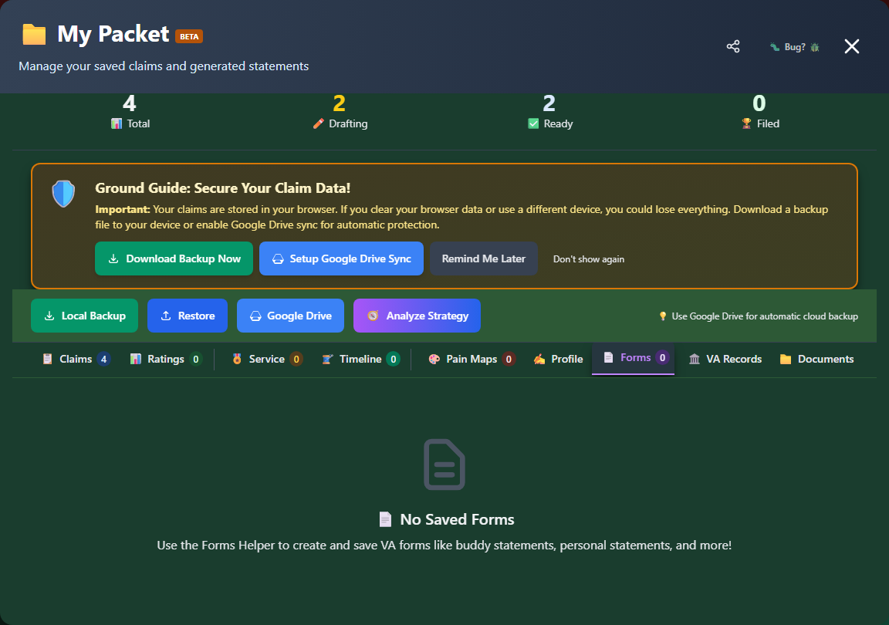

# Saved Forms

Access and manage your saved forms and statements within My Packet.

---

## What Gets Saved

My Packet stores documents you generate:

| Document Type             | Generated From | Purpose                            |
| ------------------------- | -------------- | ---------------------------------- |
| **Nexus Statements**      | Nexus Builder  | Personal statement for claims      |
| **Doctor's Cheat Sheets** | Nexus Builder  | Reference for healthcare providers |
| **VA Forms**              | Forms Helper   | Completed VA form drafts           |

---

## Accessing Saved Forms

### In My Packet

Open <strong>My Packet</strong>

Click the <strong>"Forms"</strong> tab

View the list of <strong>saved forms</strong>

Forms appear as a flat list in the Forms tab - they aren't nested under their related condition. Each entry shows the form's title, its form number/type badge, and when it was saved.

_The Forms tab, showing its empty state - forms saved from Forms Helper appear here._

---

## Viewing Forms

Click **"View"** on any saved form to open it in a read-only viewer showing the full generated content - useful for a final review before you download or print it (Ctrl+P / Cmd+P) for filing.

---

## Downloading Forms

### From the Form Viewer

Find the form in <strong>My Packet</strong>'s Forms tab

Click <strong>"View"</strong> to open it

Click <strong>"Download"</strong> in the viewer

A <strong>.txt</strong> file saves to your device

!!! info "Text Format"
Saved forms download as plain text (.txt), not PDF. Statements built through Nexus Builder (see [Managing Claims](managing-claims.md)) download in more formats - TXT, Word, or PDF.

### Downloading Everything at Once

There's no per-form ZIP or bundle export. To get everything in one file, use one of the whole-packet options in [Backup & Restore](backup-restore.md):

- **Local Backup** - a single JSON file with all your data, including saved forms
- **Dossier (HTML)** - a human-readable report you can open in any browser

---

## Editing Forms

Saved forms open in a read-only viewer - there's no "Edit" button that reopens the original wizard with your answers pre-filled. To change a form, go back to Forms Helper, fill it out again, and save a new one.

---

## Form Statuses

Forms appear in the list as soon as they're saved from Forms Helper - there's no separate Draft/Generated/Downloaded status tracking for them (that concept applies to **claims**, not saved forms - see [Managing Claims](managing-claims.md)).

---

## Managing Form Storage

### Storage Capacity

Forms are stored in browser local storage:

- Limited capacity (~5-10 MB typical)
- Multiple forms consume space
- Consider deleting outdated forms

### Deleting Forms

Find the form

Click <strong>"Delete"</strong>

<strong>Confirm</strong> deletion

!!! warning "Before Deleting"

    - Download a copy first
    - Consider backup export
    - Deletion is permanent

---

## Tips for Form Management

!!! tip "Best Practices"

    1. **Download promptly** - Save copies to your device
    2. **Name files clearly** - Rename downloaded files by hand so they're easy to find later
    3. **Organize by condition** - Create folders on your device, since My Packet's Forms tab doesn't group by condition
    4. **Backup regularly** - Your saved forms are included in Local Backup and the HTML Dossier
    5. **Update before filing** - Review and refresh
    6. **Delete outdated versions** - Free up storage space
    7. **Keep submission copies** - Save final versions you submit
