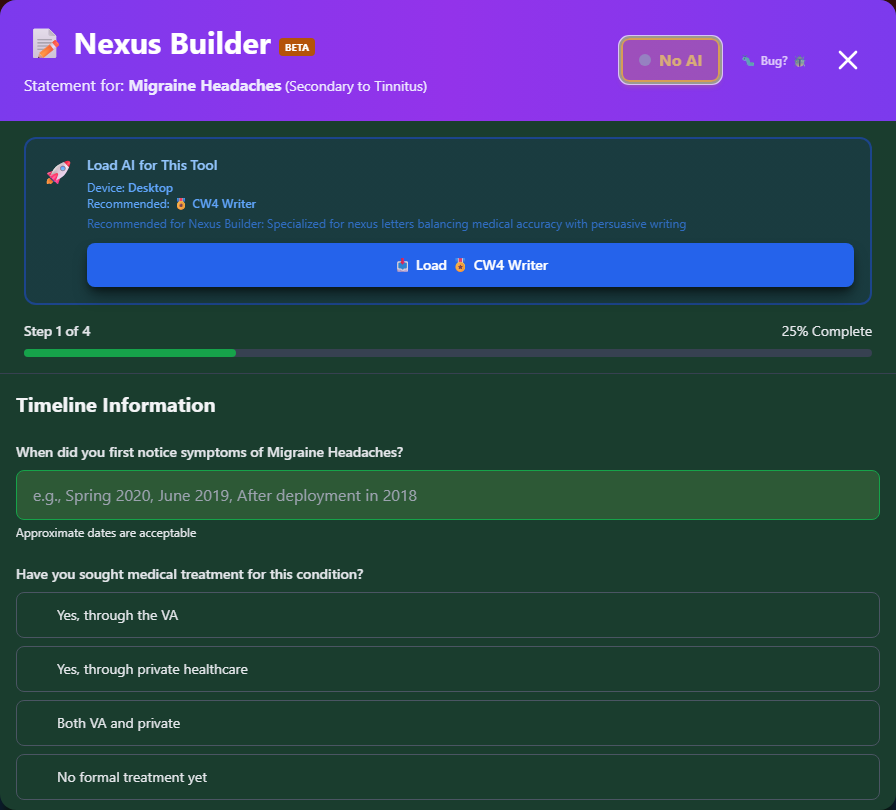
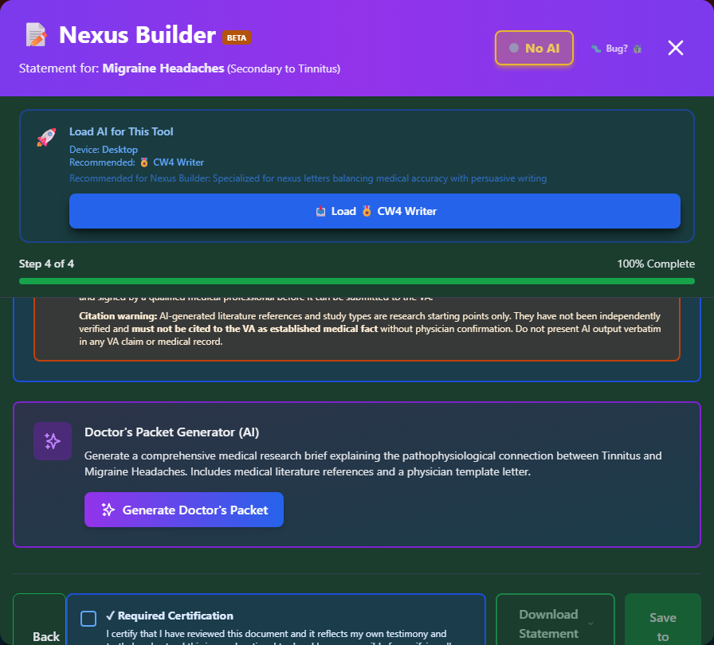

# Building Your Statement

Step-by-step guide through the Nexus Builder wizard to create your Statement in Support of Claim.


_Step 1 of the wizard: Timeline Information. The AI Statement Assistant banner at the top is optional and only activates if you load a local model._

---

## Accessing the Wizard

### From Disability Details

1. Search for your condition
2. Click to open details panel
3. Click **"Build Statement"** button
4. Wizard opens with condition pre-filled

### From My Packet

1. Open **My Packet**
2. Find your saved condition
3. Click **"Build Statement"**
4. Wizard opens with condition pre-filled

### From Secondary Scout

1. Review secondary condition suggestions
2. Click **"Learn How to Claim"**
3. Wizard opens with primary and secondary pre-filled

---

## Wizard Steps Overview

The Nexus Builder guides you through **3 steps** for a direct claim, or **4 steps** for a secondary claim (an extra "Connection" step is inserted):

| Step                        | Title                                                  | Purpose                                                                |
| --------------------------- | ------------------------------------------------------ | ---------------------------------------------------------------------- |
| 1                           | Timeline Information                                   | When you first noticed symptoms and what treatment you've had          |
| 2 _(secondary claims only)_ | Connection (Nexus) to Your Service-Connected Condition | How your primary condition causes or aggravates this one               |
| 2 or 3                      | Severity and Daily Impact                              | How the condition affects your work, social life, and daily activities |
| Final step                  | Review Your Statement                                  | Preview, optionally enhance with AI, certify, and download             |

A progress bar at the top of the wizard shows "Step X of Y" and a completion percentage.

---

## Step 1: Timeline Information

<div class="step-container">
<div class="step">
<strong>When did you first notice symptoms?</strong> - Free text, e.g. "Spring 2020" or "After deployment in 2018"
</div>
<div class="step">
<strong>Have you sought medical treatment for this condition?</strong> - Choose Yes (VA), Yes (private), Both, or No formal treatment yet
</div>
</div>

---

## Step 2: Connection (Secondary Claims Only)

This step only appears if you started the wizard from a **secondary** condition (for example, from Secondary Scout or a saved secondary claim in My Packet). It doesn't appear for direct claims.


_"Connection (Nexus) to Your Service-Connected Condition" - select how the primary condition causes or aggravates the secondary one, then explain in your own words._

<div class="step-container">
<div class="step">
<strong>How does your primary condition cause or aggravate this one?</strong> - Choose from a list of aggravation mechanisms
</div>
<div class="step">
<strong>Explain in your own words</strong> - How the primary condition affects the secondary one
</div>
<div class="step">
<strong>Describe a specific recent incident</strong> - A concrete example where the two conditions interacted
</div>
</div>

!!! tip "Keyboard Shortcut"
Press <kbd>Ctrl</kbd>+<kbd>Enter</kbd> in a text field to jump to the next field instead of reaching for your mouse.

---

## Step: Severity and Daily Impact

<div class="step-container">
<div class="step">
<strong>How does this condition affect your ability to work?</strong>
</div>
<div class="step">
<strong>How does this condition affect your social and family life?</strong>
</div>
<div class="step">
<strong>Provide specific examples of how this condition limits your daily activities</strong>
</div>
</div>

Each field includes example placeholder text to show the level of detail that's useful - for instance:

```
Example: I have difficulty concentrating due to fatigue from poor sleep.
I've missed 15+ days of work in the past year. My supervisor has
documented performance issues related to exhaustion...
```

---

## Final Step: Review & Generate


_The final step previews your generated statement side-by-side with a Doctor's Cheat Sheet draft, ready to review before downloading._

### Review Your Statement

The wizard generates your statement automatically from what you entered in the earlier steps, and shows it in a preview pane alongside a Doctor's Cheat Sheet draft.

### Edit if Needed

Click **"← Back"** to return to any earlier step and change your answers - the statement preview updates automatically.

### ✨ AI Enhancement (Optional)

**New Feature!** You can optionally enhance your statement with AI:

1. Click the **"✨ Enhance with AI"** button
2. Review the privacy disclosure showing what data will be shared
3. Click **"I Understand, Enhance with AI"** to proceed
4. The AI generates a professionally-written version
5. Use the toggle to switch between Standard and AI versions
6. Edit further if needed

!!! info "AI is Optional"
The standard template is excellent for most claims. AI enhancement is available for those who want additional polish, but it's never required.

### What AI Improves

- Professional VA-appropriate language
- Clear, logical structure
- Focus on functional impairment (what the VA looks for)
- Complete coverage of all key points

### Privacy Note

When using AI enhancement:

- ✅ Condition names and descriptions are shared
- ❌ Your name is NOT shared
- ❌ Your SSN is NOT shared
- ❌ Specific dates and locations are NOT shared
- ❌ No personally identifying information is ever shared

[Full AI privacy details →](../privacy/ai-assistant/)

### Certify and Download

Before you can download or save, check the **"Required Certification"** box confirming you've reviewed the document and it reflects your own testimony. This unlocks the **"Download Statement"** and **"Save to Packet"** buttons.

See [Download Options](download-options.md) for the available file formats.

---

## Tips for Each Section

!!! tip "Timeline" - Approximate dates are fine - "Spring 2020" is better than leaving it blank - Be accurate about whether you've sought treatment; it affects what evidence you'll need

!!! tip "Connection (Secondary Claims)" - Be specific about the medical mechanism - vague connections are the easiest to deny - The specific-incident example carries a lot of weight - use a real, recent event

!!! tip "Severity and Impact" - Describe your WORST days, not just average days - Be concrete - specific examples are better than general statements - Include financial impact if relevant (lost wages, etc.)
