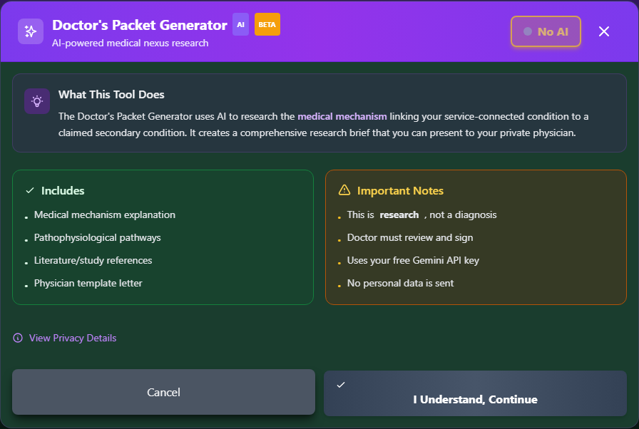

# Doctor's Cheat Sheet

Generate a reference document to help your healthcare provider write a medical nexus opinion.

_The "ready to generate" screen - review what's included, then click "I Understand, Continue" to have AI draft the packet._

!!! warning "No Guarantee of Outcome"
This tool helps you organize evidence and paperwork, but **using it does not guarantee any particular outcome** on your VA claim - ratings and decisions are made solely by the VA. Before filing, have a VSO or VA-accredited attorney review your claim. Find one at [va.gov/ogc/apps/accreditation](https://www.va.gov/ogc/apps/accreditation/).

---

## What is the Doctor's Cheat Sheet?

Inside Nexus Builder, this feature is labeled the **"Doctor's Packet Generator (AI)"**. It's an AI-powered tool that:

- Researches the **medical mechanism** linking your service-connected condition to the claimed secondary condition
- Generates a comprehensive **research brief** you can bring to your physician
- Only appears for **secondary condition** claims, on the wizard's final Review step

### What It Includes

- Medical mechanism explanation
- Pathophysiological pathways
- Literature/study references
- A physician template letter

!!! warning "Research Starting Point, Not Established Fact"
AI-generated literature references and study types are research starting points only. They have **not** been independently verified and **must not be cited to the VA as established medical fact** without physician confirmation. Never present AI output verbatim in a VA claim or medical record.

---

## Why It's Helpful

### Doctors May Not Know VA Requirements

Most civilian physicians:

- Don't write nexus letters regularly
- Are unfamiliar with VA standards
- Don't know what language to use
- May not understand the "at least as likely as not" standard

### It Saves Time

Rather than explaining everything verbally:

- Give them the cheat sheet
- They can reference while writing
- Reduces back-and-forth
- Results in stronger letters

---

## Cheat Sheet Contents

### Section 1: What is a Nexus Letter?

Explains to the doctor:

> "A nexus letter is a medical opinion stating whether the
> patient's current condition is connected to their military
> service. The VA requires this medical opinion to grant
> service connection."

### Section 2: Legal Standard

The required standard:

> "The VA uses the 'at least as likely as not' standard,
> meaning 50% or greater probability. The opinion should
> state whether it is 'at least as likely as not' that
> the condition is related to military service."

### Section 3: Key Elements to Include

Checklist for the doctor:

- ☐ Your medical credentials
- ☐ Review of medical records
- ☐ Current diagnosis
- ☐ In-service event/injury/exposure
- ☐ Medical reasoning linking them
- ☐ "At least as likely as not" language
- ☐ Signature and date

### Section 4: Your Specific Information

Pre-filled with your case details:

| Item                  | Your Information    |
| --------------------- | ------------------- |
| **Condition**         | [Your condition]    |
| **Service Dates**     | [Your dates]        |
| **In-Service Event**  | [What happened]     |
| **Current Symptoms**  | [Your symptoms]     |
| **Connection Theory** | [Medical reasoning] |

### Section 5: Suggested Language

Helpful phrases for the doctor:

**For Positive Opinion:**

> "It is my medical opinion that [condition] is at least
> as likely as not related to [veteran]'s military service,
> specifically [event/exposure/injury] that occurred during
> their service from [dates]."

**For Secondary Connection:**

> "It is my medical opinion that [secondary condition] was
> at least as likely as not caused or aggravated by the
> service-connected [primary condition]."

---

## Generating the Cheat Sheet

There are two ways to reach the Doctor's Packet Generator:

<strong>From Secondary Scout results</strong> - expand a suggestion card and click <strong>"Get Doctor's Packet (AI)"</strong>

<strong>From Nexus Builder</strong> - on a secondary claim's final Review step, click <strong>"Generate Doctor's Packet"</strong>

Review the consent screen, then click <strong>"I Understand, Continue"</strong>

The AI generates the research brief - download it as text, Word, or PDF

---

## Using the Cheat Sheet

### Before Your Appointment

1. **Print the cheat sheet** - Have a physical copy
2. **Review it yourself** - Know what it contains
3. **Gather your records** - Medical records to share

### At Your Appointment

1. **Explain your request** - "I'm filing a VA claim and need a nexus letter"
2. **Provide the cheat sheet** - "This explains what the VA needs"
3. **Share your records** - Give them relevant documentation
4. **Discuss your case** - Answer their questions

### After Your Appointment

1. **Follow up** - Make sure they're working on it
2. **Review the letter** - Check it includes required elements
3. **Request changes if needed** - Ensure proper language is used

---

## What Makes a Good Nexus Letter

### Must Include

| Element                  | Why It Matters              |
| ------------------------ | --------------------------- |
| **Doctor's credentials** | Establishes qualification   |
| **Review of records**    | Shows informed opinion      |
| **Current diagnosis**    | Confirms you have condition |
| **In-service event**     | What caused/contributed     |
| **Medical reasoning**    | WHY they're connected       |
| **Standard language**    | "At least as likely as not" |
| **Signature/date**       | Authenticates document      |

### Stronger Letters Include

- Citation of medical literature
- Explanation of medical mechanism
- Ruling out other causes
- Discussion of progression timeline
- Detailed medical rationale

---

## Tips for Success

!!! tip "Getting a Good Nexus Letter"

    1. **Choose the right provider** - Primary care, specialist, or IMO doctor
    2. **Bring documentation** - Medical records, service records
    3. **Give them time** - Don't rush the process
    4. **Offer to pay** - Some providers charge for letters
    5. **Review before submitting** - Ensure it meets VA standards
    6. **Get multiple if needed** - Specialist opinions carry more weight

---

## Common Issues

### "I'm Not Comfortable Writing This"

Some doctors may decline. Options:

- Ask for a referral to someone who will
- Seek an Independent Medical Opinion (IMO)
- Try a different provider

### Wrong Language Used

If the letter says:

- ❌ "Possibly related" - Too weak
- ❌ "May be related" - Too weak
- ❌ "Could be related" - Too weak

Request revision to:

- ✅ "At least as likely as not"
- ✅ "More likely than not"

### Missing Elements

If key elements are missing:

- Politely request an addendum
- Provide the cheat sheet again
- Explain what's missing

---

## Independent Medical Opinions (IMOs)

If your regular doctor can't help, consider an **IMO provider**:

- Doctors who specialize in VA nexus letters
- Typically charge a fee ($300-$1500+)
- Often have VA claims experience
- Review records remotely

!!! warning "Research IMO Providers"
If using an IMO provider, research their:

    - Credentials and specialty
    - Experience with VA claims
    - Reviews from other veterans
    - Fee structure
