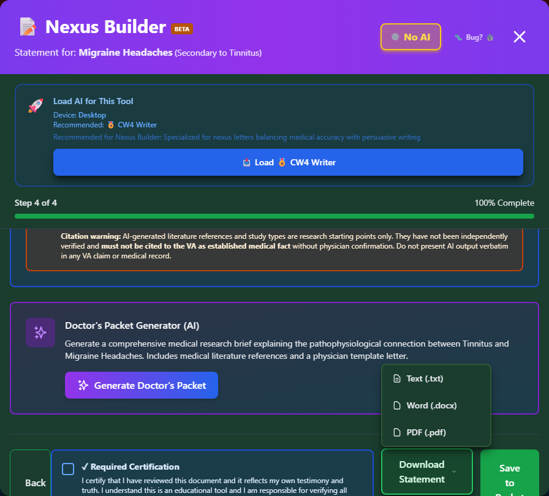

# Download Options

Export your Statement in Support of Claim and related documents.


_Check the Required Certification box first - it unlocks the Download Statement and Save to Packet buttons._

---

## Available Downloads

After completing the Nexus Builder wizard, check the **Required Certification** box, then click **"Download Statement"** to see the format menu:

| Document                          | Format                                   | Purpose                                                   |
| --------------------------------- | ---------------------------------------- | --------------------------------------------------------- |
| **Statement in Support of Claim** | Text (.txt), Word (.docx), or PDF (.pdf) | Submit to VA                                              |
| **Doctor's Packet**               | Text (.txt), Word (.docx), or PDF (.pdf) | Give to your doctor (secondary claims only, AI-generated) |

You can also click **"Save to Packet"** to store the statement in My Packet without downloading it immediately.

---

## Statement in Support of Claim

### What It Contains

Your complete personal statement including:

- Header with your information
- Condition being claimed
- Service connection explanation
- Symptom description
- Impact on daily life
- Certification and signature line

### Download Steps

<div class="step-container">
<div class="step">
Complete the Nexus Builder wizard
</div>
<div class="step">
Review the generated statement on the final step
</div>
<div class="step">
Check the <strong>Required Certification</strong> box
</div>
<div class="step">
Click <strong>"Download Statement"</strong> and choose Text, Word, or PDF
</div>
</div>

### PDF Features

- **Professional formatting** - Clean, official appearance
- **Print-ready** - Standard letter size
- **Signature line** - Space for your signature
- **Date field** - Space for signing date

---

## Doctor's Packet

### What It Contains

An AI-generated research brief for your healthcare provider (secondary claims only):

- Medical mechanism explanation
- Pathophysiological pathways
- Literature/study references
- A physician template letter

See [Doctor's Cheat Sheet](doctor-cheat-sheet.md) for the full walkthrough, including the required AI-content disclaimer.

### Download Steps

<div class="step-container">
<div class="step">
On a secondary claim's final Review step, click <strong>"Generate Doctor's Packet"</strong>
</div>
<div class="step">
Accept the consent screen ("I Understand, Continue")
</div>
<div class="step">
Download the generated packet as Text, Word, or PDF
</div>
</div>

### Choosing a Format

- **Text (.txt)** - Easiest to copy/paste or edit before printing
- **Word (.docx)** - Editable in any word processor
- **PDF (.pdf)** - Print-ready, professional appearance

---

## Saving Your Documents

### Recommended Organization

Create a folder structure for your claim:

```
My VA Claim/
├── Statements/
│   ├── Statement_PTSD_2024-01-15.pdf
│   └── Statement_BackPain_2024-01-15.pdf
├── Doctor_Letters/
│   ├── Cheat_Sheet_PTSD.pdf
│   └── Nexus_Letter_PTSD.pdf
├── Medical_Records/
│   └── [your records]
└── VA_Forms/
    └── [your forms]
```

### Naming Convention

Use descriptive filenames:

```
Statement_[Condition]_[Date].pdf

Examples:
Statement_PTSD_2024-01-15.pdf
Statement_LumbarStrain_2024-01-15.pdf
Cheat_Sheet_SleepApnea_2024-01-15.pdf
```

---

## After Downloading

### Review Your Statement

Before submitting:

- ☐ All information is accurate
- ☐ Dates are correct
- ☐ No typos or errors
- ☐ Nothing important is missing

### Sign Your Statement

Your statement needs your signature:

1. **Print** the document
2. **Sign** in the signature area
3. **Date** the document
4. **Scan** or photograph for submission

### Submitting to VA

Submit your statement:

| Method          | How                             |
| --------------- | ------------------------------- |
| **Online**      | Upload to VA.gov / eBenefits    |
| **Mail**        | Send to your VA Regional Office |
| **In Person**   | Bring to VA appointment         |
| **Through VSO** | Give to your representative     |

---

## Re-Generating Documents

### If You Need Changes

1. Open **My Packet**
2. Find the condition
3. Click **"Build Statement"**
4. Your previous entries may be saved
5. Make edits
6. Re-generate and download

### Multiple Conditions

For multiple claims:

- Create separate statements for each condition
- Or create one combined statement
- Nexus Builder supports both approaches

---

## Printing Tips

### For Submission

- Use **white, 8.5" x 11" paper**
- Print in **black ink**
- Ensure **good print quality**
- Sign in **blue or black ink**

### For Your Records

- Keep a **signed copy** for yourself
- Store **digitally** as backup
- Date your copies

---

## Troubleshooting

### PDF Won't Open

- Ensure you have a PDF reader installed
- Try a different browser
- Download again

### Document Is Blank

- Complete all required fields in wizard
- Click "Generate" before downloading
- Check your browser's download settings

### Wrong Information

- Return to wizard
- Edit the incorrect section
- Re-generate document
