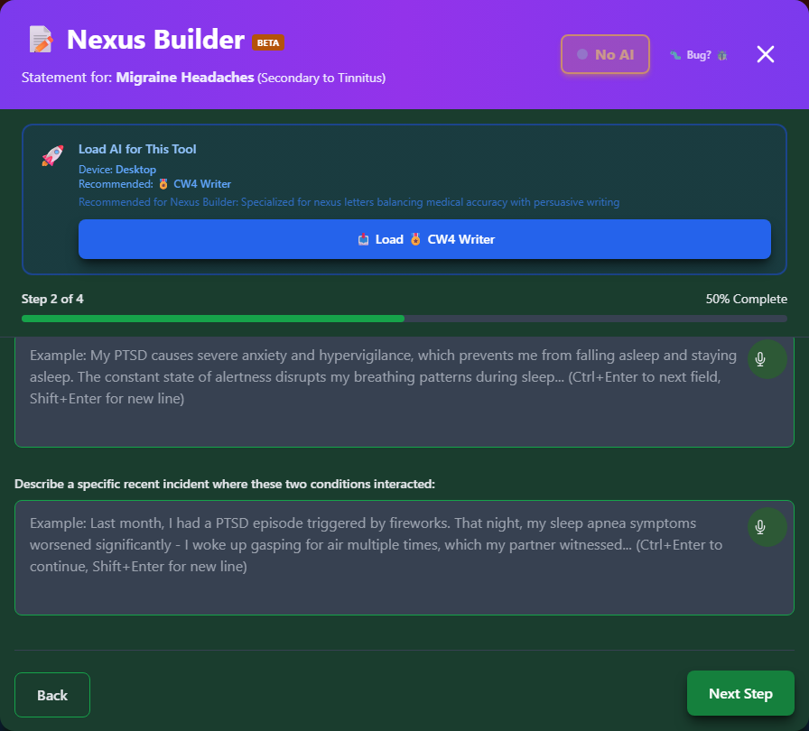

# Nexus Builder

The **Nexus Builder** is a guided wizard that helps you create a professional **Statement in Support of Claim** that articulates the connection between your condition and military service.

_A secondary-claim statement in progress - "Statement for: Migraine Headaches (Secondary to Tinnitus)."_

🆘 <strong>Veterans Crisis Line:</strong> Call 988, Press 1 | Text 838255 | Available 24/7

---

## What is a Nexus?

A **nexus** is the medical and legal connection between your current condition and your military service. It answers the question:

> "How is this condition connected to your time in service?"

---

## Types of Service Connection

### Direct Service Connection

The condition:

- Started during military service
- Was caused by an event in service
- Was first diagnosed in service

### Secondary Service Connection

The condition:

- Was caused by a service-connected condition
- Was aggravated by a service-connected condition
- Resulted from medication for a service-connected condition

### Aggravation

A pre-existing condition:

- Was made permanently worse by military service
- Worsened beyond its natural progression

---

## In This Section

<h3>📋 What is a Nexus Statement?</h3>

Understanding the purpose and components of a nexus statement.

<a href="what-is-nexus/" class="doc-button">Learn More →</a>

<h3>✍️ Building Your Statement</h3>

Step-by-step guide through the Nexus Builder wizard.

<a href="building-statement/" class="doc-button">Learn More →</a>

<h3>👨‍⚕️ Doctor's Cheat Sheet</h3>

Generate a reference sheet for your healthcare provider.

<a href="doctor-cheat-sheet/" class="doc-button">Learn More →</a>

<h3>📥 Download Options</h3>

Export your statement and supporting documents.

<a href="download-options/" class="doc-button">Learn More →</a>

---

## Why Use Nexus Builder?

### Professional Format

- Clean, professional formatting
- Proper legal language
- Clear structure

### Comprehensive Coverage

- Condition details
- Service connection
- Medical theory
- Symptom impact

### Time-Saving

- Guided wizard format
- Pre-filled information from your packet
- Templates for common scenarios

### Educational

- Explains each section
- Teaches you what matters
- Helps you articulate your case

---

## How It Works

The wizard is **3 steps** for a direct claim, or **4 steps** for a secondary claim:

<strong>Timeline</strong> - When you first noticed symptoms and whether you've sought treatment

<strong>Connection (secondary claims only)</strong> - How your primary condition causes or aggravates this one

<strong>Severity and Daily Impact</strong> - How the condition affects your work, social life, and daily activities

<strong>Review & Generate</strong> - Preview your statement, optionally enhance it with AI, and download

---

## ✨ AI Statement Assistant

**New!** The Nexus Builder now includes an optional AI-powered assistant that can help you write a more professional statement.

### How It Works

1. Complete the statement wizard with your information
2. On the review screen, click **"✨ Enhance with AI"**
3. Review the privacy disclosure showing what data will be shared
4. Click **"I Understand, Enhance with AI"** to proceed
5. The AI generates a professionally-written version of your statement
6. Review, edit if needed, and download

### Privacy First

- **You control when AI is used** - It only runs when you click the button
- **Explicit consent required** - You see exactly what's shared before confirming
- **No personal info sent** - Names, SSN, dates, and addresses are never shared
- **Optional feature** - Standard templates work great without AI

[Learn more about AI privacy →](../privacy/ai-assistant/)

### What AI Improves

| Aspect                | How AI Helps                           |
| --------------------- | -------------------------------------- |
| **Professional tone** | VA-appropriate language and formatting |
| **Clear structure**   | Logical flow of information            |
| **Effective wording** | Focus on functional impairment         |
| **Completeness**      | Ensures all key points are covered     |

---

## Important Note

!!! warning "Supporting Document, Not Medical Evidence"
The Nexus Builder creates a **Statement in Support of Claim** (VA Form 21-4138 equivalent), which is your personal statement.

    For a **medical nexus opinion**, you need a qualified medical professional to review your case and provide their opinion. The Doctor's Cheat Sheet helps facilitate this conversation.

!!! warning "No Guarantee of Outcome"
This tool helps you organize evidence and paperwork, but **using it - including the optional AI Statement Assistant - does not guarantee any particular VA rating or claim outcome**. Ratings and decisions are made solely by the VA. Before filing, have a VSO or VA-accredited attorney review your statement. Find one at [va.gov/ogc/apps/accreditation](https://www.va.gov/ogc/apps/accreditation/).

---

## Accessing Nexus Builder

### From Disability Details

1. Search for a condition
2. Click to view details
3. Click **"Build Statement"**

### From Secondary Scout

1. Find a secondary condition suggestion
2. Click **"Learn How to Claim"**

### From My Packet

1. Open My Packet
2. Find a saved condition
3. Click **"Build Statement"**

---

## Statement Components

Your generated statement includes:

| Section                | Purpose                            |
| ---------------------- | ---------------------------------- |
| **Header**             | Your identifying information       |
| **Condition**          | What you're claiming               |
| **Service Dates**      | Your military service period       |
| **Service Connection** | How it relates to service          |
| **Medical Nexus**      | The medical theory connecting them |
| **Symptoms**           | Current symptom description        |
| **Impact**             | How it affects your daily life     |
| **Treatment**          | Medical care you've received       |
| **Conclusion**         | Request for service connection     |

---

## Best Practices

!!! tip "Creating Effective Statements"

    - **Be specific** - Dates, events, details matter
    - **Be honest** - Don't exaggerate, accuracy helps
    - **Include impacts** - How does it affect your work, relationships, daily life?
    - **Mention treatment** - Document your medical care history
    - **Stay factual** - Focus on what happened and current symptoms
    - **Use medical terms** - But also explain in plain language
