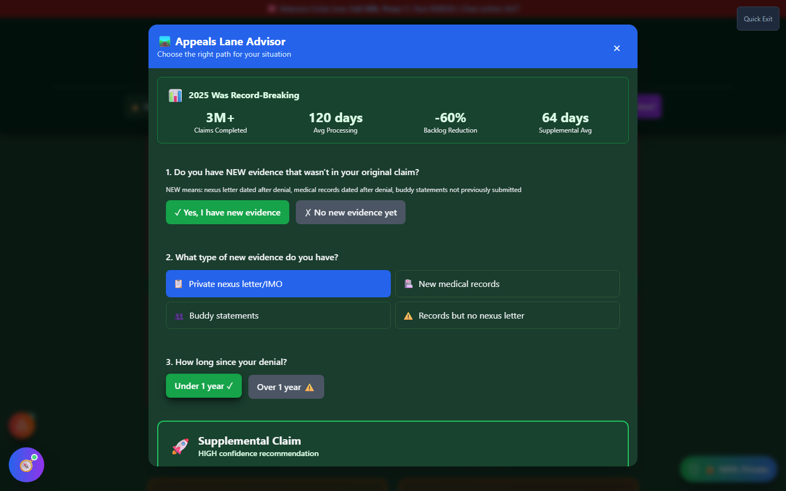

# Appeals Lane Advisor

Appeals Lane Advisor helps you choose between the three AMA (Appeals Modernization Act) appeal lanes after a VA decision you disagree with — Supplemental Claim, Higher-Level Review, or Board Appeal — based on your evidence and timing.

🆘 <strong>Veterans Crisis Line:</strong> Call 988, Press 1 | Text 838255 | Available 24/7

---

## The Three Appeal Lanes

| Lane                             | Best When                                                                                                                                                                                              | Speed                                                                                                                                                            |
| -------------------------------- | ------------------------------------------------------------------------------------------------------------------------------------------------------------------------------------------------------ | ---------------------------------------------------------------------------------------------------------------------------------------------------------------- |
| 🚀 **Supplemental Claim**        | You have **new** evidence not previously submitted (a nexus letter dated after the denial, new medical records, new buddy statements)                                                                  | Fastest — averaging **64 days** per the app's 2025 data                                                                                                          |
| ⚖️ **Higher-Level Review (HLR)** | The rater made a **clear, specific error** with the evidence already in your file (ignored evidence, misread evidence, a math error, failed duty to assist) — not just a disagreement with the outcome | Moderate — averaging **~140 days**; only about 18-20% of HLRs succeed, since most denials aren't rater errors                                                    |
| 🏛️ **Board Appeal**              | Complex cases, or multiple prior denials, that need a full review by a Veterans Law Judge                                                                                                              | Slowest — the app's real observed average is **~35.5 months** (not the official 12-18 month estimate), and about 28% of cases get remanded, adding 2+ more years |

**Important:** Higher-Level Review cannot include any new evidence — submitting new evidence gets an HLR kicked out. If you don't have new evidence _and_ don't believe the rater made a clear error, the tool recommends **gathering new evidence first** (a private nexus letter, buddy statements, new medical records) before filing anything, and filing an Intent to File immediately to lock in your effective date while you prepare.

---

## How to Launch Appeals Lane Advisor

Appeals Lane Advisor doesn't have a home page card or command-palette entry — reach it from:

- **Header** → **"🛠️ Tools"** dropdown → Maximize Your Rating section → **"Appeals Lane Advisor"**.

---

## What You'll See

_After answering the three questions — new evidence, evidence type, and time since denial — the tool shows a confidence-rated recommendation with its reasoning._

---

## Answering the Questions

<strong>Do you have new evidence?</strong> - New means dated or created after your denial, not previously submitted

<strong>What type of new evidence?</strong> - Private nexus letter/IMO, new medical records, buddy statements, or records without a nexus letter

<strong>Or, did the rater make a clear error?</strong> - Asked instead if you have no new evidence

<strong>How long since your denial?</strong> - Determines whether filing now preserves your original effective date

Each recommendation includes a **confidence level** (HIGH or MODERATE), the reasoning behind it, your specific recommended action, and — where relevant — a warning about what could go wrong with that lane.

---

## Why Timing Matters: Effective Dates

The tool illustrates two scenarios side by side:

- **File within 1 year of your denial:** your Supplemental Claim preserves your **original effective date** — you don't lose any backpay for the gap between the denial and the new filing.
- **File after 1 year:** the effective date resets, and you lose backpay for the time between your original filing and the new one.

Expand **"Critical: Effective Date Rules"** in the tool for the exact worked examples.

---

## Important Disclaimer

!!! warning "No Guarantee of Outcome"
Appeals Lane Advisor helps you **spot the appeal path that fits your situation before you file** — it does not guarantee any particular VA rating, claim outcome, or processing timeline. The statistics shown reflect VA-wide and BVA-wide averages, not a prediction for your specific appeal.

    Before you choose an appeal lane, have an accredited **Veterans Service Officer (VSO)** (free, no fees allowed) or a **VA-accredited attorney or claims agent** review your case. Find one at [va.gov/ogc/apps/accreditation](https://www.va.gov/ogc/apps/accreditation/).
