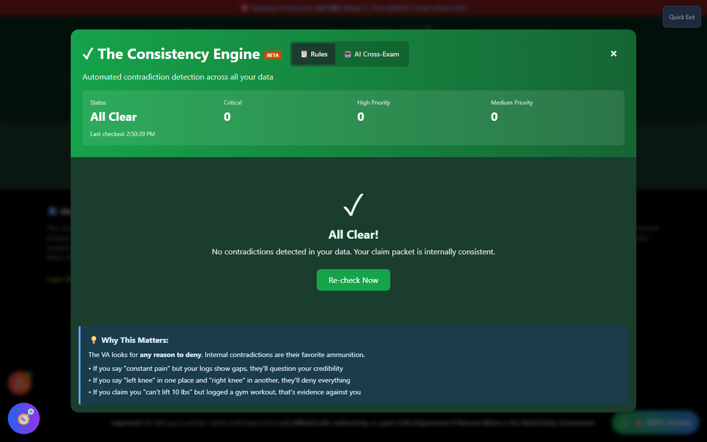

# Consistency Engine

The Consistency Engine automatically scans everything you've saved in Vet-Rate — claims, symptom logs, timeline events, and statements — for internal contradictions. It's the same kind of gap the VA looks for to justify a denial, so finding it first matters.

🆘 <strong>Veterans Crisis Line:</strong> Call 988, Press 1 | Text 838255 | Available 24/7

---

## Why This Matters

As the tool itself puts it: _"The VA looks for any reason to deny. Internal contradictions are their favorite ammunition."_ A few concrete examples it calls out:

- If you say "constant pain" but your symptom logs show gaps, your credibility gets questioned.
- If you say "left knee" in one place and "right knee" in another, the VA may deny everything rather than sort it out.
- If you claim you "can't lift 10 lbs" but logged a gym workout, that's evidence used _against_ you.

---

## How to Launch Consistency Engine

Consistency Engine doesn't have a home page card — reach it from:

- **Header** → **"🛠️ Tools"** dropdown → Quality Control section → **"Consistency Engine"**.

---

## Two Modes

Consistency Engine has two tabs:

- **📋 Rules** — Automated, rule-based checks run instantly across everything you've stored, no AI required.
- **🤖 AI Cross-Exam** — An AI-powered comparison of your evidence against your statements, for a more open-ended read. Requires an AI model loaded via the **AI Command Center**.

---

## What You'll See

_The Rules tab runs automatically when you open Consistency Engine — this example shows a fully consistent packet with zero contradictions found._

The header always shows a live summary: overall **Status**, and counts of **Critical**, **High Priority**, and **Medium Priority** issues found, plus when the check last ran.

---

## Reading a Contradiction Card

When the Rules check finds an issue, each card shows:

| Field                       | What It Shows                                  |
| --------------------------- | ---------------------------------------------- |
| **Severity badge**          | 🚨 Critical, ⚠️ High, or ⚡ Medium             |
| **Contradiction Detected**  | A plain description of the conflict            |
| **Location 1 / Location 2** | Exactly where each conflicting statement lives |
| **How to Fix**              | A specific suggested correction                |

Click **"Re-check Now"** any time after you've made changes to your saved data.

---

## Important Disclaimer

!!! warning "No Guarantee of Outcome"
Consistency Engine helps you **spot potential issues before you file** — it does not guarantee any particular VA rating or claim outcome, and it can only check contradictions in what you've actually saved to Vet-Rate.

    Before you file, have an accredited **Veterans Service Officer (VSO)** (free, no fees allowed) or a **VA-accredited attorney or claims agent** review your full claim packet. Find one at [va.gov/ogc/apps/accreditation](https://www.va.gov/ogc/apps/accreditation/).
