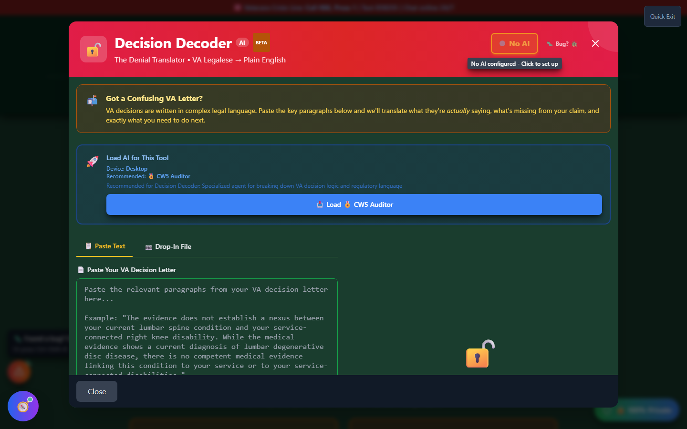

# Decision Decoder

Decision Decoder translates **any VA decision letter** — not just denials — into plain English. Paste in a letter (or drop in a PDF or photo) and it identifies what actually happened, what's missing from your claim, what to do next, and any appeal deadline mentioned in the letter.

🆘 <strong>Veterans Crisis Line:</strong> Call 988, Press 1 | Text 838255 | Available 24/7

---

## Decision Decoder vs. Denial Decoder

Vet-Rate has two related tools and it's easy to mix them up:

- **Decision Decoder** (this page) reads the full range of VA decision outcomes — Full Denial, Partial Denial, Mixed Decision, Reduction, Deferred, or Granted — from pasted text or an uploaded PDF/image, and gives a structured breakdown for whichever one it is.
- **[Denial Decoder](denial-decoder.md)** is built specifically around the denial-letter scenario: it's camera/photo-first (great for snapping a paper letter you just opened) and its output is narrower — it's built to explain _why you were denied_, not to also parse grants, reductions, or mixed outcomes.

If you have a real decision letter of any kind and want the full picture, start with Decision Decoder. If you specifically have a denial letter and a phone camera handy, Denial Decoder is the faster path.

---

## How to Launch Decision Decoder

- **Home page** → scroll to the **"✅ Quality Control"** section → click **"🔓 Decode Decision"** on the Decision Decoder card.
- **Header** → **"🛠️ Tools"** dropdown → Quality Control section → **"Decision Decoder"**.

---

## What You'll See

_Decision Decoder's "ready to decode" screen — paste the relevant paragraphs, or switch to Drop-In File, then load an AI model to run the full analysis._

Full AI-generated results appear once you've loaded a model from the **"Load AI for This Tool"** panel or the **AI Command Center**. Without AI loaded, Decision Decoder still runs a basic keyword pattern-match against your pasted text and labels the result **"Pattern-Match Analysis (No AI Loaded)"** — useful for a quick read, but load AI for the full breakdown.

---

## Getting Your Letter In

<strong>Paste the key paragraphs</strong> — You don't need the whole letter, just the "Reasons for Decision" section

<strong>Or drop in a file</strong> — PDF or image, with support for multiple files at once, OCR'd locally in your browser

<strong>Decode</strong> — Click "Decode This Decision"

!!! tip "Large documents get trimmed"
If your document is too long for the loaded AI model's context window, Decision Decoder condenses it and analyzes the beginning and end (where key decisions usually sit) — you'll see a "Large Document Trimmed" notice when this happens. For the most complete analysis, paste only the "Reasons for Decision" section.

---

## Understanding Your Results

| Section                           | What It Tells You                                                            |
| --------------------------------- | ---------------------------------------------------------------------------- |
| **Decision Type**                 | Full Denial, Partial Denial, Mixed Decision, Reduction, Deferred, or Granted |
| **In Plain English**              | A 2-3 sentence plain-language translation of the legalese                    |
| **Why the VA Made This Decision** | The VA's underlying reasoning                                                |
| **Favorable Findings**            | Facts the VA already conceded — you do **not** need to re-prove these        |
| **What's Missing**                | The specific evidence gaps driving the decision                              |
| **Your Action Plan**              | Numbered, concrete next steps                                                |
| **Appeal Options**                | Which appeal lane(s) fit your situation                                      |
| **Important Deadline**            | Any appeal deadline mentioned in the letter                                  |

A **Mixed Decision** result (some issues granted/increased, others denied in the same letter) is called out separately so you don't mistakenly appeal parts of the decision that were already in your favor.

---

## Important Disclaimer

!!! warning "No Guarantee of Outcome"
Decision Decoder helps you **spot potential issues before you file your next step** — it does not guarantee any particular VA rating or claim outcome, and its plain-English translation is educational, not legal advice.

    Before you act on its output, have an accredited **Veterans Service Officer (VSO)** (free, no fees allowed) or a **VA-accredited attorney or claims agent** review your decision letter. Find one at [va.gov/ogc/apps/accreditation](https://www.va.gov/ogc/apps/accreditation/).
