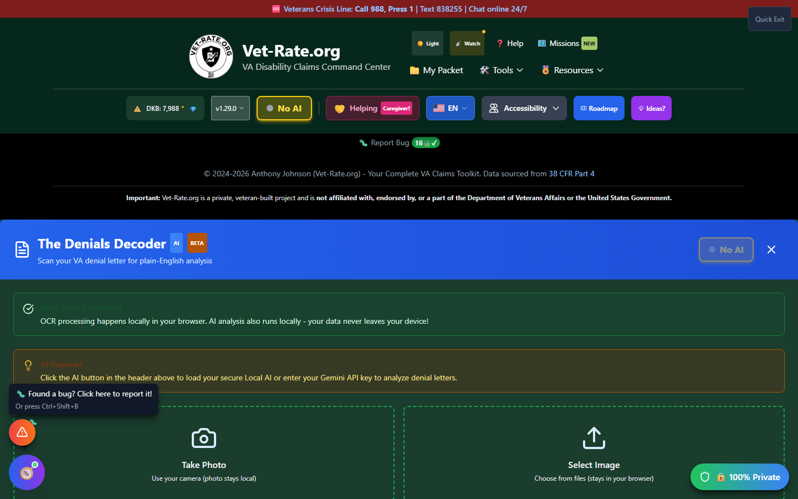

# Denial Decoder

Denial Decoder (shown in the app as **"The Denials Decoder"**) is a camera-first tool built specifically for denial letters. Take a photo or upload an image of your VA denial, and it identifies the specific legal reason you were denied, translates it into plain English, and gives you 2-3 concrete next steps.

🆘 <strong>Veterans Crisis Line:</strong> Call 988, Press 1 | Text 838255 | Available 24/7

---

## Denial Decoder vs. Decision Decoder

- **Denial Decoder** (this page) is photo/image-first — take a picture with your camera or upload an image file. It's purpose-built to explain _why you were denied_ and doesn't attempt to also handle grants, reductions, or mixed outcomes.
- **[Decision Decoder](decision-decoder.md)** accepts pasted text as well as PDFs and images, and reads the full range of VA outcomes (denials, partial denials, mixed decisions, reductions, deferrals, and grants).

If all you have is a paper denial letter in front of you, Denial Decoder's camera capture is the fastest way in. If you're working from any other kind of decision, or you'd rather paste text than photograph a page, use Decision Decoder instead.

---

## How to Launch Denial Decoder

Denial Decoder doesn't have a home page card — reach it from:

- **Header** → **"🛠️ Tools"** dropdown → Quality Control section → **"Denials Decoder"**.

---

## What You'll See

_Denial Decoder's upload screen — take a photo with your camera or select an image file. Text extraction (OCR) always runs locally in your browser._

Denial Decoder needs AI to finish the analysis. Once you upload or photograph a letter, OCR runs immediately (locally, via Tesseract.js), then the extracted text is handed to AI for interpretation — click the **AI badge** in the header, or use the **AI Command Center**, to load a model if none is active.

---

## Scanning a Letter

<strong>Take Photo</strong> — Use your device camera; the photo never leaves your browser

<strong>Or Select Image</strong> — Choose a PNG, JPG, or other image file from your device

<strong>OCR extracts the text</strong> — A local progress bar shows extraction progress

<strong>AI analyzes the denial reason</strong> — Runs automatically once text extraction finishes

!!! tip "Better photos, better results"
The in-app tips call out: shoot in good light, avoid shadows, capture the entire page, and hold the camera steady. OCR accuracy drives everything downstream.

---

## Understanding Your Results

| Field                   | What It Tells You                                                                                |
| ----------------------- | ------------------------------------------------------------------------------------------------ |
| **Why You Were Denied** | The primary legal reason (e.g., lack of nexus, lack of current diagnosis, insufficient evidence) |
| **In Plain English**    | A 5th-grade-level explanation                                                                    |
| **What Was Missing**    | The specific evidence that was missing or too weak                                               |
| **Your Next Steps**     | 2-3 concrete actions                                                                             |
| **Appeal Deadline**     | Any deadline the letter mentions                                                                 |
| **Urgency**             | High / Medium / Low, based on how time-sensitive the situation is                                |

---

## Privacy

Your photo or image **never leaves your browser** — OCR text extraction is 100% local. Only the extracted _text_ (not the image itself) is sent to AI for analysis, and if you're running a local AI model, even that stays on your device.

---

## Important Disclaimer

!!! warning "No Guarantee of Outcome"
Denial Decoder helps you **spot potential issues before you file your next step** — it does not guarantee any particular VA rating or claim outcome, and its analysis is educational, not legal advice.

    Before you act on its output, have an accredited **Veterans Service Officer (VSO)** (free, no fees allowed) or a **VA-accredited attorney or claims agent** review your denial letter. Find one at [va.gov/ogc/apps/accreditation](https://www.va.gov/ogc/apps/accreditation/).
