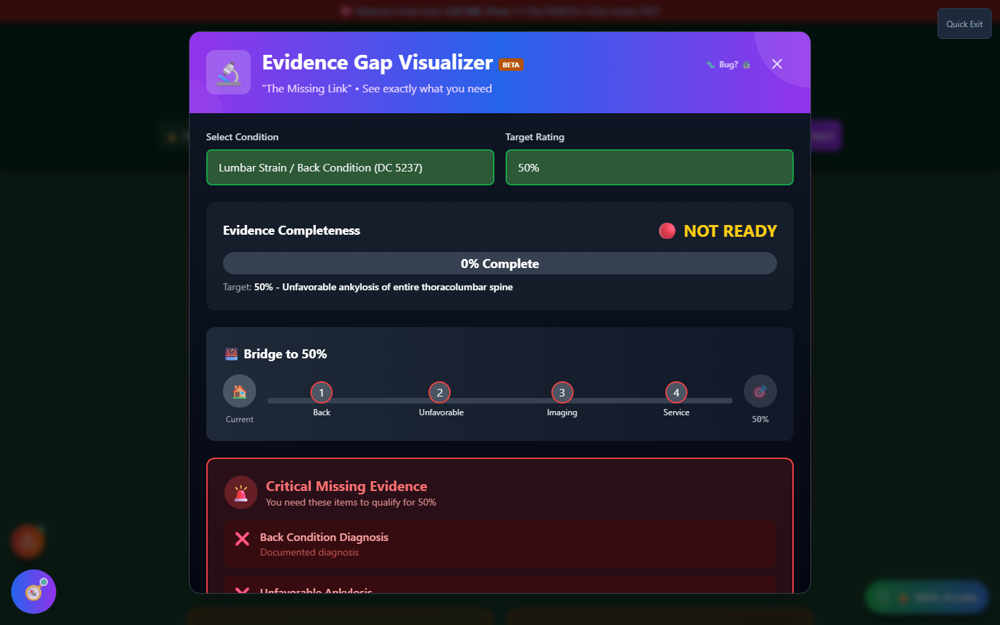

# Evidence Gap Visualizer

Evidence Gap Visualizer — nicknamed **"The Missing Link"** in the app — shows you exactly what evidence you're missing for a specific condition and target rating, instead of just letting you guess. Pick a condition, pick a rating, and check off what you already have; it shows the rest.

🆘 <strong>Veterans Crisis Line:</strong> Call 988, Press 1 | Text 838255 | Available 24/7

---

## How to Launch Evidence Gap Visualizer

- **Home page** → scroll to the **"✅ Quality Control"** section → click **"🔗 Find My Gaps"** on the Evidence Gap Finder card. (Note: the header Tools menu lists this same tool as **"Evidence Gap Finder"** — same tool, slightly different label.)
- **Header** → **"🛠️ Tools"** dropdown → Quality Control section → **"Evidence Gap Finder"**.

---

## Running a Gap Analysis

<strong>Select a condition</strong> - Choose from the list of conditions with structured evidence requirements

<strong>Select a target rating</strong> - Only ratings that apply to that condition's rating schedule are offered

<strong>Check off evidence you have</strong> - Toggle each checklist item as Found; the gauge updates live

<strong>Review critical gaps</strong> - Required items you haven't checked off are flagged as missing

<strong>Save to My Packet</strong> - Keep your gap analysis alongside your other saved claim evidence

---

## What You'll See

_A condition and target rating selected, with the completeness gauge, the "Bridge" progress visual, and critical missing evidence all populated live from the checklist._

| Section                       | What It Shows                                                                     |
| ----------------------------- | --------------------------------------------------------------------------------- |
| **Evidence Completeness**     | A percentage gauge — 0% Not Ready up through 100% Claim Ready                     |
| **Bridge to X%**              | A visual step-by-step path from your current evidence to the target rating        |
| **Critical Missing Evidence** | Every **Required** item you haven't checked off, with a description of what it is |
| **Pro Tips**                  | Condition-specific guidance for strengthening your case                           |

Each checklist item is labeled either **Required** (needed to qualify for the rating) or **Recommended** (strengthens the claim but isn't strictly required).

---

## Important Disclaimer

!!! warning "No Guarantee of Outcome"
Evidence Gap Visualizer helps you **spot potential issues before you file** — it does not guarantee any particular VA rating or claim outcome. Checking off every item on the list improves your evidence package, but the VA makes the final call on every claim.

    Before you file, have an accredited **Veterans Service Officer (VSO)** (free, no fees allowed) or a **VA-accredited attorney or claims agent** review your evidence. Find one at [va.gov/ogc/apps/accreditation](https://www.va.gov/ogc/apps/accreditation/).
