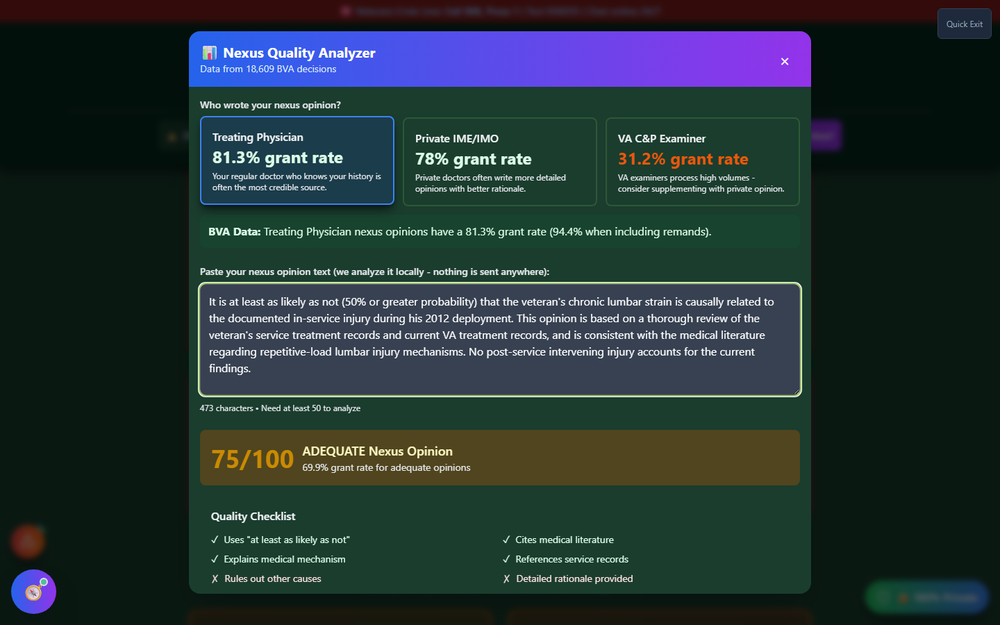

# Nexus Quality Analyzer

Nexus Quality Analyzer scores the actual text of your nexus opinion against the quality markers a VA rater or BVA judge looks for — the specific phrasing, rationale, and citations that separate an opinion the VA accepts from one it rejects.

🆘 <strong>Veterans Crisis Line:</strong> Call 988, Press 1 | Text 838255 | Available 24/7

---

## How to Launch Nexus Quality Analyzer

!!! info "Not yet on a menu"
Nexus Quality Analyzer doesn't currently have a button on the home page, the header's "🛠️ Tools" dropdown, or the command search palette. It's fully built and works exactly as described below once open — this page documents it for that reason — but as of this writing there's no menu path to reach it. If you're looking for it in the app today, this is a known gap; check with a future update or the site's Roadmap for when it's wired into a menu.

Everything in this page reflects the tool's actual behavior — it just isn't discoverable from the app's navigation yet.

---

## What You'll See

_A provider type selected, sample nexus language pasted in, and the resulting score and quality checklist._

---

## Using It

<strong>Select who wrote your nexus opinion</strong> - Treating Physician, Private IME/IMO, or VA C&P Examiner

<strong>Paste your nexus opinion text</strong> - Analyzed entirely locally in your browser; nothing is sent anywhere

<strong>Review your score</strong> - A 0-100 score with a quality label (Weak / Adequate / Strong)

<strong>Read the recommendations</strong> - Specific suggestions for strengthening the opinion

---

## The Quality Checklist

Your pasted text is checked for six specific markers:

| Marker                           | What It Looks For                                         |
| -------------------------------- | --------------------------------------------------------- |
| Uses "at least as likely as not" | The specific probability language VA adjudicators require |
| Cites medical literature         | References to published research or studies               |
| Explains medical mechanism       | The _how_ — not just the conclusion                       |
| References service records       | Ties the opinion to your actual documented history        |
| Rules out other causes           | Addresses and excludes alternative explanations           |
| Detailed rationale provided      | A thorough "why," not a bare conclusion                   |

---

## Provider Type Matters

The app shows BVA-decision-derived grant rates by who authored the opinion — a **Treating Physician** or **Private IME/IMO** opinion has historically graded out well above a **VA C&P Examiner** opinion in the underlying dataset. If your only opinion is from a VA examiner, the tool suggests supplementing it with a private opinion.

You can also expand **"What BVA Judges Say About Nexus Opinions"** to see real examples of language that won versus language that got an opinion rejected as inadequate.

---

## Important Disclaimer

!!! warning "No Guarantee of Outcome"
Nexus Quality Analyzer helps you **spot potential weaknesses in your nexus opinion before you file** — it does not guarantee any particular VA rating or claim outcome. A high score reflects the presence of language patterns historically associated with stronger opinions, not a medical or legal judgment on your specific case.

    Before you rely on a nexus opinion, have it reviewed by an accredited **Veterans Service Officer (VSO)** (free, no fees allowed) or a **VA-accredited attorney or claims agent**. Find one at [va.gov/ogc/apps/accreditation](https://www.va.gov/ogc/apps/accreditation/).
