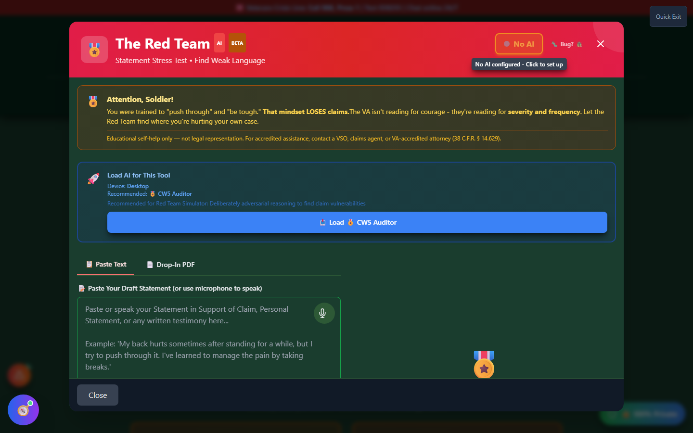

# Red Team

Red Team (shown in the app as **"The Red Team"**) is an adversarial review tool. It puts your draft personal statement through an AI "drill sergeant" that reads it the way a skeptical VA rater would — looking for language that sounds tough instead of severe — so you can shore up weak spots **before** you file, not after a denial.

🆘 <strong>Veterans Crisis Line:</strong> Call 988, Press 1 | Text 838255 | Available 24/7

---

## Why It Exists

Veterans are trained to "push through" and downplay pain. That instinct is exactly what hurts a claim: the VA isn't reading for courage, it's reading for **severity and frequency**. A statement that says "my back hurts sometimes, but I manage" reads to a rater as "not severe" — even if the reality is a debilitating, daily condition. Red Team exists to catch that gap between what you _mean_ and what the words on the page actually say.

---

## How to Launch Red Team

- **Home page** → scroll to the **"✅ Quality Control"** section → click **"🔍 Stress Test Statement"** on the Red Team card.
- **Header** → **"🛠️ Tools"** dropdown → Quality Control section → **"Red Team"**.

---

## What You'll See

_Red Team's "ready to analyze" screen — paste your draft statement, or switch to the Drop-In PDF tab, then load an AI model to run the stress test._

Red Team needs an AI model loaded before it can analyze anything. Load one from the **"Load AI for This Tool"** panel inside Red Team itself, or from the **AI Command Center** (the app's AI settings hub). Once a model is loaded, AI-generated results — a **Statement Score out of 10**, an overall assessment, and a list of specific "weak spots" with quotes, the problem, and a suggested clinical-language replacement — appear in the results panel next to your draft.

---

## Entering Your Statement

<strong>Paste or dictate</strong> — Paste your Statement in Support of Claim or use the microphone button to speak it

<strong>Or drop in a PDF</strong> — Switch to the "Drop-In PDF" tab and drag your statement document in; it's OCR'd locally in your browser

<strong>Load AI</strong> — Use the "Load AI for This Tool" panel (or AI Command Center) if no model is active yet

<strong>Stress test</strong> — Click "Stress Test My Statement" and wait roughly 10–30 seconds

---

## Common Weak Language to Watch For

Red Team's own reference panel calls out these patterns — the same examples appear in the app whether or not AI has run yet:

| Weak Phrasing      | Stronger, More Specific Phrasing      |
| ------------------ | ------------------------------------- |
| "a little bit"     | "moderate to severe"                  |
| "sometimes"        | "approximately 3-4 times weekly"      |
| "I manage"         | "I struggle to cope with"             |
| "push through"     | "forces me to stop activities"        |
| "hurts"            | "causes debilitating pain rated 7/10" |
| "trouble sleeping" | "chronic insomnia, 3-4 hours nightly" |

!!! tip "Specificity beats toughness"
Frequency, duration, and functional impact ("I can't stand for more than 10 minutes") are what raters need. Stoic understatement reads as "mild."

---

## Important Disclaimer

!!! warning "No Guarantee of Outcome"
Red Team helps you **spot potential issues before you file** — it does not guarantee any particular VA rating or claim outcome. Ratings and decisions are made solely by the VA, and Red Team's suggestions are educational, not legal advice.

    Before you rely on its output, have an accredited **Veterans Service Officer (VSO)** (free, no fees allowed) or a **VA-accredited attorney or claims agent** review your statement. Find one at [va.gov/ogc/apps/accreditation](https://www.va.gov/ogc/apps/accreditation/).
