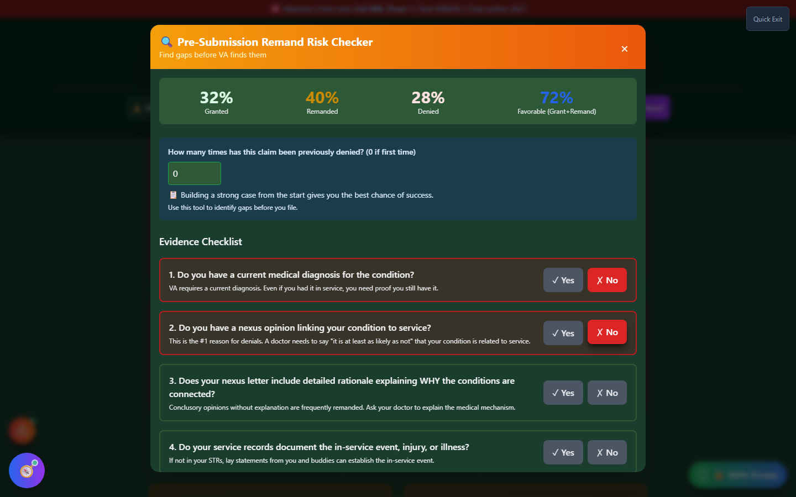

# Remand Risk Checker

Remand Risk Checker (shown in the app as **"Pre-Submission Remand Risk Checker"**) flags claim gaps that are historically associated with BVA remands — patterns pulled from the app's dataset of real Board of Veterans' Appeals decisions — so you can close them **before** you submit, not after waiting years for a remand cycle to finish.

🆘 <strong>Veterans Crisis Line:</strong> Call 988, Press 1 | Text 838255 | Available 24/7

---

## What Is a Remand — and Why Avoid One?

When the Board of Veterans' Appeals (BVA) reviews an appeal, it doesn't only grant or deny — it can also **remand** the case, sending it back to the Regional Office (RO) for more development (a missing exam, an unaddressed piece of evidence, an incomplete medical opinion). A remand isn't a loss, but it isn't a win either: it restarts a slow process and can add **years** to your case before you get an actual decision.

Avoiding an avoidable remand is one of the highest-leverage things you can do before filing — it's often the difference between a decision in months versus years.

---

## How to Launch Remand Risk Checker

Remand Risk Checker doesn't have a home page card or command-palette entry — reach it from:

- **Header** → **"🛠️ Tools"** dropdown → Maximize Your Rating section → **"Remand Risk Checker"**.

---

## What You'll See

_The stats banner shows the app's overall BVA outcome breakdown; the 8-question checklist below drives your personal risk score as you answer._

The stats banner at the top (Granted / Remanded / Denied / Favorable) reflects the app's underlying BVA dataset as a whole — it's context, not a prediction for your specific case.

---

## The 8-Question Checklist

Each question maps to a documented top reason for BVA remands or denials, weighted by how often it drives one:

| #   | Question                                                       | Why It's Weighted Heavily                                                                   |
| --- | -------------------------------------------------------------- | ------------------------------------------------------------------------------------------- |
| 1   | Do you have a current medical diagnosis?                       | The VA requires proof you still have the condition now, not just that you had it in service |
| 2   | Do you have a nexus opinion linking your condition to service? | The single most common reason for denials                                                   |
| 3   | Does your nexus letter include detailed rationale?             | Conclusory opinions without explanation are frequently remanded                             |
| 4   | Do your service records document the in-service event?         | Lay statements can fill this gap if records don't                                           |
| 5   | Have you provided personal/buddy statements?                   | Often decisive at the BVA level for continuity of symptoms                                  |
| 6   | Do you have medical records showing continuity of treatment?   | Gaps can be explained with lay evidence if needed                                           |
| 7   | Are you prepared to challenge an inadequate C&P exam?          | Short exams or missing rationale are grounds to request a new one                           |
| 8   | Will your C&P exam be with the right specialist?               | A back condition should see an orthopedist, not a generalist                                |

As you answer "No" to any question, it appears in **"Address These Gaps Before Filing"** with a severity badge (Critical / High / Medium) and a specific tip.

There's also a **"How many times has this claim been previously denied?"** field — answering it surfaces an encouragement message, since persistence with _new_ evidence measurably improves outcomes over refiling the same case.

---

## Your Risk Score

| Risk Level          | Meaning                                                                     |
| ------------------- | --------------------------------------------------------------------------- |
| ✓ Low (≤20%)        | Your evidence appears well-documented against common remand/denial patterns |
| ⚠ Moderate (21–50%) | Some real gaps remain                                                       |
| ⚠ High (51–75%)     | Multiple significant gaps                                                   |
| 🚨 Critical (>75%)  | Address gaps before filing                                                  |

Click **"Show Top BVA Remand & Denial Reasons"** for the underlying reference data behind the checklist.

---

## Important Disclaimer

!!! warning "No Guarantee of Outcome"
Remand Risk Checker helps you **spot patterns historically associated with remands before you file** — it does not guarantee any particular VA rating, claim outcome, or that your case will avoid a remand. It reflects patterns across many BVA decisions, not a prediction of what will happen to your specific claim.

    Before you file, have an accredited **Veterans Service Officer (VSO)** (free, no fees allowed) or a **VA-accredited attorney or claims agent** review your claim. Find one at [va.gov/ogc/apps/accreditation](https://www.va.gov/ogc/apps/accreditation/).
