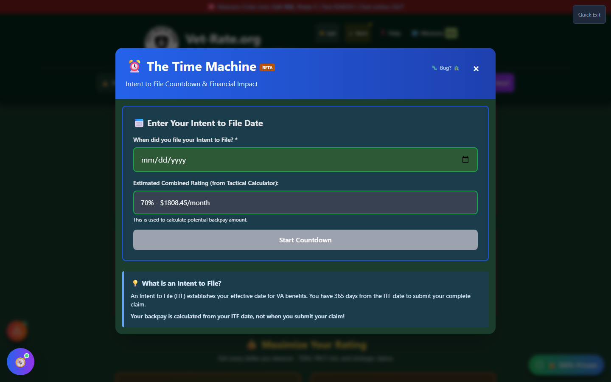
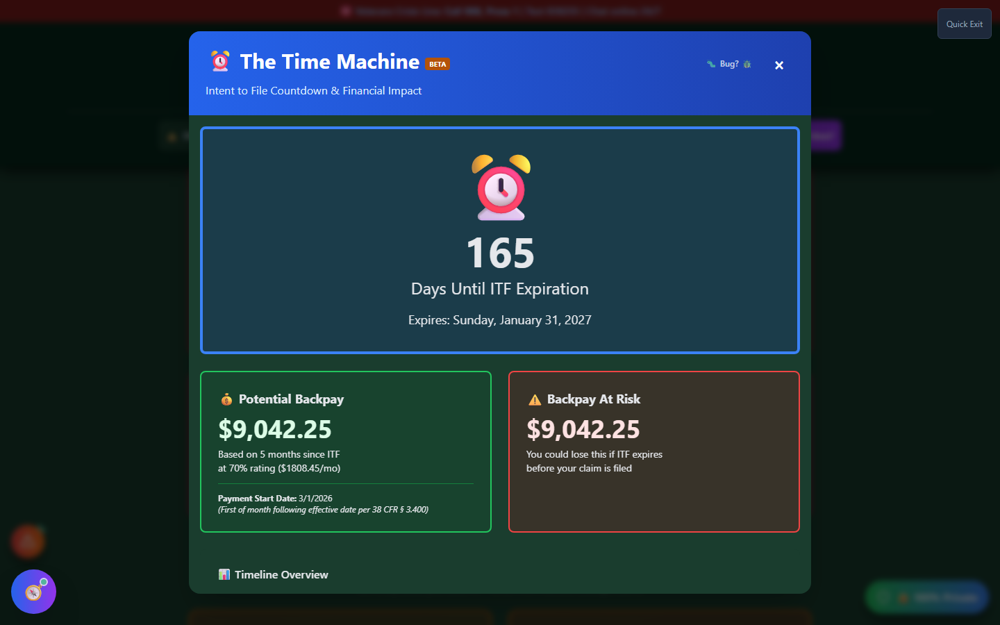

# Time Machine

Time Machine (shown in the app as **"The Time Machine"**) is a live countdown for your **Intent to File (ITF)** deadline, paired with the backpay math that's riding on it. It exists for one reason: veterans lose real money by letting an ITF quietly expire.

🆘 <strong>Veterans Crisis Line:</strong> Call 988, Press 1 | Text 838255 | Available 24/7

---

## What Is an Intent to File?

An **Intent to File (ITF)** is a short notice you submit to the VA (VA Form 21-0966) that locks in your **effective date** before your full claim is ready. You then have **365 days** from that ITF date to submit your complete claim.

Why it matters: if the VA later approves your claim, your **backpay is calculated from your ITF date — not from whenever you actually submitted the finished claim**. File the ITF the moment you decide to pursue a claim, even if your evidence isn't ready yet; you can keep building your case for up to a year without losing any backpay.

If your ITF window expires before you file, you risk losing that locked-in effective date — and the backpay tied to it.

---

## How to Launch Time Machine

- **Home page** → scroll to the **"✅ Quality Control"** section → click **"⏰ Track Deadline"** on the Time Machine card.
- **Header** → **"🛠️ Tools"** dropdown → Calculate section → **"Time Machine"**.

---

## Setting Up Your Countdown

_Enter the date you filed your Intent to File and your estimated combined rating — the countdown appears the moment you pick a date._

<strong>Enter your ITF date</strong> - The date you filed VA Form 21-0966

<strong>Set your estimated combined rating</strong> - Defaults to your saved rating from My Ratings if you have one; used only to estimate backpay

<strong>Countdown appears automatically</strong> - No separate "submit" step — as soon as a valid date is entered, the full countdown and financial-impact view replaces the entry form

---

## Reading the Countdown

_Once a date is entered: days remaining, expiration date, potential backpay, and how much of that backpay is at risk._

| Section                       | What It Shows                                                                   |
| ----------------------------- | ------------------------------------------------------------------------------- |
| **Days Until ITF Expiration** | A live day count, color-coded by urgency                                        |
| **Potential Backpay**         | Estimated based on months elapsed since your ITF date and your estimated rating |
| **Backpay At Risk**           | What you stand to lose if your claim isn't filed before the ITF expires         |
| **Payment Start Date**        | The first of the month _following_ your effective date, per 38 CFR § 3.400      |
| **Timeline Overview**         | Days elapsed, days remaining, and a visual progress bar                         |

The countdown box changes color as your deadline approaches:

| Days Remaining | State                                                                                    |
| -------------- | ---------------------------------------------------------------------------------------- |
| More than 60   | Normal (blue)                                                                            |
| 60 or fewer    | Urgent (yellow) — prioritize finishing your claim packet                                 |
| 30 or fewer    | Critical (red) — file immediately, even a "protective claim" with what you have          |
| Expired        | You may have lost backpay eligibility — file a **new** ITF immediately and contact a VSO |

---

## Important Disclaimer

!!! warning "No Guarantee of Outcome"
Time Machine helps you **track a real regulatory deadline and spot backpay at risk before it's lost** — it does not guarantee any particular VA rating, claim outcome, or exact payment amount. Backpay figures are estimates based on the rating you enter, not a VA determination.

    For confirmation of your actual ITF status or effective date, contact the VA directly or an accredited **Veterans Service Officer (VSO)** (free, no fees allowed). Find one at [va.gov/ogc/apps/accreditation](https://www.va.gov/ogc/apps/accreditation/).
