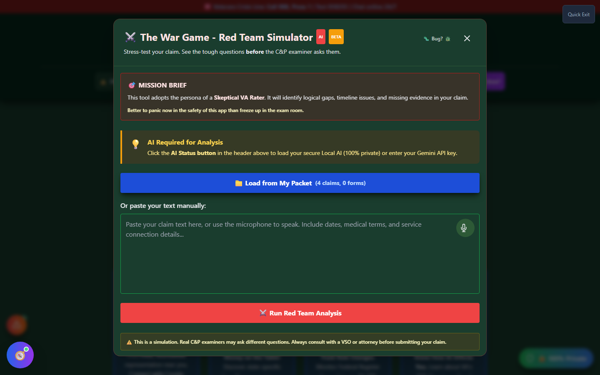

# Claim Stress Test (The War Game)

The War Game runs a saved statement or nexus letter through a simulated **skeptical VA rater** review, looking for logical gaps, timeline problems, and missing evidence — before a real C&P examiner finds them.

🆘 <strong>Veterans Crisis Line:</strong> Call 988, Press 1 | Text 838255 | Available 24/7

---

## What It Does

Veterans often submit a claim believing their statement is airtight, then get blindsided by a denial that hinges on something they never thought to address. The War Game's AI adopts the persona of a **skeptical VA rater**: it reads your statement the way an adjudicator would, and calls out logical gaps, unclear timelines, and evidence that's asserted but not actually documented — the same kind of scrutiny a real C&P exam or ratings decision applies.

!!! info "Not the Same Tool as Red Team"
Vet-Rate.org has a separate **Red Team** tool that reviews the _word choice_ in a statement — flagging language that can unintentionally hurt a claim (for example, phrasing that sounds like someone is "coping fine" when they mean the opposite). Claim Stress Test is different: it role-plays a skeptical examiner asking pointed questions about your claim as a whole, rather than line-editing your wording.

---

## How It Works

<strong>Load your statement</strong> - Pull a saved claim or form directly from My Packet, or paste text manually

<strong>Review the loaded text</strong> - Edit it in place if needed, or use the microphone to add more

<strong>Run the Red Team Analysis</strong> - The AI reviews your statement for gaps, timeline issues, and missing evidence

<strong>Address the findings</strong> - Strengthen your statement or gather the evidence it flags as missing before you submit

_The launch screen — load a saved statement from My Packet or paste text directly. Analysis requires a connected AI provider._

If you've already saved claims or statements in My Packet, **Load from My Packet** drops them straight into the review box — in the example above, the demo profile already has statements saved for tinnitus and a lumbar strain claim ready to load.

---

## AI Required

Claim Stress Test's analysis is AI-powered — it needs either a local AI model loaded through the AI Command Center or a connected API key before it can run. Until then, the tool stays in this ready-to-generate state: your statement can be loaded and reviewed, but the actual stress-test analysis won't run until an AI backend is available.

---

## Important Disclaimer

!!! warning "No Guarantee of Outcome"
This is a **simulation**. Real C&P examiners may ask different questions than the tool generates, and passing a simulated review does not guarantee any particular VA rating or claim outcome.

    Always consult with a **VSO (Veterans Service Officer)** — free, no fees allowed — or a VA-accredited attorney before submitting your claim. Find one at [va.gov/ogc/apps/accreditation](https://www.va.gov/ogc/apps/accreditation/).
