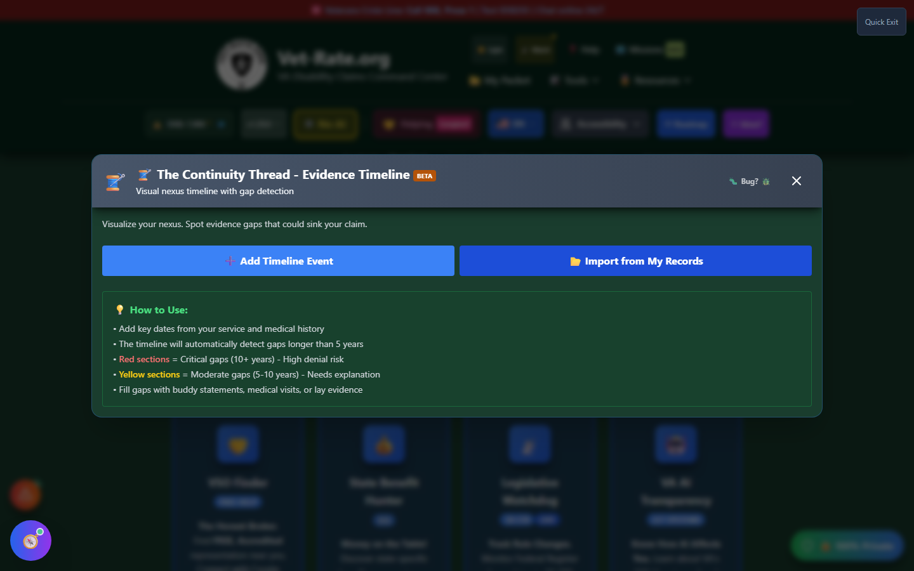
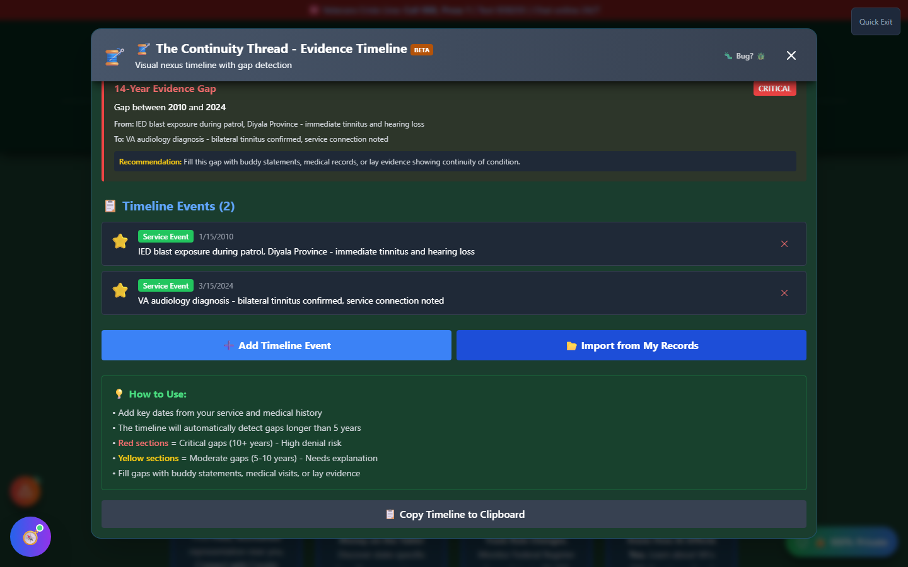

# Evidence Timeline (The Continuity Thread)

Evidence Timeline plots your service events, diagnoses, and treatment dates on a visual timeline and **automatically flags dangerous gaps** — because text is bad at showing time, and veterans often don't notice a gap in their evidence until an examiner points it out.

🆘 <strong>Veterans Crisis Line:</strong> Call 988, Press 1 | Text 838255 | Available 24/7

---

## Why Continuity Matters

VA claims are strongest when they show a **continuous thread** connecting an in-service event to your current condition: something happened in service, symptoms began, and they've continued (or been treated) more or less consistently ever since. A single in-service incident followed by a diagnosis 15 years later, with nothing documented in between, invites the VA to ask what happened during those 15 years — and to conclude the condition might be unrelated to service.

That doesn't mean a long gap is automatically fatal to a claim. It means the gap needs to be **explained** — with buddy statements, lay evidence, or medical records showing the condition existed even if it wasn't formally treated. The whole value of this tool is surfacing gaps like that before a rater does, so you have time to fill them.

---

## How It Works

<strong>Add timeline events</strong> - Service events, injuries, diagnoses, and treatment dates, each with a date and description

<strong>Or import from your records</strong> - Pull dates directly from claims already saved in My Packet

<strong>Review the visual timeline</strong> - Every event plotted in chronological order

<strong>Check for flagged gaps</strong> - Gaps over 5 years are automatically detected and color-coded by severity

_Start from scratch by adding events by hand, or import dates already saved in My Packet._

---

## Automatic Gap Detection

Once you have two or more events, the timeline automatically measures the distance between them. **Gaps of 5–10 years** are flagged yellow as moderate and worth explaining; **gaps of 10+ years** are flagged red as critical, with a materially higher risk of denial if left unaddressed. Each flagged gap comes with a direct recommendation: fill it with buddy statements, medical records, or other lay evidence showing continuity of the condition.

_A 14-year gap between an in-service incident and a formal diagnosis, flagged critical with a concrete recommendation._

In the example above, an in-service acoustic-trauma event in 2010 isn't formally diagnosed until 2024 — a 14-year gap that the tool flags as critical. That doesn't mean the claim fails; it means the veteran needs evidence (private audiology visits, buddy statements about ringing in the ears since service, hearing-protection complaints in service records) to bridge those 14 years before the VA has to ask the same question.

---

## Important Disclaimer

!!! warning "No Guarantee of Outcome"
Evidence Timeline is an **organizational and educational tool** — flagging or resolving a gap does not guarantee any particular VA rating or claim outcome. Whether evidence sufficiently establishes continuity is a determination made solely by the VA.

    For personalized guidance on filling an evidence gap, seek help from an accredited **VSO (Veterans Service Officer)** — free, no fees allowed — and/or a VA-accredited attorney or claims agent. Find one at [va.gov/ogc/apps/accreditation](https://www.va.gov/ogc/apps/accreditation/).
