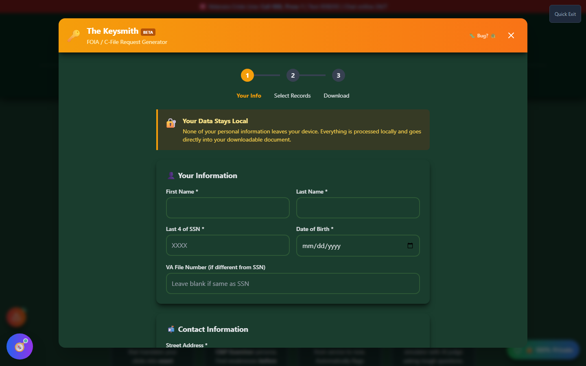
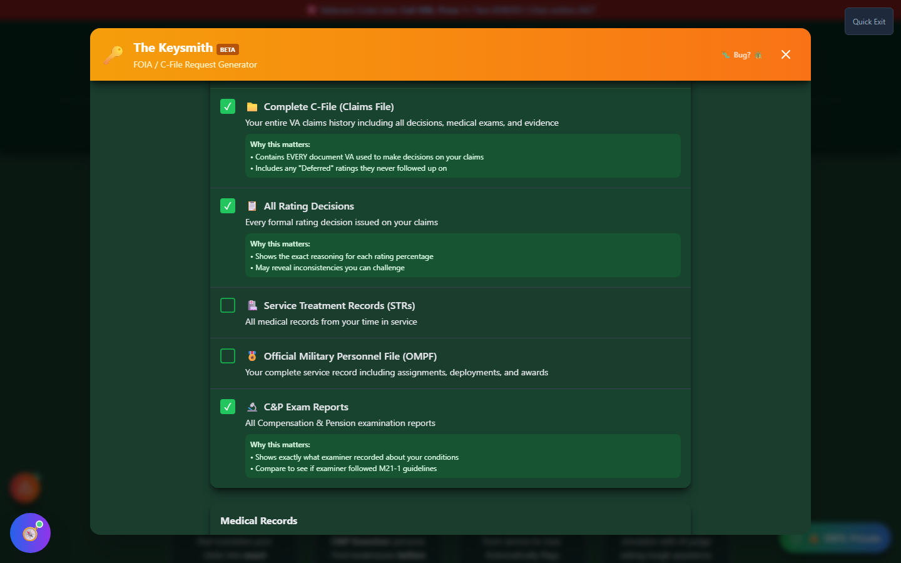

# FOIA Generator (The Keysmith)

The Keysmith generates a pre-filled Freedom of Information Act / Privacy Act request for your own VA records — most importantly, your complete **C-File** — so you can see exactly what evidence the VA used to make a decision, and what it might have missed.

🆘 <strong>Veterans Crisis Line:</strong> Call 988, Press 1 | Text 838255 | Available 24/7

---

## Why a Veteran Would Request Their Own C-File

Your C-File (Claims File) is the VA's complete internal record of your case: every rating decision, every C&P exam report, every piece of medical evidence submitted, and often internal notes about how a decision was reached. Most veterans never see the full file — they only see the decision letter that summarizes the outcome.

Requesting your C-File matters most when:

- You're preparing to **appeal** a denial or a rating you disagree with, and need to know exactly what the VA considered (or didn't)
- You suspect the VA **missed evidence** you submitted, or never followed up on something they said they would
- You want to check a C&P examiner's report against what you actually said and against M21-1 adjudication procedures
- You're investigating whether an old decision contains a **Clear and Unmistakable Error (CUE)**

Under 38 CFR § 1.555, veterans are entitled to **one free copy** of their C-File. The Keysmith exists to make requesting it painless.

---

## How It Works

<strong>Enter your information</strong> - Name, last 4 of SSN, date of birth, and contact details (all required by VA to process a FOIA/Privacy Act request)

<strong>Select which records you want</strong> - Choose from a checklist of record types, each with a plain-language explanation of why it matters

<strong>Set delivery preferences</strong> - Date range and electronic vs. physical delivery

<strong>Generate and download</strong> - A completed request ready to submit, based on VA Form 20-10206

_Step 1 — your information is used only to populate the downloadable request; it never leaves your device._

---

## Choosing What to Request

The record-type checklist covers everything from your **Complete C-File** down to specific categories like Service Treatment Records, your Official Military Personnel File, C&P Exam Reports, DBQs, nexus letters and medical opinions, award/notification letters, and Duty to Assist documentation. Each item explains, in plain language, why that specific record type matters — for example, C&P Exam Reports let you "compare to see if the examiner followed M21-1 guidelines."

The tool pre-selects the most commonly useful "essential" records so you have a sensible starting point, and you can select all, clear all, or hand-pick from there.

_Step 2 — every record type explains why a veteran would actually want it, not just what it's called._

---

## What You Get

The finished request is formatted around **VA Form 20-10206** (Freedom of Information Act / Privacy Act request) with your selected record types, date range, and delivery preference built in — ready to download and submit through VA QuickSubmit, mail, or the appropriate FOIA office.

---

## Important Disclaimer

!!! warning "No Guarantee of Outcome"
The Keysmith generates a records request — it does not file a claim or appeal, and requesting your C-File does not guarantee any particular VA rating or claim outcome. Response times and completeness of the records you receive are controlled entirely by the VA.

    For help interpreting what comes back, or deciding what to do with it, talk to an accredited **VSO (Veterans Service Officer)** — free, no fees allowed — or a VA-accredited attorney or claims agent. Find one at [va.gov/ogc/apps/accreditation](https://www.va.gov/ogc/apps/accreditation/).
