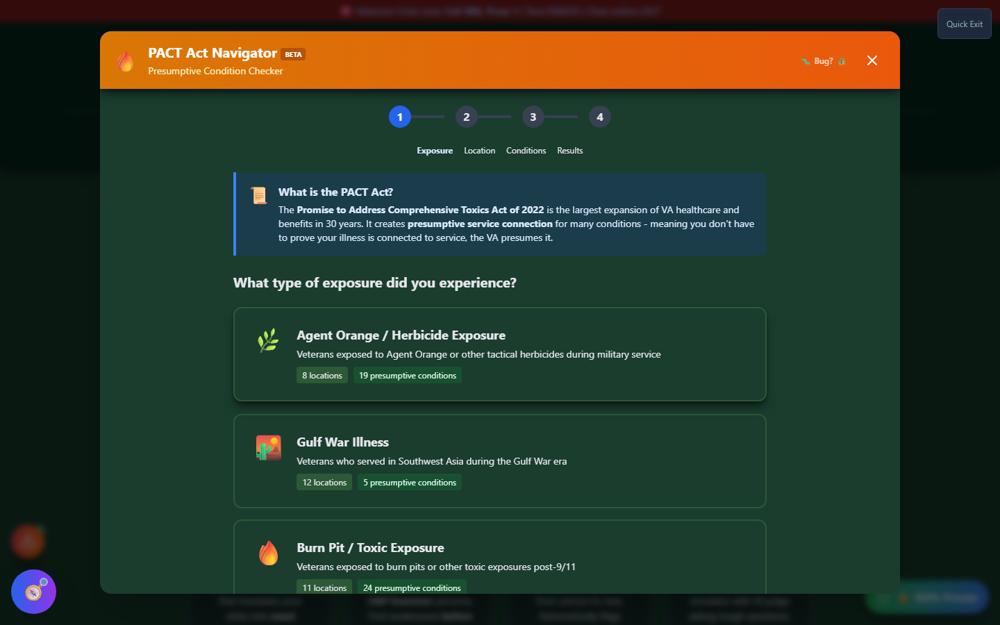
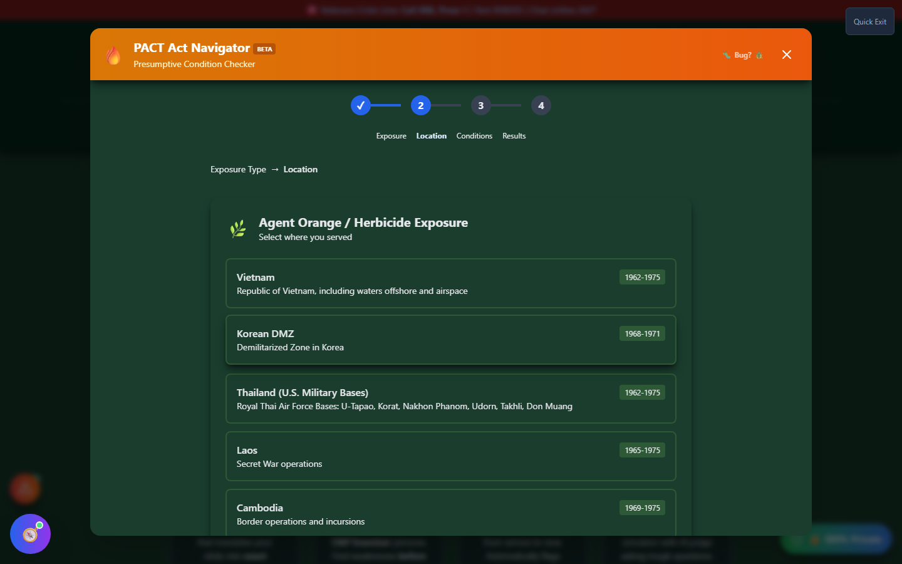

# PACT Act Navigator

PACT Act Navigator checks whether your exposure history and diagnosis qualify for **presumptive service connection** under the PACT Act — meaning you may not need to prove the medical link between your service and your condition at all.

🆘 <strong>Veterans Crisis Line:</strong> Call 988, Press 1 | Text 838255 | Available 24/7

---

## What the PACT Act Is

The **Promise to Address Comprehensive Toxics (PACT) Act of 2022** is the largest expansion of VA healthcare and benefits in roughly 30 years. It added dozens of conditions tied to toxic exposure — burn pits, Agent Orange, Gulf War particulate matter, and other airborne hazards — to the VA's list of **presumptive conditions**.

## Why "Presumptive" Matters

Normally, a veteran filing a disability claim has to establish a **nexus**: medical evidence connecting a current condition back to something that happened in service. That often means a nexus letter from a doctor, supporting records, and time.

For a **presumptive condition**, that burden flips. If you served in a qualifying location during a qualifying period and you have one of the covered diagnoses, the VA _presumes_ the connection to service — you don't have to independently prove it caused your condition. This is why checking presumptive status first, before spending time and money on a nexus letter, is worth doing.

---

## How the Navigator Works

PACT Act Navigator is a rule-based wizard — no AI involved — built directly from 38 CFR and the text of the PACT Act, covering three exposure eras:

- **Vietnam / Agent Orange Era** (1962–1975)
- **Gulf War Era** (1990–present)
- **Post-9/11 / Burn Pits** (2001–present)

<strong>Choose your exposure type</strong> - Agent Orange/herbicide, Gulf War, or burn pits/airborne hazards

<strong>Select where you served</strong> - Specific locations and date ranges tied to that exposure type

<strong>Select your condition(s)</strong> - Search or browse the presumptive condition list for that exposure

<strong>Review your results</strong> - See which of your conditions qualify as presumptive, which don't, and what to do next

_Step 1 — pick your exposure category. Each card shows how many locations and presumptive conditions it covers._

Each exposure type has its own list of qualifying service locations and date ranges — for Agent Orange/herbicide exposure alone, that includes Vietnam, the Korean DMZ, specific U.S. air bases in Thailand, Laos, and Cambodia, each with its own effective date range.

_Step 2 — location and date range narrow down which presumptions actually apply to your service._

---

## What the Results Tell You

The results screen separates your selected conditions into **presumptive** and **non-presumptive** for your specific exposure/location combination, explains what that status means in plain language, links the relevant legal citations, and lays out concrete next steps — including cases where a condition isn't presumptive but might still be claimable with a traditional nexus.

---

## Important Disclaimer

!!! warning "No Guarantee of Outcome"
PACT Act Navigator is an **educational tool** that maps your inputs against the published presumptive-condition rules — it does not file anything on your behalf and does not guarantee any particular VA rating or claim outcome. Presumptive status still requires the VA to confirm your diagnosis and qualifying service; always verify your specific situation before filing.

    For personalized guidance, seek help from an accredited **VSO (Veterans Service Officer)** — free, no fees allowed — and/or a VA-accredited attorney or claims agent. Find one at [va.gov/ogc/apps/accreditation](https://www.va.gov/ogc/apps/accreditation/).
