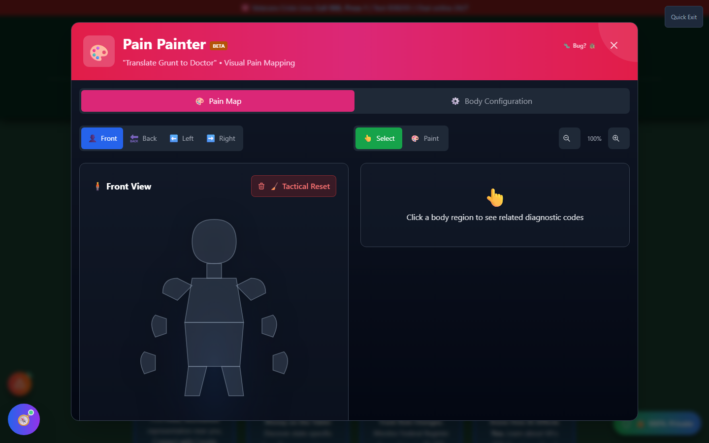
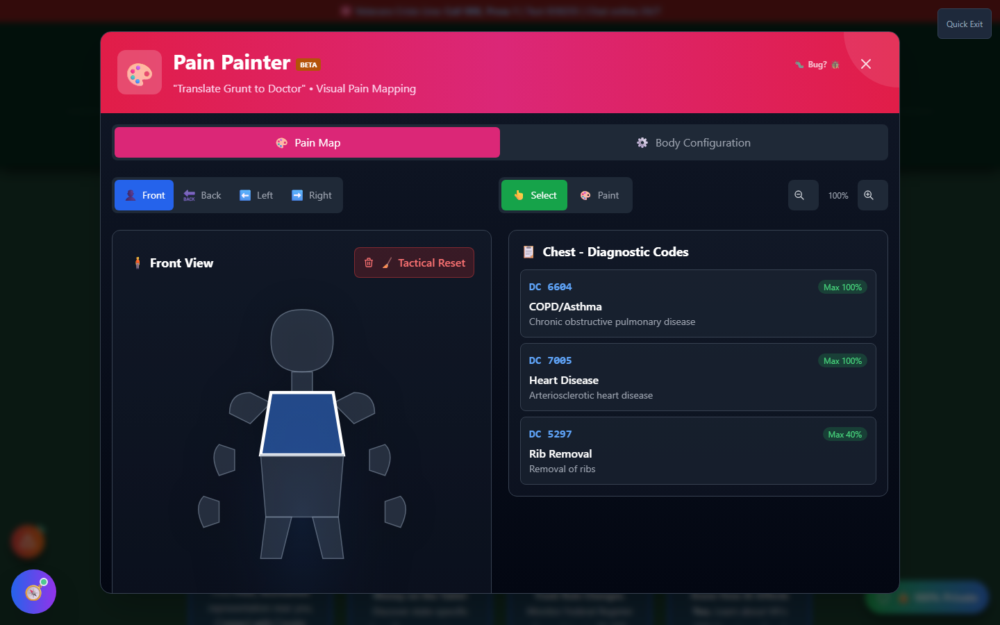

# Pain Painter (Somatic Target)

Pain Painter is an interactive body map that translates **where it hurts** into the medical terminology and diagnostic codes a VA rater actually needs — no more trying to describe pain locations in your own words and hoping it lands correctly in your file.

🆘 <strong>Veterans Crisis Line:</strong> Call 988, Press 1 | Text 838255 | Available 24/7

---

## Why Location Matters for a Claim Narrative

Veterans generally know exactly where something hurts — but not always the medical name for it. "My back hurts" and "lumbosacral strain, L4-L5" describe the same thing, but only one of them maps cleanly onto a diagnostic code and rating schedule. Pain Painter closes that gap: click the region that hurts, and it surfaces the diagnostic codes, condition names, and maximum ratings associated with that body area, so you can describe your condition precisely in a statement, buddy letter, or C&P exam.

---

## How It Works

<strong>Choose a view</strong> - Front, back, left, or right

<strong>Click a body region</strong> - Select mode marks individual regions; Paint mode builds a heatmap across multiple areas

<strong>Review diagnostic code suggestions</strong> - See the conditions and diagnostic codes associated with that region, with their maximum rating percentages

<strong>Export your pain map</strong> - Bring a visual summary to a medical appointment or C&P exam

_The interactive body map — front, back, and both sides are selectable, with independent Select and Paint modes._

---

## From Click to Diagnostic Code

Clicking a region highlights it and opens a panel of the diagnostic codes tied to that area, each with a short description and its maximum schedular rating. This is meant as a translation aid and a starting point for conversation with a medical provider — not a diagnosis.

_Selecting a region surfaces the diagnostic codes and maximum ratings associated with that part of the body._

The tool also looks for **nexus patterns** — for example, flagging when a gait-altering leg injury and a hip or back condition are both mapped, since one commonly causes or aggravates the other as a secondary condition.

---

## Important Disclaimer

!!! warning "No Guarantee of Outcome"
Pain Painter suggests diagnostic codes based on body location as an **educational and organizational aid** — it is not a medical diagnosis, and using it does not guarantee any particular VA rating or claim outcome. Only a qualified medical professional and the VA itself can establish an actual diagnosis and rating.

    For personalized guidance, seek help from an accredited **VSO (Veterans Service Officer)** — free, no fees allowed — and/or a VA-accredited attorney or claims agent. Find one at [va.gov/ogc/apps/accreditation](https://www.va.gov/ogc/apps/accreditation/).
