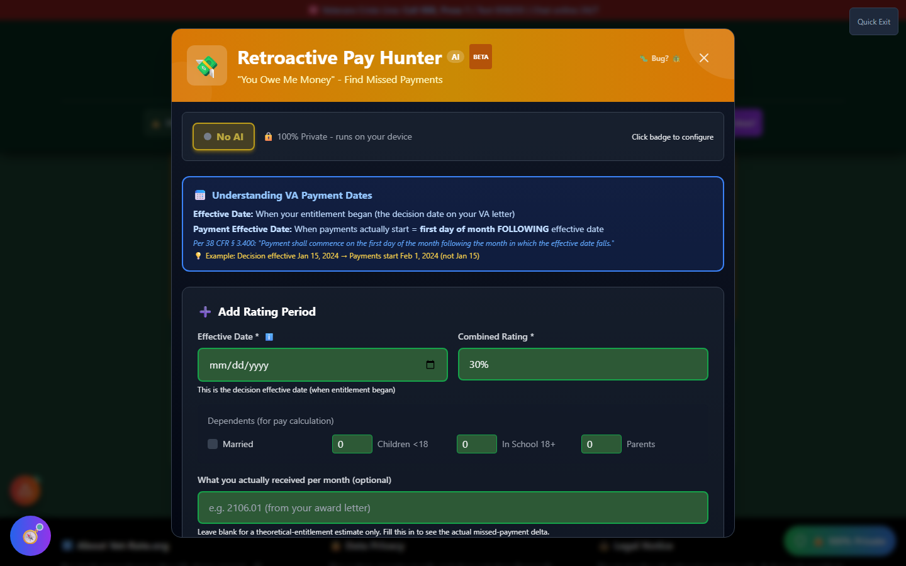
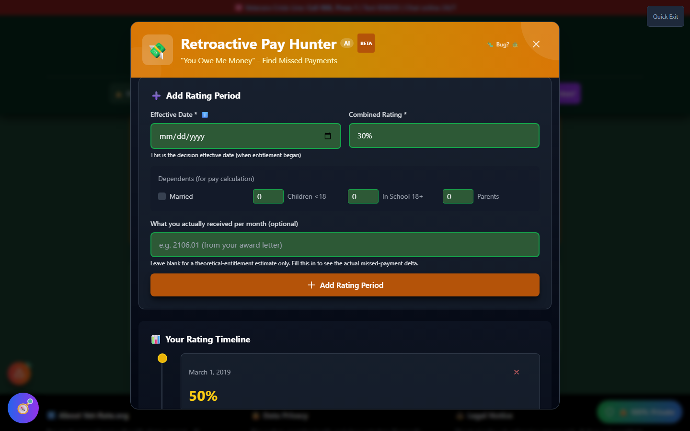
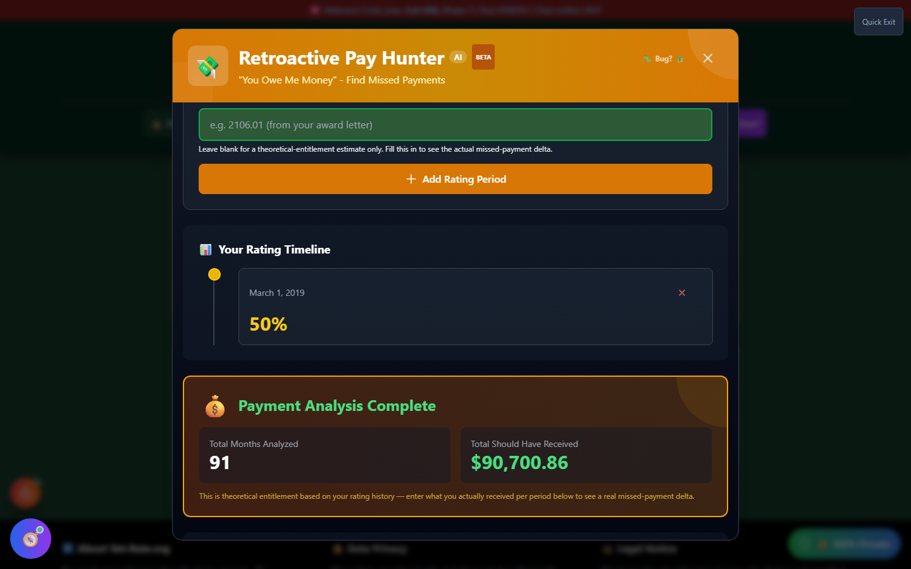

# Retro Pay Hunter

Retro Pay Hunter analyzes your rating history to estimate whether the VA owes you **retroactive (back) pay** — money you should have received based on your effective dates, but that a payment error or missed bilateral factor may have left on the table.

🆘 <strong>Veterans Crisis Line:</strong> Call 988, Press 1 | Text 838255 | Available 24/7

---

## What Retro Pay Actually Is

VA compensation is driven by **effective dates**, not the date a decision letter arrives. When a claim is approved, the VA determines an _effective date_ — when your entitlement to that rating actually began, which is often earlier than the decision date itself. Under 38 CFR § 3.400, payment begins on the **first day of the month following** the month your effective date falls in — so an effective date of February 15, 2024 means payments start March 1, 2024, not February 15.

"Retro pay" (or retroactive pay) is the lump-sum difference between what you were entitled to starting from your effective date and what you actually received. It shows up when:

- A rating increase's effective date is earlier than when payments actually started
- The **bilateral factor** (an extra combined-ratings bump for related paired-limb disabilities under 38 CFR § 4.26) wasn't applied when it should have been
- An old decision contains a **Clear and Unmistakable Error (CUE)** that, if corrected, would change the effective date

---

## How It Works

<strong>Add each rating period</strong> - Effective date, combined rating percentage, and dependent information for pay calculation

<strong>Optionally enter what you actually received</strong> - From your award letter, to see a real missed-payment delta instead of a theoretical estimate

<strong>Run the analysis</strong> - The tool compares your rating history against the correct historical pay tables

<strong>Review flagged issues</strong> - Missing bilateral factor application and common CUE patterns are checked automatically

_Leave "actually received" blank for a theoretical-entitlement estimate, or fill it in from your award letter to see a real payment delta._

Each rating period you add appears on a visual timeline, so you can see your rating history at a glance before running the analysis.

_A single rating period on the timeline, ready to analyze. Add every rating change you've had for the most accurate picture._

---

## Reading Your Results

The analysis totals how many months were covered and what you should have received in that window, based on the historical VA pay tables for each rating percentage and dependent status.

_A theoretical-entitlement estimate for one rating period. Enter what you actually received to see the real missed-payment delta instead._

If you didn't enter what you actually received, the total shown is a **theoretical entitlement** — what your rating history says you should have gotten, not proof you were underpaid. Entering your actual monthly payment amounts turns this into a real comparison and surfaces the specific delta, if any.

The tool also checks for two of the most common sources of missed money:

- **Missing bilateral factor** — a combined-ratings math error when two rated conditions affect paired limbs (both legs, both arms, etc.)
- **Common CUE patterns** — a reference library of the kinds of errors that have historically supported Clear and Unmistakable Error claims, to help you recognize if something similar happened in your file

---

## Important Disclaimer

!!! warning "No Guarantee of Outcome"
Retro Pay Hunter provides **estimates only**, based on the rating periods you enter — it does not access your actual VA payment history and does not guarantee any particular VA rating, retroactive payment, or claim outcome. A theoretical entitlement estimate is not proof of underpayment.

    Consult with a **VSO (Veterans Service Officer)** — free, no fees allowed — or a VA-accredited attorney for official payment disputes or CUE claims. Find one at [va.gov/ogc/apps/accreditation](https://www.va.gov/ogc/apps/accreditation/).
