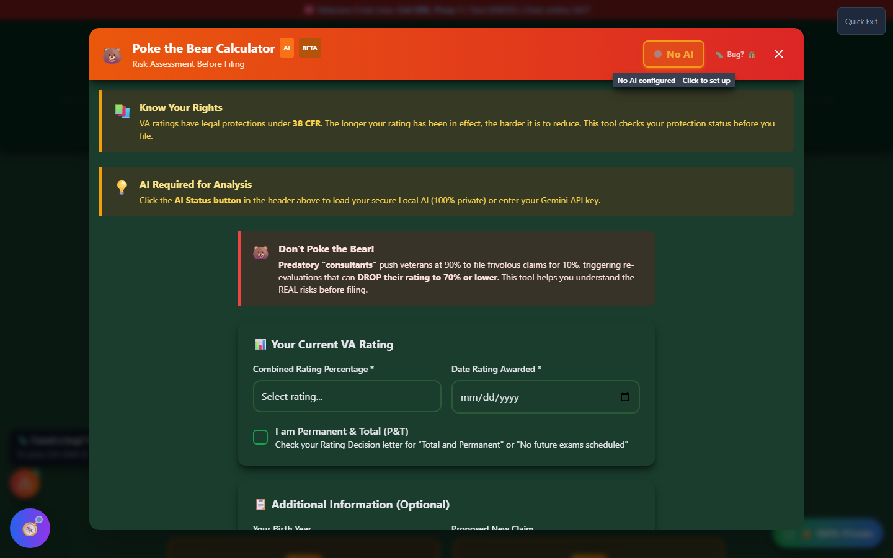
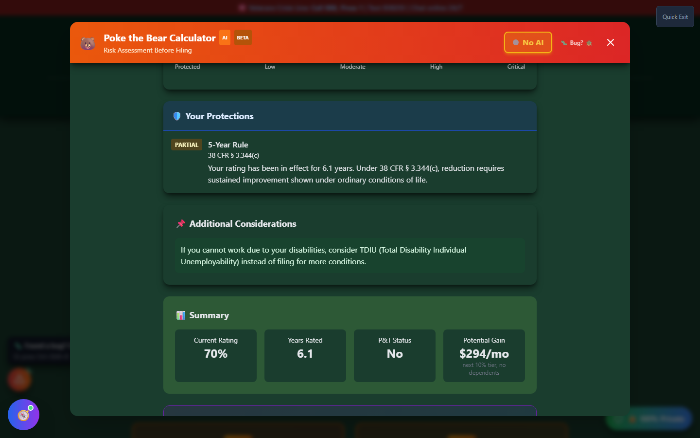

# Risk Assessment (Poke the Bear Calculator)

Risk Assessment is a **defensive** tool. Before you file a new claim, it checks whether doing so could put your **existing rating** at risk — and explains exactly what legal protections already apply to you.

🆘 <strong>Veterans Crisis Line:</strong> Call 988, Press 1 | Text 838255 | Available 24/7

---

## Why This Tool Exists

Filing a VA disability claim opens a **new review of your file**. In most cases that's fine — the VA is only looking at the new condition. But when the VA schedules a Compensation & Pension (C&P) exam for a new claim, the examiner sometimes documents findings about your **existing, already-rated conditions** too. If those findings show improvement, that documentation can be used to start a **reduction proposal** on a rating you already have — even though you never asked the VA to re-look at it.

This is a real risk, not a hypothetical one. It's most likely to matter if:

- Your current rating hasn't been in place very long
- Your rating isn't legally protected yet (see below)
- You're filing for something minor while sitting at a high combined rating

It is **not** a reason to avoid filing legitimate claims, and it does not mean every new claim risks your rating. Most veterans with older or protected ratings have little to worry about. The point of this tool is to help you understand _your specific_ exposure before you file — not to talk you out of a claim you're entitled to make.

---

## What It Checks

<strong>Enter your current combined rating</strong> - Percentage and the date it was awarded

<strong>Note Permanent & Total (P&T) status</strong> - If applicable, since P&T changes which protections apply

<strong>Add optional context</strong> - Your birth year (for the 55+ exam-exemption check), the condition you're considering claiming, and your other rated conditions

<strong>Review your protections and risk level</strong> - See which legal protections already cover you and what, if anything, remains exposed

_The input form — combined rating and award date are required; everything else sharpens the analysis._

---

## The Legal Protections It Checks

| Protection                  | Citation          | What It Means                                                                                                                                                                                                                         |
| --------------------------- | ----------------- | ------------------------------------------------------------------------------------------------------------------------------------------------------------------------------------------------------------------------------------- |
| **5-Year Rule**             | 38 CFR § 3.344(c) | Once a rating has been in effect 5+ years, the VA can't reduce it without evidence of **sustained improvement under the ordinary conditions of life** — a single good exam isn't enough. Under 5 years, a rating is easier to reduce. |
| **20-Year Rule**            | 38 CFR § 3.951    | A rating in effect for 20+ years generally cannot be reduced below its lowest level in that period, except in cases of fraud.                                                                                                         |
| **Permanent & Total (P&T)** | —                 | A P&T rating is protected from routine future exams, but filing a _new_ claim while P&T can still open review of your file in some circumstances.                                                                                     |
| **Age 55+ Exam Exemption**  | —                 | The VA generally stops scheduling routine re-examinations once a veteran turns 55, absent evidence a condition has materially improved.                                                                                               |

Results show as a risk meter (Protected → Low → Moderate → High → Critical) with a plain-language breakdown of which of these protections apply to you right now, plus a summary of your years-rated, P&T status, and potential financial upside of the new claim.

_Results for a 70% rating in place 6.1 years — partially protected under the 5-Year Rule, with a summary of the potential upside._

---

## Reading Your Result

- **Protected / Low** — Your existing protections are strong relative to what a new claim could expose. This does not mean zero risk, but the odds favor you.
- **Moderate / High** — Your rating is newer or unprotected enough that a new claim carries real exposure. Consider whether the condition you want to claim is well-documented and whether it's worth the timing risk, or whether waiting (or consulting a VSO first) makes sense.
- **Critical** — Usually shown for veterans at or near 100% P&T considering a claim for a minor, marginally-documented condition. The tool will explicitly flag this combination and suggest talking to a VSO before filing.

If you can't work because of your service-connected disabilities, the tool will also point you toward **TDIU (Total Disability Individual Unemployability)** as a potential alternative to filing for additional conditions — TDIU pays at the 100% rate without needing a combined 100% schedular rating.

---

## Important Disclaimer

!!! warning "No Guarantee of Outcome"
Risk Assessment is an **educational tool** that explains legal protections and general VA practice — it does not predict what the VA will actually do with your specific file, and it does not guarantee any particular VA rating or claim outcome. Reduction decisions are made solely by the VA, and every case has facts this tool cannot see.

    Before filing a claim while carrying an existing rating you want to protect, talk to a **VSO (Veterans Service Officer)** — free, no fees allowed — or a **VA-accredited attorney or claims agent**. Find one at [va.gov/ogc/apps/accreditation](https://www.va.gov/ogc/apps/accreditation/).
