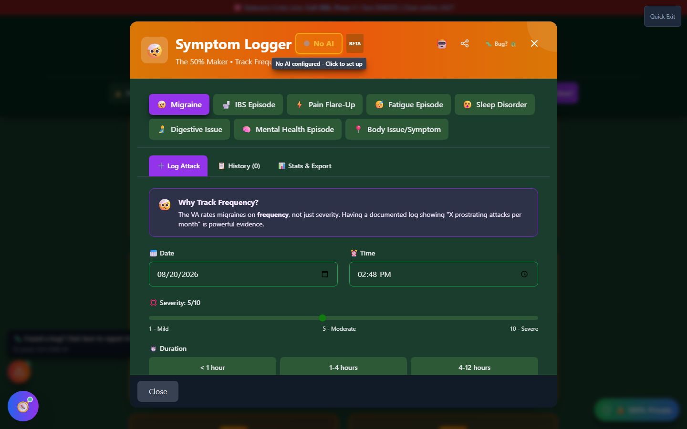
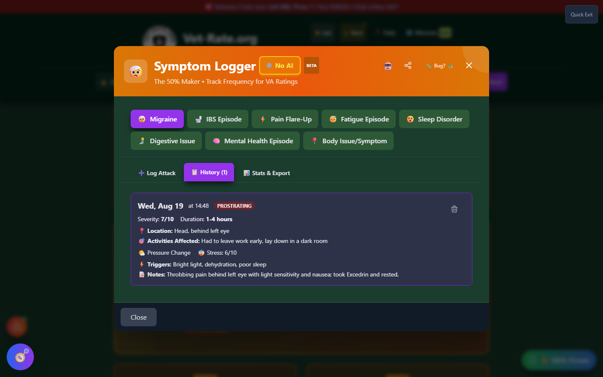
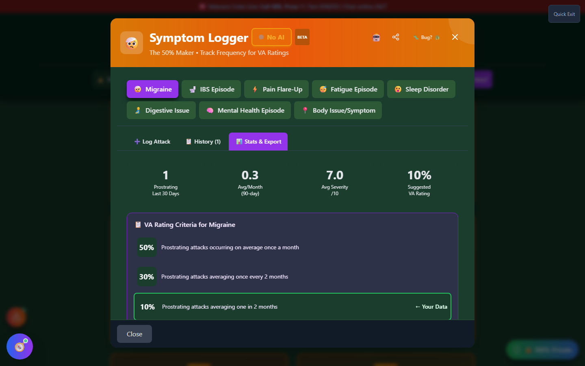

# Symptom Logger

Symptom Logger is a private, local log for tracking episodic symptoms — migraines, IBS episodes, pain flare-ups, fatigue, sleep disturbance, and more — over time. Many VA rating criteria depend on **frequency**, not just severity, and a contemporaneous log is far stronger evidence than trying to reconstruct months of symptoms from memory at a C&P exam.

🆘 <strong>Veterans Crisis Line:</strong> Call 988, Press 1 | Text 838255 | Available 24/7

---

## Why Contemporaneous Logging Matters

A single doctor's visit shows the VA one data point: how you felt that day. Many diagnostic codes are rated on how _often_ something happens over a sustained period — for example, migraines are rated in part on how many **prostrating attacks** occur per month, averaged over several months. If a veteran shows up to a C&P exam and says "I get migraines a lot," that's not evidence. If they show up with a dated log of every attack, its severity, duration, and whether it forced them to stop what they were doing, that's a record the VA can actually rate against.

Logging as symptoms happen (rather than reconstructing them later) also shows the VA that a condition is **ongoing and consistent**, not a one-time complaint — which matters both for the initial rating and for proving continuity if you ever need to defend that rating later.

---

## What You Can Track

Symptom Logger covers eight symptom types out of the box: **Migraine, IBS Episode, Pain Flare-Up, Fatigue Episode, Sleep Disorder, Digestive Issue, Mental Health Episode,** and a general **Body Issue/Symptom** catch-all. Each type ships with its own VA rating-criteria reference so you can see, while you log, what frequency and severity thresholds correspond to which rating percentage.

<strong>Pick a symptom type</strong> - Switch tabs any time; each type keeps its own separate log

<strong>Log an attack</strong> - Date, time, severity (1-10), duration, body location, activities affected, weather, stress level, whether it was prostrating, medication taken, triggers, and free-text notes

<strong>Review your history</strong> - Every entry for that symptom type, in one place

<strong>Check your stats</strong> - Frequency over the last 30 and 90 days, average severity, and a suggested VA rating based on your own data

<strong>Export</strong> - Generate a professional PDF log to bring to your C&P exam or hand to your VSO

_Eight symptom types, each with its own frequency-focused rating explanation._

---

## Why "Prostrating" Matters

For several conditions — migraines especially — the difference between a 10% rating and a 50% rating comes down to whether attacks are **prostrating**: severe enough that you had to stop what you were doing. Symptom Logger asks this directly for every entry and flags prostrating attacks in your history, because it's one of the specific facts VA raters are looking for.

_A single logged attack — severity, duration, body location, activity impact, and triggers are all captured in one place._

---

## Stats & Export

The Stats & Export tab turns your raw log into the numbers a rater actually needs: prostrating attacks in the last 30 and 90 days, average attacks per month, average severity, and — for symptom types with numeric rating criteria — a suggested VA rating percentage based on your logged frequency, shown next to the official rating-criteria table so you can see exactly why.

_Your own data mapped directly against the official rating thresholds for that symptom type._

From here you can export a dated PDF log — useful evidence to bring to a C&P exam, attach to a claim, or hand to a VSO.

---

## Where This Data Lives

Everything you log stays in your browser's local storage on this device — nothing is uploaded anywhere unless you explicitly export or share it. If you use the optional AI assistant to help draft trigger lists, activity-impact descriptions, or clinical-style notes, only the text you choose to send leaves your device — see the [AI Assistant Privacy](../privacy/ai-assistant.md) page for details.

---

## Important Disclaimer

!!! warning "No Guarantee of Outcome"
Symptom Logger helps you organize evidence, but **using it does not guarantee any particular VA rating or claim outcome** — ratings and decisions are made solely by the VA. The "suggested rating" shown in Stats & Export is an educational estimate based on the official criteria, not a determination.

    For personalized guidance, seek help from an accredited **VSO (Veterans Service Officer)** — free, no fees allowed — and/or a VA-accredited attorney or claims agent. Find one at [va.gov/ogc/apps/accreditation](https://www.va.gov/ogc/apps/accreditation/).
