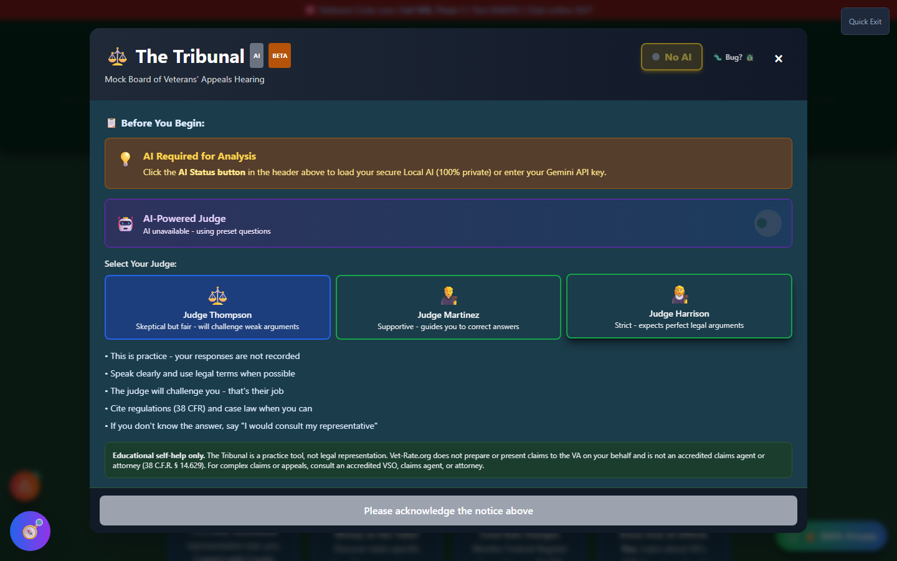

# The Tribunal

The Tribunal is a voice-interactive mock hearing simulator that lets you practice in front of an AI Veterans Law Judge before a real **Higher-Level Review** or **Board of Veterans' Appeals** hearing.

🆘 <strong>Veterans Crisis Line:</strong> Call 988, Press 1 | Text 838255 | Available 24/7

---

## What It Does

A BVA hearing can be the first time a veteran has to speak about their claim out loud, under pressure, in front of a judge who is actively looking for gaps in the argument. The Tribunal simulates that experience: you pick a judge persona, the AI asks questions the way a real Veterans Law Judge might, and you respond by voice or by typing. It's practice, not the real thing — the goal is to walk into an actual hearing having already heard (and answered) the hard questions once.

---

## The Setup Screen

Before a session starts, The Tribunal walks you through what to expect and asks you to acknowledge how the audio technology works. Because this is a voice-interactive tool, testing it end-to-end requires an actual microphone and speakers in a live browser session — this page documents the setup screen itself rather than a simulated hearing.

_The pre-hearing setup screen — choose a judge persona, review the guidelines, and acknowledge the audio-technology notice before a session can begin._

### Choosing a Judge Persona

- **Judge Thompson** — Skeptical but fair; will challenge weak arguments
- **Judge Martinez** — Supportive; guides you toward correct answers
- **Judge Harrison** — Strict; expects precise legal arguments

### Before You Begin

The setup screen lays out the ground rules plainly: this is practice and your responses aren't recorded, speak clearly and use legal terminology where you can, the judge is _supposed_ to challenge you, cite regulations (38 CFR) and case law when relevant, and if you don't know an answer, it's fine to say you'd consult your representative — that's a normal, honest answer in a real hearing too.

### Audio Technology, Made Optional

Every word the AI judge says is also shown as text in live captions, so a microphone and speakers are never strictly required — typing works at all times, even while the judge is "speaking." Microphone input is opt-in, and voice data is processed locally in your browser rather than being recorded or stored.

---

## Important Disclaimer

!!! warning "Educational Self-Help Only"
The Tribunal is a **practice tool, not legal representation**. Vet-Rate.org does not prepare or present claims to the VA on your behalf and is not an accredited claims agent or attorney (38 CFR § 14.629). Completing a mock hearing does not guarantee any particular VA rating or claim outcome, and a real Veterans Law Judge may ask different questions than the simulation does.

    For complex claims or appeals, consult an accredited **VSO (Veterans Service Officer)** — free, no fees allowed — a claims agent, or an attorney. Find one at [va.gov/ogc/apps/accreditation](https://www.va.gov/ogc/apps/accreditation/).
