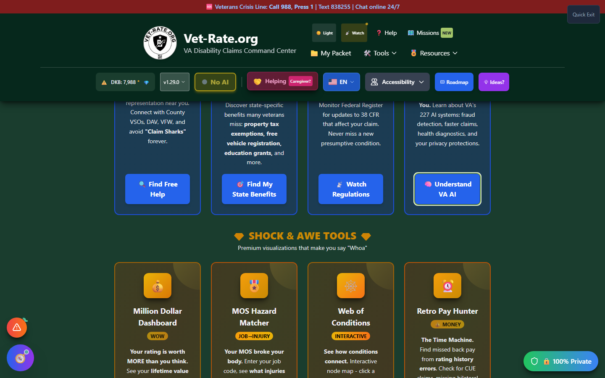
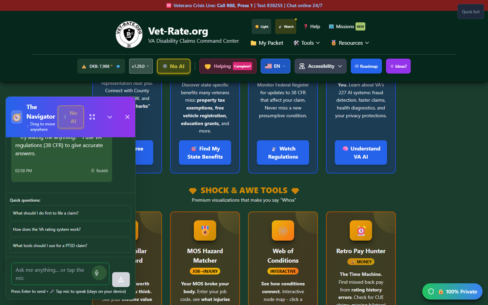

# AI Assistant (The Navigator)

The AI Assistant - nicknamed **"The Navigator"** - is Vet-Rate.org's **general-purpose AI chat companion**. Unlike the task-specific AI tools elsewhere in the app (Secondary Scout's suggestions, Ask the Regs' regulation Q&amp;A, C-File Analyzer's document review), the Navigator is a free-form conversation partner you can bring up from anywhere to ask broad questions about your claim, the app itself, or where to go next.

---

## Screenshots

_The Navigator's compass icon floats in the bottom-left corner of every screen in the app._

_The chat panel opens docked in the corner; it can also be expanded to a full modal._

---

## Where to Find It

The Navigator is a **floating bubble** (🧭) fixed to the **bottom-left corner** of every screen in the app - it's always accessible, regardless of which tool or page you're currently using.

<strong>Click the compass bubble</strong> - Bottom-left corner, always visible

<strong>Start typing</strong> - Ask anything about your claim, a condition, or how to use a specific tool

<strong>Expand if needed</strong> - The docked chat panel can expand into a larger modal for longer conversations

<strong>Close anytime</strong> - Your conversation context is tied to the tool you had open when you launched it, so the Navigator knows what screen you were on

---

## What Makes It Different From Other AI Tools

| Tool                                     | Purpose                                               |
| ---------------------------------------- | ----------------------------------------------------- |
| **AI Assistant (Navigator)**             | Open-ended conversation, available everywhere         |
| [Ask the Regs](ask-the-regs.md)          | Focused Q&amp;A against the CFR, keyboard-only        |
| Secondary Scout / C-File Analyzer / etc. | Task-specific AI features embedded in their own tools |

All of them share the same underlying AI mode you configure in the [AI Command Center](ai-command-center.md) - Local (private, on-device) or Cloud (Gemini). If no AI mode is configured yet, the Navigator will prompt you to set one up.

---

## Important Disclaimer

!!! warning "Educational Tool"
The Navigator is a conversational aid, not a substitute for a VA-accredited representative or medical professional. Verify anything claim-critical it tells you against official sources or a qualified human before acting on it.
