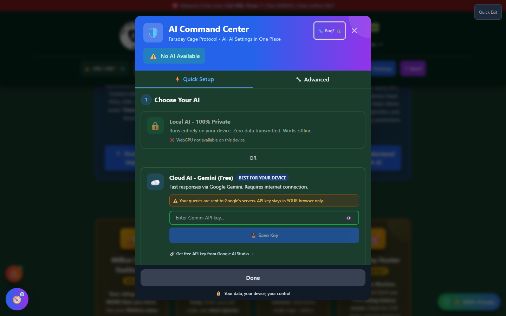
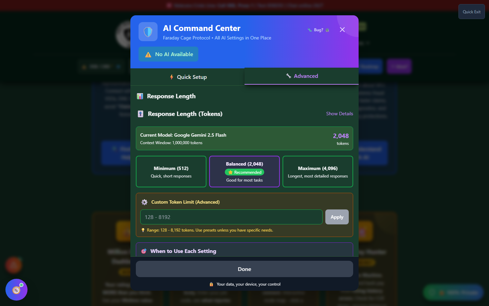

# AI Command Center

The AI Command Center - "The Faraday Cage Protocol" - is the **one place for every AI setting** in Vet-Rate.org. Nearly every AI-powered tool in the app (Secondary Scout's AI suggestions, C-File Analyzer, Ask the Regs, the AI Assistant, and more) links back here to load or switch AI modes, so it's worth understanding thoroughly.

🆘 <strong>Veterans Crisis Line:</strong> Call 988, Press 1 | Text 838255 | Available 24/7

---

## The Two AI Modes - What Actually Happens to Your Data

This is the single most important thing to understand about AI in Vet-Rate.org, so it's stated plainly:

!!! va-info "Local AI vs. Cloud AI - Precisely" - **Local AI (Swarm / on-device):** Runs entirely inside your browser using **WebGPU**. Your prompts, your documents, and the AI's responses **never leave your device**. It works offline once the model is downloaded, and Vet-Rate.org's servers never see any of it. - **Cloud AI (Google Gemini):** Your question **is sent to Google's servers** to generate a response. This is the only mode in the app where your input leaves your device. Your Gemini API key is stored only in your own browser - Vet-Rate.org never sees or stores it - but the _content of your questions_ does go to Google when you use this mode.

    Any other "local" mode offered elsewhere in the app (Wllama, local-server) follows the same rule as Local AI here: **nothing leaves your device.** Only Cloud mode transmits data off-device.

---

## Screenshots

_Quick Setup: choose Local AI (100% private, on-device) or Cloud AI (Gemini, requires your own API key)._

_The Advanced tab: response-length limits, AI personality presets, GPU selection, and Diamond Knowledge Base details._

---

## Quick Setup Tab

### Option A: Local AI (Recommended)

- Runs on your device via **WebGPU** - the app detects whether your browser/GPU supports it and shows the active GPU when available
- Downloads a compact (~1-2 GB) model the first time you activate it
- Works **offline** after the initial download
- A built-in test box lets you ask a sample question once the model is loaded, so you can confirm it's working before relying on it elsewhere

!!! note "About the Named Model Options"
The model picker lists several specialty-named options (e.g., "350F All Source Intel," "270A Legal Admin"). As of this writing, **these share one underlying engine** - the app downloads whichever ~1-2 GB build fits your device regardless of which specialty you pick. The specialty-tuned models are in testing and are not yet live; treat the names as roadmap labels, not distinct AI personalities today.

### Option B: Cloud AI (Google Gemini)

- Requires a **free Gemini API key** from Google AI Studio (linked directly in the panel)
- Your key is saved only in your browser's local storage
- Faster responses, no download required, but needs an internet connection
- The panel displays an explicit warning: _"Your queries are sent to Google's servers. API key stays in YOUR browser only."_

---

## Advanced Tab

- **Response Length** - controls how long AI answers are allowed to run
- **AI Personality** - a preset selector for response tone/style
- **GPU Settings** - lets you pick which GPU to use when WebGPU detects more than one
- **Diamond Knowledge Base** - both Local and Cloud AI draw from the same ~8,000-entry curated database of VA regulations, 38 CFR text, BVA decisions, and CAVC rulings. Local AI pulls 6-8 entries per query (tuned for GPU memory); Cloud AI pulls 8-10 entries (full context)
- **Device Capability** - shows your detected device tier and whether WebGPU is available

---

## How to Open the AI Command Center

<strong>From the header</strong> - Click the AI status badge (shows your current AI mode) in the header, or open the "🛠️ Tools" menu → Support &amp; Resources → AI Settings

<strong>From any AI-powered tool</strong> - Nearly every AI tool (Ask the Regs, C-File Analyzer, VSO Finder's AI search, the AI Assistant, etc.) has its own status badge that opens the Command Center directly, so you never have to leave what you're doing to set up AI

---

## Choosing a Mode

| If you...                                                           | Choose                                            |
| ------------------------------------------------------------------- | ------------------------------------------------- |
| Want maximum privacy, even offline                                  | **Local AI**                                      |
| Have an older device or no WebGPU support                           | **Cloud AI** (the panel flags this automatically) |
| Don't want to create a Google account or API key                    | **Local AI**                                      |
| Want the fastest responses and don't mind sending queries to Google | **Cloud AI**                                      |

---

## Important Disclaimer

!!! warning "AI Output Is Not Legal or Medical Advice"
Regardless of which mode you use, AI-generated answers - including citations - should be verified against the official 38 CFR text or with a VA-accredited VSO or attorney before you rely on them for a claim.
